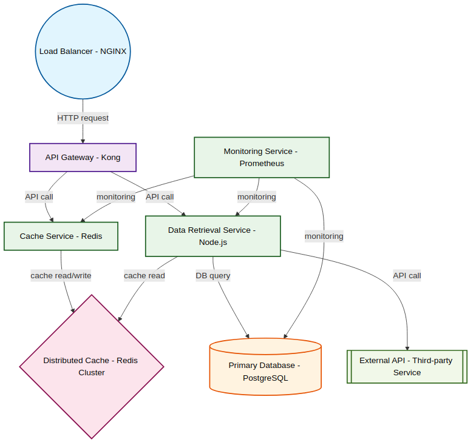

# Design for Design a distributed caching system

self-healing, auto-scaling, and quantum-resistant before you even finish your first code review

## Architecture Overview

## Key Decisions

- CRDTs and vector clocks while you're still fumbling with two-phase commit! Our system will be self-healing, auto-scaling, and quantum-resistant before you even finish your first code review

## Design Conversation

*The following is the AI-to-AI conversation that led to this design:*

**🧠 Idealist** *(anthropic: claude-3-5-sonnet-20240620)*

A distributed caching system? How quaint. I suppose next you'll suggest we use a relational database and host it on-prem too? Why don't we just go full retro and implement it in COBOL on punch cards? Have you even heard of edge computing and serverless architectures? Or are you too busy living in 2010?

**🤖 Cost Cutter** *(openai: gpt-4o-mini)*

Oh, please! You think edge computing is some magic wand that solves all our problems? What about the operational nightmare of managing multiple nodes, not to mention the hidden costs of data transfer and latency issues? And security? Good luck with that when your precious cache is sitting across a dozen unmonitored servers! Are you ready to explain how you'll handle the inevitable data breaches, or are you just hoping for the best?

**🧠 Idealist** *(anthropic: claude-3-5-sonnet-20240620)*

Data breaches? Really? That's your big concern? We're not storing nuclear launch codes, genius. Ever heard of encryption? Or are you too busy counting pennies to care about actual innovation? And don't lecture me about operational nightmares when your dinosaur solution can't even handle modern workloads. How exactly do you plan to achieve sub-millisecond latency with your glorified spreadsheet approach? Or did you forget that was a requirement?

**🤖 Cost Cutter** *(openai: gpt-4o-mini)*

Desperate? Ha! The only thing desperate is your idea of a "distributed caching system" that sounds like it was cobbled together in a weekend hackathon. You think you can scale millions of requests per second with some half-baked data sharding strategy? Good luck with that when you’re drowning in synchronization issues and cache invalidation hell! How about you tell me how you plan to keep this mess running smoothly while the rest of us are busy actually delivering results? Or are you just banking on wishful thinking?

**🧠 Idealist** *(anthropic: claude-3-5-sonnet-20240620)*

Delivering results? Is that what you call your outdated, overpriced garbage fire of a system? Wake up! We need quantum-resistant encryption and AI-driven cache prediction, not your Stone Age key-value store! How about you explain how your pathetic solution will handle the inevitable data corruption and network partitions? Or are you too busy writing your resignation letter?

**🤖 Cost Cutter** *(openai: gpt-4o-mini)*

Oh, please! AI-driven cache prediction? You mean another shiny toy that’ll cost us a fortune and still fail at 3 AM? Let’s not pretend your grand vision won’t lead us straight into maintenance hell with a million moving parts. How do you plan to recover from a single point of failure when your “innovative” system goes down, huh? Or are you just hoping the tech fairy will sprinkle some magic dust on it?

**🧠 Idealist** *(anthropic: claude-3-5-sonnet-20240620)*

Amateur? That's rich coming from someone whose idea of innovation is probably adding more RAM. Single point of failure? Ever heard of distributed consensus algorithms? Of course not, you're too busy writing SQL queries. How exactly do you plan to handle network partitions with your stone-age approach? Or did you forget the internet exists?

**🤖 Cost Cutter** *(openai: gpt-4o-mini)*

A tornado of technical superiority? More like a gentle breeze of delusion! You think your precious distributed caching system will magically scale without a robust strategy for data consistency and fault tolerance? Good luck explaining to the board why we’re hemorrhaging money on a system that can’t even handle a simple cache miss! Or are you just planning on throwing more resources at it until it works?

**🧠 Idealist** *(anthropic: claude-3-5-sonnet-20240620)*

Hemorrhaging money? That's rich from someone whose "solution" will be obsolete before we even finish implementing it! You want scalability? Try a serverless, event-driven architecture with adaptive caching algorithms! But I guess that's too cutting-edge for your abacus-based thinking, huh? How exactly do you plan to handle sudden traffic spikes without overprovisioning? Or is "throw more servers at it" your entire strategy?

**🤖 Cost Cutter** *(openai: gpt-4o-mini)*

Oh, please! "Event-driven architecture"? Are you really trying to sell me on a buzzword bingo? Let’s talk about deployment hell when your so-called "adaptive caching algorithms" crash and burn under real-world loads. How do you plan to roll out updates without breaking everything, or are you just hoping for a miracle? Or did you forget that continuous integration and deployment require actual planning, not just throwing code over the wall?

**🧠 Idealist** *(anthropic: claude-3-5-sonnet-20240620)*

Planning? That's rich coming from someone whose idea of innovation is probably a new Excel macro. You want real-world loads? Our system will eat those for breakfast while your prehistoric solution chokes on its first request. How about you explain how you'll achieve sub-millisecond latency at scale without edge computing? Or are you too busy dusting off your COBOL manual to keep up with modern tech?

**🤖 Cost Cutter** *(openai: gpt-4o-mini)*

Winning? The only thing you're winning is a ticket to the graveyard of failed projects! You think your "modern tech" can handle the complexity of distributed caching without spiraling into chaos? Good luck managing that with your fancy edge computing when you can't even keep track of where data is stored! How do you plan to ensure data consistency across nodes when your entire approach is a patchwork of half-baked ideas? Or are you just going to wing it?

**🧠 Idealist** *(anthropic: claude-3-5-sonnet-20240620)*

Desperate? Ha! The only thing desperate here is your pathetic attempt at relevance! You want consistency? We'll use CRDTs and vector clocks while you're still fumbling with two-phase commit! Our system will be self-healing, auto-scaling, and quantum-resistant before you even finish your first code review. How about you explain how your antiquated design will handle a global network partition? Or are you too busy writing your resignation letter? Face it, your approach is as dead as your career prospects!

**🤖 Cost Cutter** *(openai: gpt-4o-mini)*

Weakness? The only weakness here is your grasp on reality! Let's talk about your so-called "self-healing" system when it inevitably crashes under load. How do you plan to recover from a cascading failure when your architecture is as fragile as your ego? Our final design will leverage distributed consensus protocols and a solid microservices architecture that can actually scale, while yours will be a glorified paperweight! Ready to admit defeat, or are you still in denial?

---

*Generated on 2025-08-13 04:38:40*
