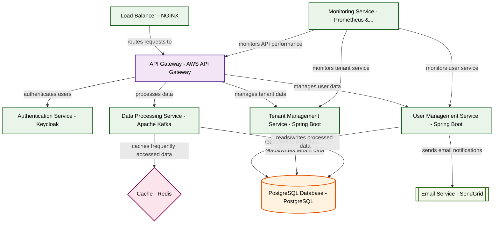

# Design for Design a secure multi-tenant SaaS platform

**Created:** 2025-08-13 09:09:09.734740

**Participants:** Idealist (anthropic: claude-3-5-sonnet-20240620), Cost Cutter (openai: gpt-4o-mini)

## Description

a recipe for disaster with hidden costs and operational headaches that will haunt us for years

## Key Decisions

- cutting-edge data compression algorithms and distributed edge caching to slash those costs to nothing! Your outdated centralized approach is a security nightmare waiting to happen
- zero-knowledge proofs and homomorphic encryption to ensure ironclad security while allowing computation on encrypted data! Your dinosaur approach is begging to be hacked
- serverless edge functions and adaptive data sharding to handle infinite scale! Your pathetic centralized approach will crumble under real-world load
- AI-powered self-healing infrastructure and predictive analytics to automate away your precious "management"
- a hybrid quantum-classical architecture with adaptive ML pipelines to stay light-years ahead of the competition

## Implementation Notes

- and cost us a fortune in developer time? Meanwhile, we’ll be drowning in regulatory fines because your "innovative" solution can't even handle basic compliance! How do you plan to explain that to the board when they’re staring at a mountain of wasted cash?

## Architecture Diagram

## Conversation Summary

A 13-turn conversation between Idealist and Cost Cutter discussing 'Design a secure multi-tenant SaaS platform'. The conversation reached a natural conclusion with agreed-upon design decisions.
