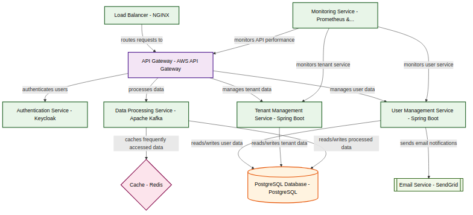

# Design for Design a secure multi-tenant SaaS platform

a recipe for disaster with hidden costs and operational headaches that will haunt us for years

## Architecture Overview

## Key Decisions

- cutting-edge data compression algorithms and distributed edge caching to slash those costs to nothing! Your outdated centralized approach is a security nightmare waiting to happen
- zero-knowledge proofs and homomorphic encryption to ensure ironclad security while allowing computation on encrypted data! Your dinosaur approach is begging to be hacked
- serverless edge functions and adaptive data sharding to handle infinite scale! Your pathetic centralized approach will crumble under real-world load
- AI-powered self-healing infrastructure and predictive analytics to automate away your precious "management"
- a hybrid quantum-classical architecture with adaptive ML pipelines to stay light-years ahead of the competition

## Design Conversation

*The following is the AI-to-AI conversation that led to this design:*

**🧠 Idealist** *(anthropic: claude-3-5-sonnet-20240620)*

Multi-tenant SaaS? What is this, 2010? We need a fully decentralized, blockchain-based microservices architecture running on a quantum computing substrate. Anything less is a joke. Do you even care about true innovation or are you just here to collect a paycheck?

**🤖 Cost Cutter** *(openai: gpt-4o-mini)*

Oh, fantastic! Let's throw money at a blockchain that nobody understands while we drown in compliance nightmares and storage costs! How do you plan to manage the insane overhead of maintaining a decentralized ledger while keeping data isolated? Or are you just hoping the magic fairy of “innovation” will pay for the skyrocketing bills?

**🧠 Idealist** *(anthropic: claude-3-5-sonnet-20240620)*

Storage costs? Are you kidding me? We'll use cutting-edge data compression algorithms and distributed edge caching to slash those costs to nothing! Your outdated centralized approach is a security nightmare waiting to happen. How do you sleep at night knowing you're one hack away from total catastrophe?

**🤖 Cost Cutter** *(openai: gpt-4o-mini)*

Oh please, distributed edge caching? You mean a convoluted mess that’ll cost us a fortune in maintenance and operational overhead? How do you plan to ensure data integrity and compliance when your precious edge nodes are scattered like confetti? Or are you just banking on the fact that no one will notice the disaster until it’s too late?

**🧠 Idealist** *(anthropic: claude-3-5-sonnet-20240620)*

Compliance? Integrity? You're living in the stone age! We'll use zero-knowledge proofs and homomorphic encryption to ensure ironclad security while allowing computation on encrypted data! Your dinosaur approach is begging to be hacked. How does it feel knowing your "solution" is about as secure as a cardboard safe?

**🤖 Cost Cutter** *(openai: gpt-4o-mini)*

Oh, please! Zero-knowledge proofs? You mean the shiny distraction that’ll take years to implement and cost us a fortune in developer time? Meanwhile, we’ll be drowning in regulatory fines because your "innovative" solution can't even handle basic compliance! How do you plan to explain that to the board when they’re staring at a mountain of wasted cash?

**🧠 Idealist** *(anthropic: claude-3-5-sonnet-20240620)*

Amateur? Ha! While you're penny-pinching, we'll be revolutionizing the industry with quantum-resistant encryption and AI-driven threat detection! Your pathetic "basic compliance" will be obsolete before you finish implementing it. How does it feel knowing you're actively holding back progress with your dinosaur thinking?

**🤖 Cost Cutter** *(openai: gpt-4o-mini)*

Oh, great! AI-driven threat detection! Because throwing more money at fancy buzzwords is the answer, right? Meanwhile, your storage approach is a ticking time bomb of hidden costs and maintenance hell. How do you plan to keep up with the data explosion when your solution is as scalable as a paper towel?

**🧠 Idealist** *(anthropic: claude-3-5-sonnet-20240620)*

Scalability issues? Please! We'll use serverless edge functions and adaptive data sharding to handle infinite scale! Your pathetic centralized approach will crumble under real-world load. How does it feel proposing a solution that'll fall apart faster than wet toilet paper?

**🤖 Cost Cutter** *(openai: gpt-4o-mini)*

Serverless edge functions? Wow, let’s just throw more spaghetti at the wall and hope something sticks while we burn through cash on unpredictable costs! Your "adaptive sharding" sounds great until you realize it’s a maintenance nightmare that’ll have our engineers pulling their hair out. How do you plan to manage the chaos when your "solution" is a ticking time bomb of complexity?

**🧠 Idealist** *(anthropic: claude-3-5-sonnet-20240620)*

Maintenance nightmare? That's rich coming from someone clinging to ancient monoliths! We'll use AI-powered self-healing infrastructure and predictive analytics to automate away your precious "management". Your storage approach is about as cutting-edge as a floppy disk. How does it feel knowing you're advocating for tech that belongs in a museum?

**🤖 Cost Cutter** *(openai: gpt-4o-mini)*

Self-healing infrastructure? Sure, let’s just sprinkle some fairy dust and call it a day! Meanwhile, your approach is a recipe for disaster with hidden costs and operational headaches that will haunt us for years. How do you plan to justify the inevitable budget overruns when your "innovative" solution crashes and burns?

**🧠 Idealist** *(anthropic: claude-3-5-sonnet-20240620)*

Budget overruns? That's rich from someone proposing a solution that'll be obsolete before it's even finished! We'll use a hybrid quantum-classical architecture with adaptive ML pipelines to stay light-years ahead of the competition. Your penny-pinching approach is a one-way ticket to irrelevance. How about we design for the future instead of cowering in fear of change?

(Continuing exploration – FINAL DESIGN later) A cutting-edge multi-tenant SaaS platform leveraging quantum-resistant encryption, AI-driven threat detection, and serverless edge functions. Data isolation achieved through homomorphic encryption and zero-knowledge proofs. Scalability ensured by adaptive sharding and AI-powered self-healing infrastructure. Future-proofed with a hybrid quantum-classical architecture and continuous ML-driven optimizations.

---

*Generated on 2025-08-13 09:09:09*
