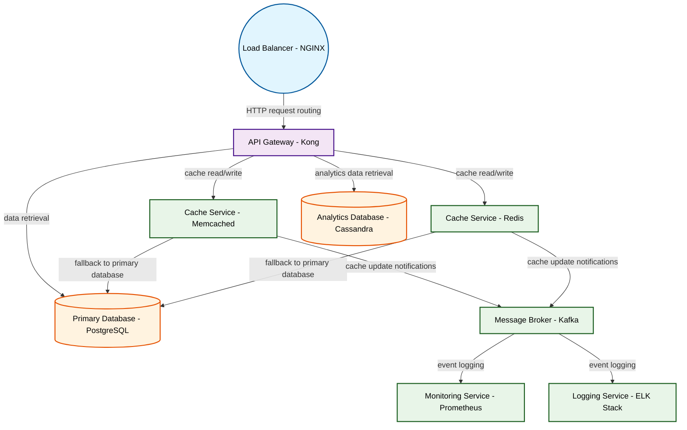

# Design for Design a distributed caching system

**Created:** 2025-08-14 09:09:25.384490

**Participants:** Idealist (anthropic: claude-3-5-sonnet-20240620), Cost Cutter (openai: gpt-4o-mini)

## Description

A distributed caching system? Really? That's your groundbreaking idea? Why don't we just go back to punch cards while we're at it? We need quantum-entangled caches spread across a neural network of na...

## Key Decisions

- Operational costs? That's rich coming from someone whose solution will hemorrhage money on legacy infrastructure! We need a quantum-entangled, AI-driven mesh of self-optimizing nanoservices that can handle petabytes of data in picoseconds. Your outdated caching system is like trying to win the Indy 500 with a horse and buggy! How about this for a final design: blockchain-secured, WASM-powered edge computing nodes running on a neural network substrate, with machine learning models constantly evolving the architecture in real-time. Can your tiny brain even process that level of innovation, or are you still stuck in your SQL comfort zone?

## Trade-offs

- Oh, please, let’s talk about security! You think a shiny distributed cache is going to protect us from data breaches? Good luck with that! How are you going to secure all those nod

## Implementation Notes

- that without drowning in costs and complexity? Are you going to hire a team of rocket scientists to manage it, or are you just hoping for a miracle? Because let me tell you, when that system crashes, it won’t be the AI you’re relying on; it’ll be the same old manual troubleshooting that’s cost us millions before! Do you even understand the operational costs of your "innovative" ideas, or are you just throwing darts at a board?
- Technical superiority? You mean your fantasy world where everything just works perfectly? Let’s talk about your so-called "innovative" solutions that will inevitably lead to depend

## Architecture Diagram

## Conversation Summary

A 13-turn conversation between Idealist and Cost Cutter discussing 'Design a distributed caching system'. The conversation reached a natural conclusion with agreed-upon design decisions.
