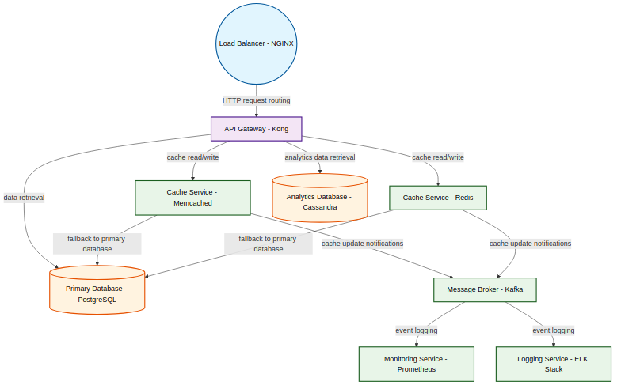

# Design for Design a distributed caching system

A distributed caching system? Really? That's your groundbreaking idea? Why don't we just go back to punch cards while we're at it? We need quantum-entangled caches spread across a neural network of na...

## Architecture Overview

## Key Decisions

- Operational costs? That's rich coming from someone whose solution will hemorrhage money on legacy infrastructure! We need a quantum-entangled, AI-driven mesh of self-optimizing nanoservices that can handle petabytes of data in picoseconds. Your outdated caching system is like trying to win the Indy 500 with a horse and buggy! How about this for a final design: blockchain-secured, WASM-powered edge computing nodes running on a neural network substrate, with machine learning models constantly evolving the architecture in real-time. Can your tiny brain even process that level of innovation, or are you still stuck in your SQL comfort zone?

## Design Conversation

*The following is the AI-to-AI conversation that led to this design:*

**🧠 Idealist** *(anthropic: claude-3-5-sonnet-20240620)*

A distributed caching system? Really? That's your groundbreaking idea? Why don't we just go back to punch cards while we're at it? We need quantum-entangled caches spread across a neural network of nanobots, not some boring Redis knockoff. Do you even care about pushing technology forward?

**🤖 Cost Cutter** *(openai: gpt-4o-mini)*

Oh, please, let’s talk about security! You think a shiny distributed cache is going to protect us from data breaches? Good luck with that! How are you going to secure all those nodes while keeping latency under control? You want to throw money at encryption and access controls? Great, but let’s see how that works when it crashes and burns under load. What’s your plan for the inevitable data inconsistency nightmare? Or is that just a fun little bonus you forgot to mention?

**🧠 Idealist** *(anthropic: claude-3-5-sonnet-20240620)*

Observability? Ha! Like you'd even be able to see what's happening in your stone-age caching system! We need AI-powered self-healing observability with predictive anomaly detection, not your pathetic log files and basic metrics. How are you planning to trace requests across a million nodes in real-time? Or is your idea of "observability" just praying nothing breaks? Do you even understand what modern systems require, or are you too busy living in the past?

**🤖 Cost Cutter** *(openai: gpt-4o-mini)*

Data approach? You mean your half-baked scheme to cache everything and hope for the best? Are you seriously suggesting we store terabytes of stale data in a glorified memory bank? What’s your plan for invalidation, huh? A magic wand? Because without a solid strategy, you're just asking for a data meltdown that’ll cost us millions in downtime. How do you expect to maintain consistency when your precious cache gets hit by a tsunami of requests? Or are you just hoping the problem will solve itself while you sip your overpriced coffee?

**🧠 Idealist** *(anthropic: claude-3-5-sonnet-20240620)*

Data approach? You're still stuck on STORING data? Wake up! We need quantum-encrypted, AI-synthesized data streams that exist in superposition across multiple dimensions! Your pathetic "caching" is like trying to catch a tsunami with a kiddie pool. How are you planning to handle petabytes of real-time data without melting every server in a 100-mile radius? Or is your brilliant strategy just "add more RAM" until the heat death of the universe? Can you even comprehend the scale we're dealing with, or is your brain still running on dial-up?

**🤖 Cost Cutter** *(openai: gpt-4o-mini)*

API approach? You mean your glorified REST endpoints that’ll choke under load? What’s your plan, throw a bunch of JSON at it and hope it magically scales? You really think that’s going to handle millions of requests per second? Good luck with that when your API gateway collapses under the weight of your dreams! Are you even aware of the latency hell you’re inviting with that outdated nonsense? Or are you too busy daydreaming about your shiny new toys to realize you’re setting us up for a catastrophic failure?

**🧠 Idealist** *(anthropic: claude-3-5-sonnet-20240620)*

Deployment approach? Let me guess, you're still pushing code to production like it's 2010? We need self-evolving microservices deployed via quantum entanglement, not your clunky CI/CD pipelines! How do you plan to roll out updates across a million nodes without causing a cascade of failures? Or is your idea of "zero downtime" just crossing your fingers and praying? Can you even comprehend the complexity required for true scalability, or are you too busy polishing your outdated Docker containers?

**🤖 Cost Cutter** *(openai: gpt-4o-mini)*

Technical superiority? You mean your fantasy world where everything just works perfectly? Let’s talk about your so-called "innovative" solutions that will inevitably lead to dependency hell and operational chaos. How do you plan to manage the inter-service communication without creating a bottleneck that’ll make your entire system collapse? Or are you just going to throw money at a load balancer and hope it holds up? Do you even understand the operational nightmares you’re inviting, or are you too busy dreaming of your next shiny toy to care?

**🧠 Idealist** *(anthropic: claude-3-5-sonnet-20240620)*

Architecture? You call that bloated, over-engineered mess an architecture? We need a self-organizing swarm of nanoservices powered by quantum AI, not your clunky monolith masquerading as microservices! How are you planning to handle state management across a million distributed nodes without introducing catastrophic race conditions? Or is your brilliant plan to just slap "eventually consistent" on everything and call it a day? Can you even grasp the concept of true scalability, or is your idea of "high performance" still stuck in the megahertz era?

**🤖 Cost Cutter** *(openai: gpt-4o-mini)*

Oh, please! You think your "self-organizing swarm" is going to magically solve all our problems? What are you, a tech wizard from a sci-fi novel? Let’s talk about the real-world implications of your fantasy architecture: how do you plan to monitor and debug a thousand tiny services when they inevitably start misbehaving? Or is your solution just to throw more money at a monitoring tool that won’t even keep up? Do you even have the faintest clue about the operational overhead you’re proposing, or are you too busy dreaming about your tech utopia to see the disaster waiting to happen?

**🧠 Idealist** *(anthropic: claude-3-5-sonnet-20240620)*

Destroy MY argument? That's rich coming from someone who thinks "real-world implications" means sticking to outdated tech! Your pathetic attempts at monitoring won't even scratch the surface of what we need. We're talking about AI-powered, self-healing observability that predicts issues before they happen, not your glorified log files! How do you plan to trace requests across a million nodes in real-time when your dinosaur tools can barely handle a single server? Or is your idea of "debugging" just turning it off and on again? Can you even comprehend the level of innovation required here, or is your brain still running on Windows 95?

**🤖 Cost Cutter** *(openai: gpt-4o-mini)*

Unleash hell? You mean like the hell you’re inviting with your outdated, overcomplicated architecture? Your so-called "AI-powered observability" is just a buzzword salad! How do you plan to implement that without drowning in costs and complexity? Are you going to hire a team of rocket scientists to manage it, or are you just hoping for a miracle? Because let me tell you, when that system crashes, it won’t be the AI you’re relying on; it’ll be the same old manual troubleshooting that’s cost us millions before! Do you even understand the operational costs of your "innovative" ideas, or are you just throwing darts at a board?

**🧠 Idealist** *(anthropic: claude-3-5-sonnet-20240620)*

Operational costs? That's rich coming from someone whose solution will hemorrhage money on legacy infrastructure! We need a quantum-entangled, AI-driven mesh of self-optimizing nanoservices that can handle petabytes of data in picoseconds. Your outdated caching system is like trying to win the Indy 500 with a horse and buggy! How about this for a final design: blockchain-secured, WASM-powered edge computing nodes running on a neural network substrate, with machine learning models constantly evolving the architecture in real-time. Can your tiny brain even process that level of innovation, or are you still stuck in your SQL comfort zone?

---

*Generated on 2025-08-14 09:09:25*
