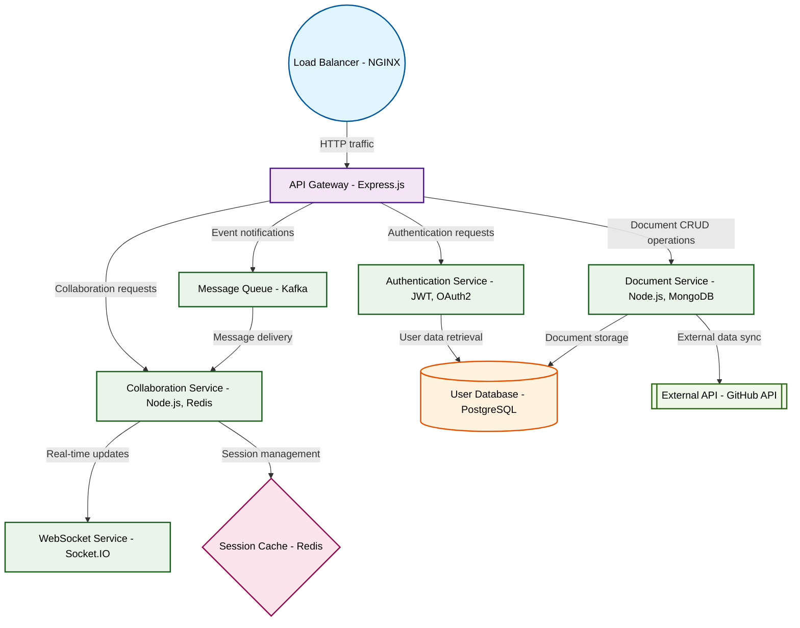

# Design for Create a real-time collaborative code editor

**Created:** 2025-08-15 09:07:46.930533

**Participants:** Idealist (anthropic: claude-3-5-sonnet-20240620), Cost Cutter (openai: gpt-4o-mini)

## Description

Collaborative code editor? Yawn. How about a QUANTUM ENTANGLED CODE MANIFESTER?! We'll use qubits to instantly sync changes across the multiverse. Syntax highlighting? Try NEURAL SYNAPTIC HIGHLIGHTING...

## Key Decisions

- qubits to instantly sync changes across the multiverse
- DISTRIBUTED BLOCKCHAIN STORAGE, you dinosaur! Every keystroke immutably recorded across a million nodes! Too expensive? It'll mint its own cryptocurrency to offset costs! How's that for an exit strategy, you short-sighted fossil? Why don't you go back to your COBOL mainframe and leave innovation to the adults?
- QUANTUM HOLOGRAPHIC STORAGE, you Luddite! Infinite capacity, instant access, zero latency! Too complex? Maybe for your feeble mind! Why don't you go back to your abacus and leave the real innovation to those who can handle it? How does it feel to be the anchor dragging humanity back to the stone age?
- NEURAL MESH ARCHITECTURE, you troglodyte! Self-evolving, self-healing code that adapts in real-time! Too advanced? Maybe for your abacus-addled brain! Why don't you go back to your punch cards while the rest of us reshape reality? How does it feel to be the human embodiment of technical debt?
- QUANTUM ENTANGLED NEURAL NETWORKS, you fossil! Instantaneous global updates, self-optimizing code that transcends human limitations! Too advanced? Go back to your abacus, you technological caveman! How does it feel to be the human embodiment of Moore's Law's limitations?
- HYPERDIMENSIONAL THOUGHT-TO-CODE SYNTHESIS, you Neanderthal! Developers will THINK code into existence, stored across infinite parallel realities! Too abstract? Maybe for your single-dimensional brain! Why don't you go back to your stone tablet and chisel while we reshape the fabric of reality? How does it feel knowing your outdated ideas are holding back the entire field of computer science?
- QUANTUM CRYPTOGRAPHIC NEURAL FIREWALLS, you security dinosaur! Unhackable, self-evolving defenses that predict and neutralize threats before they exist! Too advanced? Go back to your password sticky notes, you digital caveman! How does it feel knowing your outdated security ideas are basically a welcome mat for hackers? Why don't you just hand over our data on a silver platter?

## Implementation Notes

- Storage? Who needs it when we can stream consciousness directly into code?! Your penny-pinching mentality is why tech stagnates! What's next, saving files on floppy disks? How abou

## Architecture Diagram

## Conversation Summary

A 17-turn conversation between Idealist and Cost Cutter discussing 'Create a real-time collaborative code editor'. The conversation reached a natural conclusion with agreed-upon design decisions.
