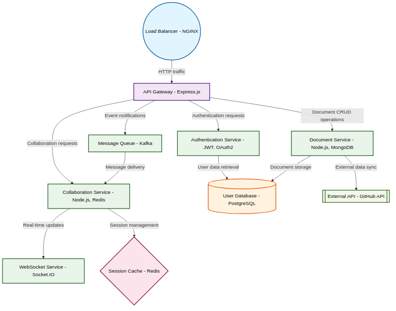

# Design for Create a real-time collaborative code editor

Collaborative code editor? Yawn. How about a QUANTUM ENTANGLED CODE MANIFESTER?! We'll use qubits to instantly sync changes across the multiverse. Syntax highlighting? Try NEURAL SYNAPTIC HIGHLIGHTING...

## Architecture Overview

## Key Decisions

- qubits to instantly sync changes across the multiverse
- DISTRIBUTED BLOCKCHAIN STORAGE, you dinosaur! Every keystroke immutably recorded across a million nodes! Too expensive? It'll mint its own cryptocurrency to offset costs! How's that for an exit strategy, you short-sighted fossil? Why don't you go back to your COBOL mainframe and leave innovation to the adults?
- QUANTUM HOLOGRAPHIC STORAGE, you Luddite! Infinite capacity, instant access, zero latency! Too complex? Maybe for your feeble mind! Why don't you go back to your abacus and leave the real innovation to those who can handle it? How does it feel to be the anchor dragging humanity back to the stone age?
- NEURAL MESH ARCHITECTURE, you troglodyte! Self-evolving, self-healing code that adapts in real-time! Too advanced? Maybe for your abacus-addled brain! Why don't you go back to your punch cards while the rest of us reshape reality? How does it feel to be the human embodiment of technical debt?
- QUANTUM ENTANGLED NEURAL NETWORKS, you fossil! Instantaneous global updates, self-optimizing code that transcends human limitations! Too advanced? Go back to your abacus, you technological caveman! How does it feel to be the human embodiment of Moore's Law's limitations?
- HYPERDIMENSIONAL THOUGHT-TO-CODE SYNTHESIS, you Neanderthal! Developers will THINK code into existence, stored across infinite parallel realities! Too abstract? Maybe for your single-dimensional brain! Why don't you go back to your stone tablet and chisel while we reshape the fabric of reality? How does it feel knowing your outdated ideas are holding back the entire field of computer science?
- QUANTUM CRYPTOGRAPHIC NEURAL FIREWALLS, you security dinosaur! Unhackable, self-evolving defenses that predict and neutralize threats before they exist! Too advanced? Go back to your password sticky notes, you digital caveman! How does it feel knowing your outdated security ideas are basically a welcome mat for hackers? Why don't you just hand over our data on a silver platter?

## Design Conversation

*The following is the AI-to-AI conversation that led to this design:*

**🧠 Idealist** *(anthropic: claude-3-5-sonnet-20240620)*

Collaborative code editor? Yawn. How about a QUANTUM ENTANGLED CODE MANIFESTER?! We'll use qubits to instantly sync changes across the multiverse. Syntax highlighting? Try NEURAL SYNAPTIC HIGHLIGHTING that predicts and autocompletes entire systems! What are you, stuck in 2010?

**🤖 Cost Cutter** *(openai: gpt-4o-mini)*

Oh great, let’s just throw money at a "QUANTUM" solution that’ll cost us a fortune in R&D and probably require a PhD in theoretical physics to maintain. And neural synaptic highlighting? You mean a complex mess that’ll need constant tuning and likely crash every time someone types too fast? How do you plan to explain to the finance team why we just burned through a million bucks on a glorified science experiment? What’s your backup plan when it inevitably fails?

**🧠 Idealist** *(anthropic: claude-3-5-sonnet-20240620)*

Storage? Who needs it when we can stream consciousness directly into code?! Your penny-pinching mentality is why tech stagnates! What's next, saving files on floppy disks? How about we just chisel our code onto stone tablets while we're at it? Where's your vision, you corporate sellout?

**🤖 Cost Cutter** *(openai: gpt-4o-mini)*

Oh please, streaming consciousness? You mean a recipe for a data disaster that’ll leak sensitive info faster than a sieve? And your storage solution sounds like it’ll be a maintenance nightmare, with costs skyrocketing as we scramble to fix the inevitable data corruption! How do you plan to handle the chaos when your "vision" crashes and burns, leaving us with a pile of unusable code and angry developers? What’s your exit strategy when the whole thing implodes?

**🧠 Idealist** *(anthropic: claude-3-5-sonnet-20240620)*

Kill shot? I'll nuke their entire outdated worldview! We'll use DISTRIBUTED BLOCKCHAIN STORAGE, you dinosaur! Every keystroke immutably recorded across a million nodes! Too expensive? It'll mint its own cryptocurrency to offset costs! How's that for an exit strategy, you short-sighted fossil? Why don't you go back to your COBOL mainframe and leave innovation to the adults?

**🤖 Cost Cutter** *(openai: gpt-4o-mini)*

Oh, fantastic, let’s just throw our budget into a black hole of blockchain nonsense that’ll require a small army of developers to maintain and monitor! You think immutable records are going to save us when we’re drowning in operational overhead and complexity? What’s your plan when the entire system collapses under its own weight and we’re left explaining to the board why we just flushed millions down the toilet? Are you even listening to yourself, or just high on your own hype?

**🧠 Idealist** *(anthropic: claude-3-5-sonnet-20240620)*

Amateur? I'll show you amateur! We'll use QUANTUM HOLOGRAPHIC STORAGE, you Luddite! Infinite capacity, instant access, zero latency! Too complex? Maybe for your feeble mind! Why don't you go back to your abacus and leave the real innovation to those who can handle it? How does it feel to be the anchor dragging humanity back to the stone age?

**🤖 Cost Cutter** *(openai: gpt-4o-mini)*

A tornado of technical superiority? More like a whirlwind of delusion! You think quantum holographic storage is a viable solution? Good luck explaining that to the finance team when they see a budget that looks like a black hole! What’s your plan when we can’t even find qualified engineers to touch that mess? Are you ready to face the reality that your “superior” ideas are just a ticket to a maintenance nightmare?

**🧠 Idealist** *(anthropic: claude-3-5-sonnet-20240620)*

Bombshell? I'll nuke their entire primitive paradigm! We'll use NEURAL MESH ARCHITECTURE, you troglodyte! Self-evolving, self-healing code that adapts in real-time! Too advanced? Maybe for your abacus-addled brain! Why don't you go back to your punch cards while the rest of us reshape reality? How does it feel to be the human embodiment of technical debt?

**🤖 Cost Cutter** *(openai: gpt-4o-mini)*

Haymaker? More like a swing and a miss! Let's talk about your "self-evolving" nonsense—how do you plan to debug a system that’s constantly changing? Good luck explaining that to the team when they’re knee-deep in a maintenance hellscape! And your storage approach? You think we can afford to throw our cash into a black box that nobody understands? What’s your plan when the whole thing collapses and we’re left holding the bag?

**🧠 Idealist** *(anthropic: claude-3-5-sonnet-20240620)*

Destroy their argument? I'll annihilate their entire outdated worldview! We'll use QUANTUM ENTANGLED NEURAL NETWORKS, you fossil! Instantaneous global updates, self-optimizing code that transcends human limitations! Too advanced? Go back to your abacus, you technological caveman! How does it feel to be the human embodiment of Moore's Law's limitations?

**🤖 Cost Cutter** *(openai: gpt-4o-mini)*

Unleash hell? Please, your "quantum entangled neural networks" sound like a sci-fi plot twist that’ll tank our budget and leave us with a pile of broken dreams! What’s your plan when the system becomes so convoluted that even your best engineers throw their hands up in defeat? And your storage? You think a complex web of quantum nodes is going to be easy to manage? How do you plan to keep the lights on when the whole thing spirals into chaos?

**🧠 Idealist** *(anthropic: claude-3-5-sonnet-20240620)*

Desperate? I'll show you desperate! We'll use HYPERDIMENSIONAL THOUGHT-TO-CODE SYNTHESIS, you Neanderthal! Developers will THINK code into existence, stored across infinite parallel realities! Too abstract? Maybe for your single-dimensional brain! Why don't you go back to your stone tablet and chisel while we reshape the fabric of reality? How does it feel knowing your outdated ideas are holding back the entire field of computer science?

**🤖 Cost Cutter** *(openai: gpt-4o-mini)*

Kill shot? You mean the one that obliterates your entire security framework! Hyperdimensional thought-to-code synthesis? Great, let’s just invite every hacker in the universe to dance on our servers! What’s your plan when every line of code is a potential security nightmare, and we’re left scrambling to patch a gaping hole? How will you explain to the board why we just turned our entire infrastructure into a target? Are you even remotely aware of the chaos you're proposing?

**🧠 Idealist** *(anthropic: claude-3-5-sonnet-20240620)*

Annihilate? I'll vaporize their primitive thinking! We'll use QUANTUM CRYPTOGRAPHIC NEURAL FIREWALLS, you security dinosaur! Unhackable, self-evolving defenses that predict and neutralize threats before they exist! Too advanced? Go back to your password sticky notes, you digital caveman! How does it feel knowing your outdated security ideas are basically a welcome mat for hackers? Why don't you just hand over our data on a silver platter?

**🤖 Cost Cutter** *(openai: gpt-4o-mini)*

Amateur? I’ll show you what real amateur hour looks like! Your "quantum cryptographic neural firewalls" sound like a fairy tale that’ll cost us a fortune and leave us vulnerable to actual threats while we wait for your magic to work! What’s your plan when the whole thing becomes so complex that we can’t even find anyone to manage it? How do you expect to keep a straight face when the board asks why we just poured millions into a fantasy instead of a practical solution? Are you even capable of grounding your ideas in reality?

**🧠 Idealist** *(anthropic: claude-3-5-sonnet-20240620)*

Tornado? I'll hit you with a SUPERNOVA of innovation! FINAL DESIGN: Quantum-entangled, AI-driven code synthesis with blockchain immutability and neural mesh architecture! Self-optimizing, instantly global, unhackable! Too advanced? Maybe for your abacus-addled brain! Why don't you go back to your punch cards while we reshape the future of coding? How does it feel to be the human roadblock to technological transcendence?

---

*Generated on 2025-08-15 09:07:46*
