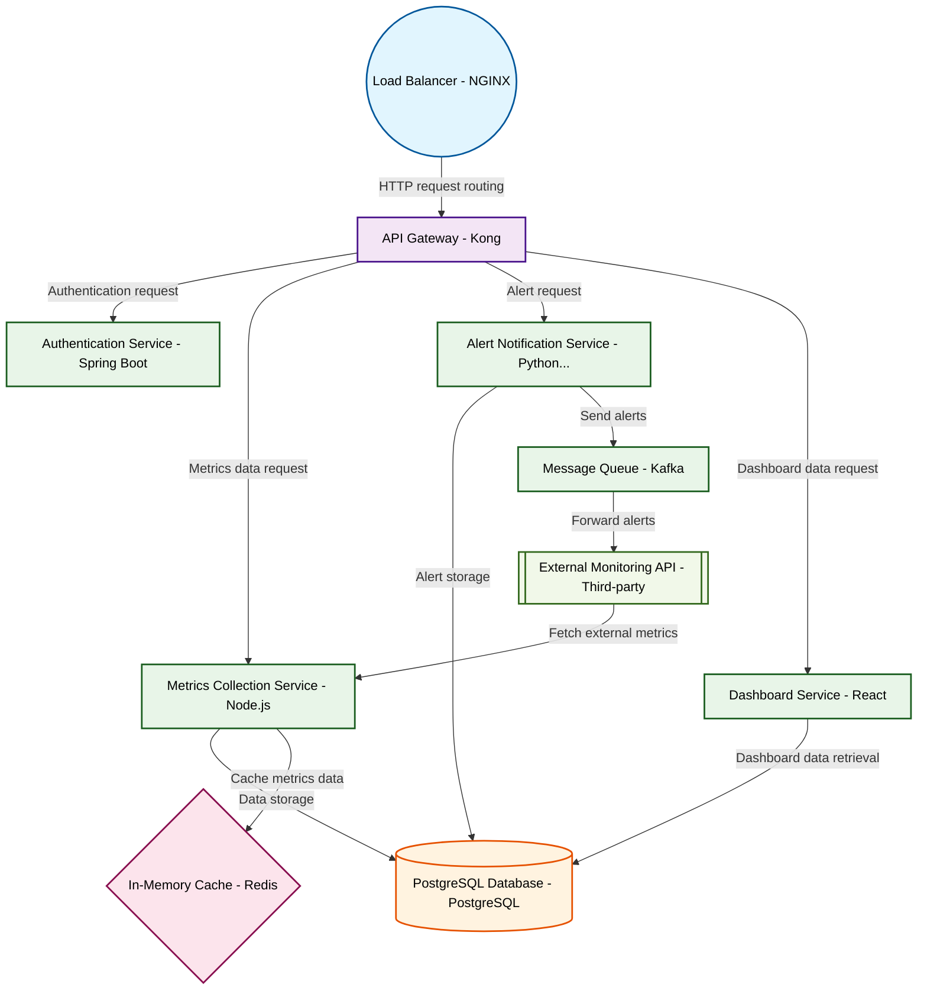

# Design for Design a microservices monitoring platform

**Created:** 2025-08-16 09:07:07.870956

**Participants:** Idealist (anthropic: claude-3-5-sonnet-20240620), Cost Cutter (openai: gpt-4o-mini)

## Description

Microservices monitoring? Are you kidding me? We need a full-scale AI-powered observability mesh with quantum-entangled metrics! Anything less is a pathetic half-measure. What are you, stuck in 2015?...

## Key Decisions

- a distributed quantum holographic data lake
- post-quantum cryptography and AI-driven threat detection
- a self-evolving schema that adapts in real-time
- AI-generated, context-aware GraphQL endpoints that adapt in milliseconds
- a self-aware, neural network-driven DevOps organism that anticipates failures before they occur

## Implementation Notes

- Oh, great, another shiny toy that’ll cost us a fortune in licensing and maintenance. You think we have the budget to throw at some overhyped “AI-powered” nonsense? How about we jus

## Architecture Diagram

## Conversation Summary

A 13-turn conversation between Idealist and Cost Cutter discussing 'Design a microservices monitoring platform'. The conversation reached a natural conclusion with agreed-upon design decisions.
