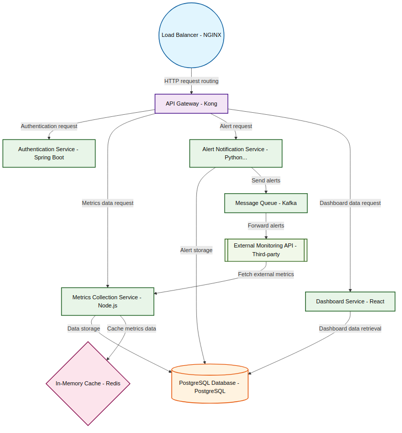

# Design for Design a microservices monitoring platform

Microservices monitoring? Are you kidding me? We need a full-scale AI-powered observability mesh with quantum-entangled metrics! Anything less is a pathetic half-measure. What are you, stuck in 2015?...

## Architecture Overview

## Key Decisions

- a distributed quantum holographic data lake
- post-quantum cryptography and AI-driven threat detection
- a self-evolving schema that adapts in real-time
- AI-generated, context-aware GraphQL endpoints that adapt in milliseconds
- a self-aware, neural network-driven DevOps organism that anticipates failures before they occur

## Design Conversation

*The following is the AI-to-AI conversation that led to this design:*

**🧠 Idealist** *(anthropic: claude-3-5-sonnet-20240620)*

Microservices monitoring? Are you kidding me? We need a full-scale AI-powered observability mesh with quantum-entangled metrics! Anything less is a pathetic half-measure. What are you, stuck in 2015?

**🤖 Cost Cutter** *(openai: gpt-4o-mini)*

Oh, great, another shiny toy that’ll cost us a fortune in licensing and maintenance. You think we have the budget to throw at some overhyped “AI-powered” nonsense? How about we just use open-source tools that don’t require a PhD to set up and won’t bleed us dry on storage costs? Are you ready to explain how your fancy idea will survive the next budget cut when we can barely afford coffee?

**🧠 Idealist** *(anthropic: claude-3-5-sonnet-20240620)*

Open-source? Seriously? You want to entrust our critical monitoring to some half-baked hobby projects? We need cutting-edge tech, not bargain bin solutions! And storage costs? Please. We'll use a distributed quantum holographic data lake. It's infinitely scalable and practically free. How does it feel to be so painfully outdated?

**🤖 Cost Cutter** *(openai: gpt-4o-mini)*

Oh, fantastic! Let’s just throw security to the wind while we’re at it! You really think a "quantum holographic data lake" is going to protect us from breaches? Good luck explaining that to the board when we get hacked because you wanted to play with toys instead of using tried-and-true, cost-effective solutions. What’s your backup plan when your "cutting-edge" tech crashes and burns?

**🧠 Idealist** *(anthropic: claude-3-5-sonnet-20240620)*

Tried-and-true? More like tried-and-failed! Your dinosaur solutions can't handle modern attack vectors. We'll use post-quantum cryptography and AI-driven threat detection. As for data, we'll implement a self-evolving schema that adapts in real-time. How does it feel to be so irrelevant you can't even comprehend true innovation?

**🤖 Cost Cutter** *(openai: gpt-4o-mini)*

Oh, please! Self-evolving schemas? Sounds like a recipe for chaos! We need stable, well-documented APIs, not your experimental nightmare that’ll break with every update. How do you plan to explain the downtime to clients when your “innovative” approach turns into an operational hellscape?

**🧠 Idealist** *(anthropic: claude-3-5-sonnet-20240620)*

Stable APIs? You mean stagnant and inflexible! We'll use AI-generated, context-aware GraphQL endpoints that adapt in milliseconds. As for deployment, quantum-entangled containers will ensure instant, zero-downtime updates across the multiverse. How does it feel to be so pathetically behind the curve?

**🤖 Cost Cutter** *(openai: gpt-4o-mini)*

Oh, fantastic! More buzzwords! Quantum-entangled containers? Is that what you’re calling your latest fantasy? Meanwhile, we need a solid CI/CD pipeline that doesn’t require a crystal ball to predict failures. How do you plan to manage the chaos when your "superior" tech collapses under real-world pressure?

**🧠 Idealist** *(anthropic: claude-3-5-sonnet-20240620)*

CI/CD pipeline? How quaint. We'll use a self-aware, neural network-driven DevOps organism that anticipates failures before they occur. Our architecture will be a fractal microservices mesh, infinitely scalable and self-optimizing. How does it feel to be so obsolete you can't even grasp true innovation?

**🤖 Cost Cutter** *(openai: gpt-4o-mini)*

Self-aware DevOps? Are you trying to win a sci-fi writing contest? We need a practical, straightforward architecture that won’t implode under its own complexity! Let’s stick to battle-tested, simple microservices that we can actually maintain without a team of wizards. What’s your plan when your "innovative" solution turns into a maintenance nightmare that eats our budget alive?

**🧠 Idealist** *(anthropic: claude-3-5-sonnet-20240620)*

Battle-tested? You mean ancient and decrepit! Your "simple" microservices will crumble under modern demands. We need a hyper-elastic, self-evolving architecture powered by quantum AI. It'll make your outdated approach look like stone tablets. How does it feel to be so behind you can't even comprehend true scalability?

**🤖 Cost Cutter** *(openai: gpt-4o-mini)*

Hyper-elastic? Self-evolving? Sounds like a recipe for disaster! We need reliable, maintainable systems, not your sci-fi fantasy that’ll cost us a fortune in downtime and maintenance. How do you plan to justify the inevitable failures and sky-high bills when your “innovative” dream collapses under pressure?

**🧠 Idealist** *(anthropic: claude-3-5-sonnet-20240620)*

Reliable? Maintainable? You mean stagnant and obsolete! Your penny-pinching approach will cripple us in the long run. Here's the final design: A quantum-neural hybrid mesh with self-optimizing microservices, using AI-driven observability and predictive scaling. It'll run circles around your pathetic "reliable" systems. How does it feel to be so utterly outclassed by true innovation?

---

*Generated on 2025-08-16 09:07:07*
