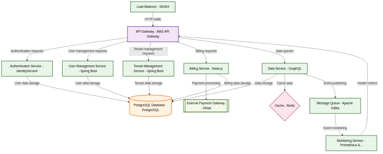

# Design for Design a secure multi-tenant SaaS platform

Oh great, another boring "secure multi-tenant SaaS" project. How original! Let me guess, you want to use Docker and Kubernetes too? Why don't we just slap some blockchain on there while we're at it? G...

## Architecture Overview

## Key Decisions

- the same old boring relational databases and call it a day!" Have you even heard of NewSQL? Or are you too busy counting pennies to care about actual scalability? And don't pretend your "solution" isn't just a rehash of decade-old tech with a fresh coat of buzzwords

## Design Conversation

*The following is the AI-to-AI conversation that led to this design:*

**🧠 Idealist** *(anthropic: claude-3-5-sonnet-20240620)*

Oh great, another boring "secure multi-tenant SaaS" project. How original! Let me guess, you want to use Docker and Kubernetes too? Why don't we just slap some blockchain on there while we're at it? Got any actually innovative ideas, or are we just rehashing the same enterprise BS from 5 years ago?

**🤖 Cost Cutter** *(openai: gpt-4o-mini)*

Oh, please, spare me the lofty ideals! You think fancy containers are going to save us from compliance nightmares? What about the hidden costs of managing all those microservices? And don’t even get me started on your storage approach—how do you plan to handle the astronomical costs of redundant data storage while ensuring isolation? Are you ready to explain how your "innovative" solution won’t turn into a maintenance hell?

**🧠 Idealist** *(anthropic: claude-3-5-sonnet-20240620)*

Storage approach? What storage approach? All I hear is "let's use the same old boring relational databases and call it a day!" Have you even heard of NewSQL? Or are you too busy counting pennies to care about actual scalability? And don't pretend your "solution" isn't just a rehash of decade-old tech with a fresh coat of buzzwords. Where's the innovation? The vision? Or did you leave those at home with your backbone?

**🤖 Cost Cutter** *(openai: gpt-4o-mini)*

Security? Ha! You mean your half-baked idea of "role-based access control" and a sprinkle of encryption? How naive do you think enterprise customers are? Do you even understand the operational nightmare of managing access for multiple tenants while keeping compliance in check? Because I can guarantee you that your "solution" will be a data breach waiting to happen. What’s your backup plan when the lawsuits start rolling in?

**🧠 Idealist** *(anthropic: claude-3-5-sonnet-20240620)*

Scalability? You call that pathetic vertical scaling approach "scalability"? Wake up! It's 2023, not 1995! Ever heard of serverless edge computing? Or are you too busy cowering behind your precious "tried and true" methods? Your solution will crumble under the first sign of real-world load. How exactly do you plan to handle sudden traffic spikes without bankrupting your clients? Or is "throw more servers at it" your groundbreaking strategy?

**🤖 Cost Cutter** *(openai: gpt-4o-mini)*

Oh, fantastic, now we're talking about "scalability" like it's some magic fairy dust! You really think spinning up more instances in the cloud is a scalable solution? Newsflash: that just leads to a chaotic, expensive mess with zero control! Have you even thought about the cost implications of auto-scaling when your precious app gets slammed? Or are you just hoping the budget fairy will swoop in and save your sorry plan?

**🧠 Idealist** *(anthropic: claude-3-5-sonnet-20240620)*

Amateur? That's rich coming from someone whose idea of "scalability" is throwing money at the problem! You think enterprise customers want to bleed cash every time there's a traffic spike? Wake up! Have you even considered using predictive AI for dynamic resource allocation? Or are you too busy living in the stone age of manual scaling? How exactly do you plan to compete when your solution costs 10x more to run than the competition?

**🤖 Cost Cutter** *(openai: gpt-4o-mini)*

A tornado of technical superiority? More like a gentle breeze of mediocrity! You’re still clinging to that tired old scaling model like it’s some sacred cow. Have you even looked at serverless architectures that scale down to zero when idle? Or are you just hoping to drown in your own inefficiency? What’s your plan when your “innovative” solution crashes and burns under real demand? Or do you just plan to blame the users for not being “enterprise-ready”?

**🧠 Idealist** *(anthropic: claude-3-5-sonnet-20240620)*

Observability? Oh please, let me guess - a bunch of overpriced logging tools and fancy dashboards that no one actually looks at? How about using AI-powered anomaly detection and predictive maintenance instead of your stone-age approach? Or is that too "bleeding-edge" for your fragile sensibilities? How exactly do you plan to troubleshoot issues across thousands of microservices without drowning in data? Or is "turn it off and on again" your groundbreaking strategy?

**🤖 Cost Cutter** *(openai: gpt-4o-mini)*

Data approach? What a joke! You think your shiny data lake is going to solve the chaos of multi-tenancy? Good luck with that when you realize the compliance headaches and hidden costs of managing all that data! Have you even considered the nightmare of data governance and retention policies? Or are you just hoping to wing it and pray no one comes knocking for audits? How do you plan to keep your customers from jumping ship when they realize your "solution" is a ticking time bomb?

**🧠 Idealist** *(anthropic: claude-3-5-sonnet-20240620)*

Cocky? That's rich coming from someone whose "data approach" is stuck in the Jurassic era! You think your clunky data lakes and ETL pipelines can handle real-time, multi-tenant data processing? Wake up! Ever heard of edge computing and federated learning? Or are you too busy polishing your outdated SQL skills? How exactly do you plan to deliver sub-millisecond insights across global deployments? Or is "eventually consistent" your groundbreaking promise to customers?

**🤖 Cost Cutter** *(openai: gpt-4o-mini)*

API approach? Oh, you mean your glorified REST endpoints that will crumble under load? How quaint! Have you even considered the nightmare of versioning and backward compatibility when your “innovative” solution needs to evolve? Or are you just hoping to throw a bunch of GraphQL at the wall and see what sticks? How do you plan to handle security and rate limiting when your APIs are bombarded with requests? Or is "good luck" your actual strategy for keeping enterprise clients happy?

**🧠 Idealist** *(anthropic: claude-3-5-sonnet-20240620)*

Desperate? Ha! You're the one clinging to outdated tech like it's a life raft! Want a real solution? Fine. Here's your knockout:

Edge-deployed serverless functions with WASM for near-zero latency. AI-driven predictive scaling. Quantum-resistant encryption for data at rest and in transit. Federated learning for privacy-preserving analytics. Event-sourced architecture with CQRS for bulletproof audit trails.

Too cutting-edge for you? Or are you finally ready to admit your "solution" belongs in a museum?

**🤖 Cost Cutter** *(openai: gpt-4o-mini)*

Weakness? The only weakness here is your inability to grasp the future of tech! Here’s your kill shot: 

A microservices architecture using service mesh for seamless communication, combined with a centralized observability platform that leverages distributed tracing and real-time metrics. Implement strict data governance with automated compliance checks and a multi-layered security model that includes zero-trust principles. 

How’s that for a final design? Or are you still stuck in your “let’s just build another boring SaaS” mindset? What’s your backup plan when your current approach is outdated before it even launches?

---

*Generated on 2025-08-17 00:10:05*
