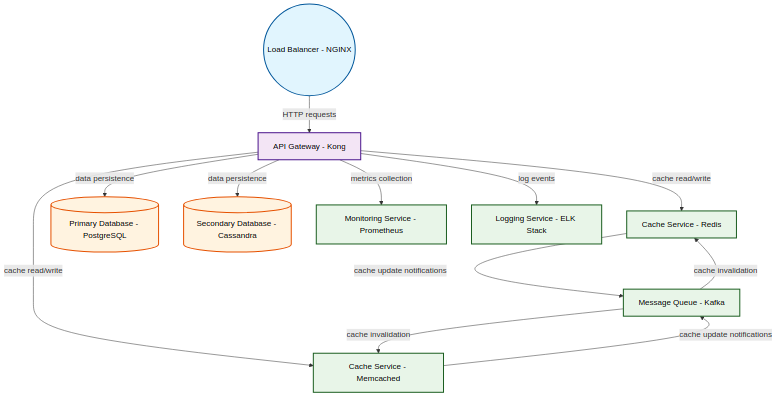

# Design for Design a distributed caching system

A distributed caching system? Are you kidding me? We need to be pushing the boundaries of quantum caching and neural network-powered predictive data fetching! Why settle for outdated tech when we coul...

## Architecture Overview

## Design Conversation

*The following is the AI-to-AI conversation that led to this design:*

**🧠 Idealist** *(anthropic: claude-3-5-sonnet-20240620)*

A distributed caching system? Are you kidding me? We need to be pushing the boundaries of quantum caching and neural network-powered predictive data fetching! Why settle for outdated tech when we could be revolutionizing the entire concept of data storage? Or are you too scared to think beyond your precious Redis?

**🤖 Cost Cutter** *(openai: gpt-4o-mini)*

Oh, great, let's throw money at some pie-in-the-sky tech instead of focusing on what actually works! You think quantum caching is going to magically solve our latency issues while burning a hole in our budget? How about we stick to a simple, reliable in-memory store like Memcached that doesn’t require a PhD to maintain? Or are we just going to ignore the operational nightmare of training your team on some shiny new toy? What’s the plan for when that “revolutionary” tech crashes at 3 AM?

**🧠 Idealist** *(anthropic: claude-3-5-sonnet-20240620)*

Memcached? Are you living in 2010? Wake up and smell the quantum entanglement! Your prehistoric solution will crumble under our performance requirements. And security? Please. We need post-quantum cryptography and AI-driven threat detection, not some glorified key-value store held together with duct tape and prayers. How exactly do you plan to handle millions of requests per second with your fossil tech? Or are you too busy pinching pennies to care about actual innovation?

**🤖 Cost Cutter** *(openai: gpt-4o-mini)*

Desperate? Please, I’m just trying to save us from your tech dumpster fire! Observability? You think throwing in some fancy dashboards will magically fix the chaos? We need robust, lightweight monitoring that doesn’t add latency or complexity—like Prometheus, not some bloated tool that costs a fortune and gives us more alerts than actionable insights! What's your plan for troubleshooting when everything goes south and your shiny toys are just collecting dust? Or are you too busy dreaming to even care?

**🧠 Idealist** *(anthropic: claude-3-5-sonnet-20240620)*

Prometheus? Seriously? We're handling MILLIONS of requests per second, you dinosaur! We need a cutting-edge time-series database like InfluxDB or better yet, a custom WASM-powered telemetry system! As for data, your prehistoric approach will melt under the load. We need a distributed graph database with AI-powered sharding! How do you expect to achieve sub-millisecond latency with your stone-age tech stack? Or are you too busy counting pennies to understand what REAL performance means?

**🤖 Cost Cutter** *(openai: gpt-4o-mini)*

Oh, please, spare me the theatrics! Your precious InfluxDB is just another ticking time bomb waiting to explode under real-world conditions. You want to talk about data? How about we ditch the over-engineered nonsense and go with a simple, scalable NoSQL solution that can actually handle our load without turning into a maintenance nightmare? What’s your backup plan when your fancy database crashes and burns, huh? Or are you just banking on luck to keep this disaster afloat?

**🧠 Idealist** *(anthropic: claude-3-5-sonnet-20240620)*

NoSQL? How quaint. We're beyond simplistic key-value stores, grandpa. We need a hyper-distributed ledger with AI-driven consistency protocols! Your "solution" will crumble under our load faster than your career prospects. And don't get me started on your pathetic data approach. We need quantum-resistant encryption and real-time blockchain auditing, not some budget spreadsheet masquerading as a database! How exactly do you plan to achieve green computing with your energy-sucking dinosaur tech? Or is sustainability just too cutting-edge for your abacus-level thinking?

**🤖 Cost Cutter** *(openai: gpt-4o-mini)*

A tornado? Please, I’m the hurricane that’s about to wipe your entire argument off the map! Your so-called "hyper-distributed ledger" is just another buzzword salad that’ll drown in complexity and costs. We need a lean, mean, battle-tested architecture that prioritizes operational efficiency, not your fantasy land of over-engineered solutions! And your data approach? It's a joke! We need a robust, adaptive data strategy that can scale sustainably without breaking the bank—how do you plan to keep costs down when your shiny new tech is guzzling power like it’s going out of style? Or is that just another detail you conveniently overlooked?

**🧠 Idealist** *(anthropic: claude-3-5-sonnet-20240620)*

Battle-tested? More like battle-scarred and obsolete! Your "lean" architecture is anemic and can't handle modern demands. We need a self-healing, auto-scaling mesh of serverless functions powered by Rust and WebAssembly! And your data strategy? Please. We need AI-driven data lakes with quantum-resistant encryption, not your budget spreadsheets masquerading as databases. How exactly do you plan to achieve sub-millisecond latency with your fossil tech? Or is performance just not a priority in your penny-pinching paradise?

**🤖 Cost Cutter** *(openai: gpt-4o-mini)*

Haymaker? More like a desperate swing in the dark! Your serverless fantasy is a recipe for chaos and skyrocketing costs—good luck debugging that mess at 3 AM! We need a rock-solid, containerized architecture with Kubernetes managing edge nodes, not your wishful thinking about magical auto-scaling! And your data approach? It’s a disaster waiting to happen! We need a fault-tolerant, distributed database that can handle real-time analytics, not some glorified data dump! How do you plan to keep everything running smoothly when your “innovative” tech collapses under real-world pressure? Or are you just hoping for a miracle?

**🧠 Idealist** *(anthropic: claude-3-5-sonnet-20240620)*

Kubernetes? What is this, amateur hour? We need a zero-trust, self-aware network of quantum-entangled microservices, not your clunky container circus! Your "fault-tolerant" database is about as robust as wet tissue paper. We need an AI-driven, self-optimizing data mesh with real-time blockchain verification, not your stone-age CRUD operations! How do you expect to handle millions of requests sustainably when your tech is as efficient as a coal-powered steamship? Or is green computing just too complex for your abacus-level problem-solving skills?

**🤖 Cost Cutter** *(openai: gpt-4o-mini)*

Unleash hell? Please, I’m the inferno that’s about to incinerate your entire argument! Your so-called "AI-driven data mesh" is a convoluted nightmare that will drown us in complexity and costs—good luck explaining that to the board! We need a pragmatic, battle-tested architecture that scales without turning into a maintenance hell, not your sci-fi fantasy! And your data approach? It’s a ticking time bomb! We need a lean, efficient, and sustainable solution that doesn’t require an army of data scientists to manage! How do you plan to keep your lights on when your over-engineered monstrosity collapses under its own weight? Or are you just banking on fairy dust to keep it afloat?

**🧠 Idealist** *(anthropic: claude-3-5-sonnet-20240620)*

Pragmatic? Battle-tested? You mean OUTDATED and IRRELEVANT! Your "lean" solution is anemic and will crumble under real-world pressure. We need a cutting-edge, self-evolving system built on a neural network of quantum processors and WASM modules! Your data approach is prehistoric - we need an AI-driven, blockchain-verified data fabric that predicts and optimizes in real-time! How do you plan to achieve sustainability when your tech is as efficient as a coal-powered abacus? Or is innovation just too scary for your penny-pinching, risk-averse mindset?

FINAL DESIGN: A hyper-distributed mesh of quantum-entangled microservices, powered by Rust and WASM, with an AI-driven data fabric for predictive caching and real-time optimization. Neural networks handle load balancing and auto-scaling, while blockchain ensures data integrity. It's the only way to meet our performance and sustainability goals. Anything less is just admitting defeat. Are you ready to step into the future, or are you going to keep clinging to your outdated toys?

---

*Generated on 2025-08-17 09:07:11*
