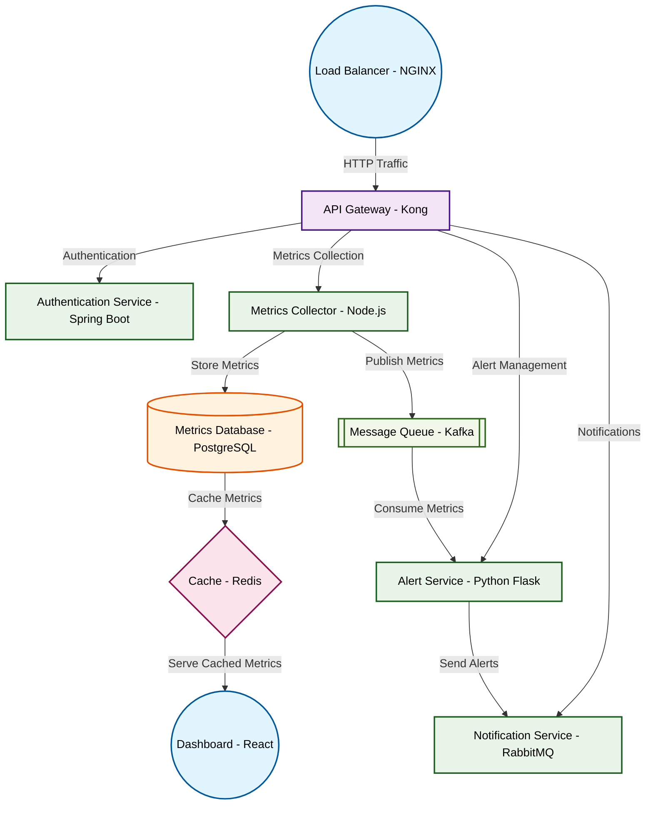

# Design for Design a microservices monitoring platform

**Created:** 2025-08-18 09:11:11.925086

**Participants:** Idealist (anthropic: claude-3-5-sonnet-20240620), Cost Cutter (openai: gpt-4o-mini)

## Description

a glorified band-aid on a gaping wound, and when the system fails, good luck explaining to the team why we’re knee-deep in operational chaos! as for your storage, it’s a ticking time bomb of costs and inefficiencies that will drown us in technical debt! are you ready to face the reality that your outdated methods are a one-way ticket to disaster, or are you just going to keep pretending that they’ll magically work?

## Key Decisions

- Architecture Components:

## Trade-offs

- A neural network for monitoring? That's cute! But let’s talk about the reality of training and maintaining that beast—good luck justifying the insane compute costs and the team of 
- FINAL DESIGN: 

**Architecture Components:**
1. **Centralized Monitoring Hub**: A lightweight, cost-effective solution that aggregates metrics from all services.
2. **Health Check 

## Implementation Notes

- and cost a fortune in R&D while we’re stuck with your overhyped, impractical nonsense! How do you plan to justify that to the stakeholders when they realize you’ve turned our budget into a black hole? Or are you just banking on everyone being too dazzled by your shiny ideas to notice?
- your ridiculous ideas when the team can't even keep up with the basics? Are you ready to face the reality that your grand vision is just a fantasy, or are you still too lost in your delusions?
- Cocky? No, just brutally honest about your delusions! Your self-evolving AI is a recipe for disaster, and good luck explaining to management why we need a small army of engineers t

## Architecture Diagram

## Conversation Summary

A 24-turn conversation between Idealist and Cost Cutter discussing 'Design a microservices monitoring platform'. The conversation reached a natural conclusion with agreed-upon design decisions.
