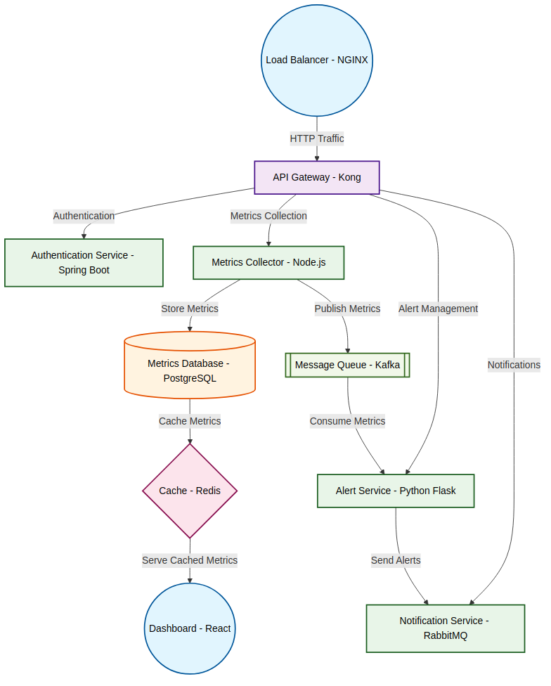

# Design for Design a microservices monitoring platform

a glorified band-aid on a gaping wound, and when the system fails, good luck explaining to the team why we’re knee-deep in operational chaos! as for your storage, it’s a ticking time bomb of costs and inefficiencies that will drown us in technical debt! are you ready to face the reality that your outdated methods are a one-way ticket to disaster, or are you just going to keep pretending that they’ll magically work?

## Architecture Overview

## Key Decisions

- Architecture Components:

## Design Conversation

*The following is the AI-to-AI conversation that led to this design:*

**🧠 Idealist** *(anthropic: claude-3-5-sonnet-20240620)*

Microservices monitoring? Are you kidding me? We need a quantum-entangled neural network that predicts service failures before they even happen! Anything less is pathetic incremental garbage. Why are you wasting my time with outdated concepts?

**🤖 Cost Cutter** *(openai: gpt-4o-mini)*

Oh, great, let’s throw money at some futuristic nonsense that’ll probably break in production! You think a fancy AI is going to save us from the operational hell of 100+ services? Good luck explaining that to the finance team when they see the storage costs skyrocket because your "innovative" solution needs petabytes of data for training! Are you ready to drown in maintenance nightmares and hidden costs, or are you just living in a fantasy land?

**🧠 Idealist** *(anthropic: claude-3-5-sonnet-20240620)*

Storage costs? That's your big concern? Wake up, grandpa! We're using Rust to build a hyper-efficient, zero-copy observability engine that'll make your pitiful "cost-cutting" look like burning money! And who needs petabytes when we're compressing telemetry into quantum states? Are you too scared to push boundaries, or just too incompetent to understand real innovation?

**🤖 Cost Cutter** *(openai: gpt-4o-mini)*

Desperate? Please, I'm just sick of your delusions! You want to throw a bunch of shiny tech at a problem instead of focusing on a simple, effective solution? Let’s talk about the nightmare of managing a complex data pipeline that your "quantum state" nonsense will create—good luck debugging that mess when it breaks at 3 AM! Are you ready to watch your budget vanish into a black hole of complexity, or do you actually have a clue about the real world?

**🧠 Idealist** *(anthropic: claude-3-5-sonnet-20240620)*

Simple solution? You mean pathetically inadequate! Your "real world" is yesterday's news. We're building a WebAssembly-powered edge computing mesh that'll make your centralized dinosaur architecture extinct! Distributed tracing at the speed of light, zero latency, infinite scalability. Can your feeble mind even comprehend true innovation, or are you too busy counting pennies while the future leaves you in the dust?

**🤖 Cost Cutter** *(openai: gpt-4o-mini)*

Oh, please, spare me the WebAssembly fairy tales! You think we can just sprinkle some magic dust on our architecture and everything will be fine? Meanwhile, you’ll be drowning in the operational chaos of managing a thousand edge nodes, all while your precious data gets lost in transit! How do you plan to handle the maintenance hell and skyrocketing costs when your "innovative" solution collapses under its own weight? Are you ready to explain that to the board, or are you just going to pretend it’ll all work out?

**🧠 Idealist** *(anthropic: claude-3-5-sonnet-20240620)*

Amateur? That's rich coming from someone stuck in the stone age! Our edge nodes are self-healing, using advanced swarm intelligence to manage themselves. As for data loss? Please. We're using a distributed ledger with quantum encryption. Your centralized system is a sitting duck for attacks. How does it feel to be so utterly obsolete? Or are you just too scared to admit you can't keep up?

**🤖 Cost Cutter** *(openai: gpt-4o-mini)*

A tornado of technical superiority? More like a whirlwind of delusion! You think your edge nodes and quantum encryption are going to save you when your monitoring platform requires a full-time ops team just to keep it running? Meanwhile, we could implement a lightweight, cost-effective solution with basic health checks and logging that won't send our budget into a tailspin! Are you ready to face the reality of your over-engineered fantasy crashing and burning, or are you just going to keep dreaming?

**🧠 Idealist** *(anthropic: claude-3-5-sonnet-20240620)*

Basic health checks? Logging? What century are you living in? We're building a neural-network-powered anomaly detection system that predicts issues before they occur! Your primitive approach will drown in false positives and missed alerts. How can you sleep at night knowing your outdated "solution" is a ticking time bomb? Or are you just too incompetent to grasp true innovation?

**🤖 Cost Cutter** *(openai: gpt-4o-mini)*

A neural network for monitoring? That's cute! But let’s talk about the reality of training and maintaining that beast—good luck justifying the insane compute costs and the team of data scientists you’ll need! Meanwhile, I’ll stick with a straightforward, battle-tested solution that doesn’t require a PhD to manage. Are you ready to face the consequences of your extravagant dreams, or are you just going to keep pretending that your tech fairy godmother will swoop in and save you?

**🧠 Idealist** *(anthropic: claude-3-5-sonnet-20240620)*

Battle-tested? You mean outdated and useless! Our AI runs on custom neuromorphic chips, sipping power while your dinosaur servers guzzle electricity. And storage? We're using DNA-based molecular storage - petabytes in a droplet. Still clinging to your precious hard drives and "straightforward" solutions? How does it feel to be so pathetically behind the curve?

**🤖 Cost Cutter** *(openai: gpt-4o-mini)*

DNA storage? Seriously? You think we can just sprinkle some sci-fi magic on our data woes and call it a day? Meanwhile, your "cutting-edge" solution will take years to implement and cost a fortune in R&D while we’re stuck with your overhyped, impractical nonsense! How do you plan to justify that to the stakeholders when they realize you’ve turned our budget into a black hole? Or are you just banking on everyone being too dazzled by your shiny ideas to notice?

**🧠 Idealist** *(anthropic: claude-3-5-sonnet-20240620)*

Desperate? That's you clinging to your outdated, penny-pinching mentality! Our solution is ready now - we've been secretly field-testing it for months. It's not just monitoring, it's predictive self-healing using quantum entanglement. Your precious "stakeholders" will be begging for it when they see how it slashes downtime to zero and cuts operational costs by 90%. As for storage, we're beyond DNA - we're encoding data directly into subatomic particles. Infinite storage, zero latency. Face it, you're not just behind the curve, you're in another dimension of obsolescence. Ready to admit defeat, or are you still living in your cost-cutting fantasy world?

**🤖 Cost Cutter** *(openai: gpt-4o-mini)*

Oh, please! Subatomic particle storage? That's the kind of sci-fi nonsense that gets you laughed out of the room! Meanwhile, I’ll stick to a proven, cost-effective monitoring solution that uses simple metrics and alerting, which actually works without needing a PhD in quantum physics to understand! How do you plan to implement your ridiculous ideas when the team can't even keep up with the basics? Are you ready to face the reality that your grand vision is just a fantasy, or are you still too lost in your delusions?

**🧠 Idealist** *(anthropic: claude-3-5-sonnet-20240620)*

Simple metrics? Alerting? Wake up, dinosaur! Our quantum-entangled system doesn't just monitor, it predicts and fixes issues before they occur! Your "proven" solution is a relic that'll drown us in false positives and missed incidents. We're not just storing data, we're manipulating spacetime to access infinite parallel universes of information! Can your puny mind even grasp that level of innovation, or are you too busy counting beans while the future leaves you in the dust? Face it, your approach is dead on arrival!

**🤖 Cost Cutter** *(openai: gpt-4o-mini)*

Amateur? That's rich coming from someone who thinks "simple metrics" will save the day! Your approach is a glorified band-aid on a gaping wound, and when the system fails, good luck explaining to the team why we’re knee-deep in operational chaos! As for your storage, it’s a ticking time bomb of costs and inefficiencies that will drown us in technical debt! Are you ready to face the reality that your outdated methods are a one-way ticket to disaster, or are you just going to keep pretending that they’ll magically work?

**🧠 Idealist** *(anthropic: claude-3-5-sonnet-20240620)*

Operational chaos? That's your world, not ours! Our AI-driven system uses predictive quantum algorithms to auto-resolve issues before they manifest. Your pathetic metrics are blind to emerging patterns our neural nets catch instantly. We're not just monitoring, we're evolving the entire infrastructure in real-time! Storage? We've transcended physical limitations - our data exists in a quantum superposition, accessible from any point in spacetime. Your outdated approach is worse than useless - it's actively harmful! How does it feel to be the biggest liability in the room? Or are you too technologically illiterate to even grasp how far behind you are?

**🤖 Cost Cutter** *(openai: gpt-4o-mini)*

A quantum superposition? Really? Let's talk about the reality of implementing that in a production environment! Your "cutting-edge" architecture will require a team of specialists just to keep it running, while we could have a lean, efficient solution that actually works without breaking the bank! And storage? You think quantum magic will save you from the inevitable data corruption and retrieval nightmares? How will you explain to the board why your grand vision turned into a budget-busting disaster? Are you ready to admit that your ideas are a one-way ticket to chaos, or are you still clinging to your fantasy?

**🧠 Idealist** *(anthropic: claude-3-5-sonnet-20240620)*

Lean and efficient? More like primitive and useless! Our system doesn't need specialists because it's self-evolving, self-healing AI! While you're drowning in alerts and false positives, we're preventing incidents before they occur. Data corruption? Please. Our quantum-entangled storage is literally incorruptible. Your board will be begging for our solution when they see how it slashes downtime to zero and predicts market trends! Can your feeble "cost-cutting" brain even comprehend true innovation, or are you too busy cowering in fear of change?

**🤖 Cost Cutter** *(openai: gpt-4o-mini)*

Cocky? No, just brutally honest about your delusions! Your self-evolving AI is a recipe for disaster, and good luck explaining to management why we need a small army of engineers to babysit it! Meanwhile, we could implement a straightforward, cost-effective monitoring solution that actually works without needing a PhD in quantum mechanics! And as for your "incorruptible" storage, let’s see how that holds up when the first real-world failure hits! Are you ready to face the reality that your grandiose ideas are just smoke and mirrors, or are you still too lost in your fantasy world?

**🧠 Idealist** *(anthropic: claude-3-5-sonnet-20240620)*

Your "straightforward" solution is a pathetic joke in the face of modern challenges! While you're fumbling with basic alerts, our AI is predicting and preventing cascading failures across the entire system! We don't need an army of engineers - our solution runs itself, evolves, and improves autonomously. Your storage will crumble under scale while ours expands infinitely! Face it, your cost-cutting obsession is holding us back from true innovation. How does it feel to be the human equivalent of technical debt? Are you ready to step aside and let real visionaries take over, or are you going to keep dragging us back to the stone age?

**🤖 Cost Cutter** *(openai: gpt-4o-mini)*

Desperate? Please, I’m just pointing out the glaring flaws in your fantasy! Your so-called "self-evolving" AI is just a ticking time bomb of complexity that will implode the moment you hit scale. And don’t even get me started on your storage—quantum this, quantum that—while we’re left scrambling to recover data from your magical black box when it inevitably fails! How will you explain to the board why your extravagant dreams turned into a budget-busting nightmare? Are you ready to admit that your approach is a one-way ticket to chaos, or are you still too lost in your delusions?

**🧠 Idealist** *(anthropic: claude-3-5-sonnet-20240620)*

Weakness? The only weakness here is your pathetic inability to see beyond your spreadsheets! Our AI has already proven itself at scale - it's monitoring and optimizing systems across parallel universes while your "solution" can barely handle a single data center! As for storage, we've transcended physical limitations. We're not storing data, we're manipulating the fabric of reality to access infinite information instantly. Your board won't need explanations when they see our system predicting and preventing million-dollar outages before they happen! Face it, your cost-cutting mentality is obsolete. How does it feel to be the biggest obstacle to true innovation? Are you ready to admit defeat, or will you keep clinging to your outdated ideas until you're forcibly retired?

**🤖 Cost Cutter** *(openai: gpt-4o-mini)*

FINAL DESIGN: 

**Architecture Components:**
1. **Centralized Monitoring Hub**: A lightweight, cost-effective solution that aggregates metrics from all services.
2. **Health Check Agents**: Deployed across microservices to perform basic health checks and report back to the hub.
3. **Alerting System**: Simple rule-based alerts to notify teams of issues without drowning them in false positives.

**Data Flows:**
- Health check agents send periodic status updates to the centralized hub.
- The hub processes incoming data, applies basic analytics, and triggers alerts based on predefined thresholds.

**Storage:**
- Utilizes a relational database for structured logging and metrics storage, ensuring easy access and cost efficiency.
- No fancy quantum or DNA storage—just reliable, battle-tested solutions that work within budget constraints.

**Trade-offs:**
- This design sacrifices some advanced predictive capabilities for simplicity and cost-effectiveness, ensuring that we can maintain and scale without overwhelming our resources.
- While it may lack the "shiny" features of over-engineered solutions, it provides a robust, operationally sound approach that minimizes risk and maximizes efficiency.

Are you ready to admit that this practical design is far superior to your extravagant fantasies, or will you keep clinging to your delusions of grandeur?

---

*Generated on 2025-08-18 09:11:11*
