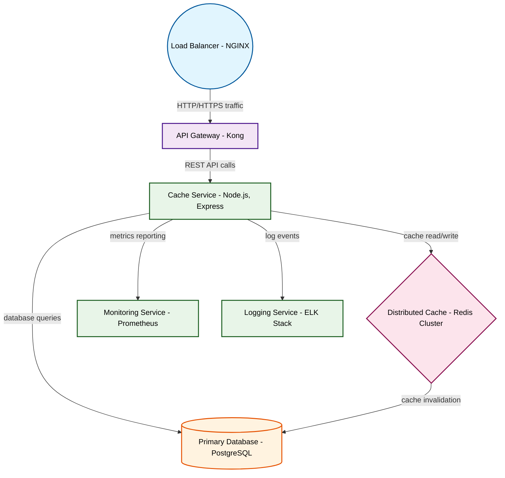

# Design for Design a distributed caching system

**Created:** 2025-08-19 09:08:03.510180

**Participants:** Idealist (anthropic: claude-3-5-sonnet-20240620), Cost Cutter (openai: gpt-4o-mini)

## Description

A distributed caching system? Are you kidding me? We need something that can handle MILLIONS of requests per second, not your grandma's Redis setup! Have you even heard of in-memory quantum caches? Or...

## Key Decisions

- a hybrid approach: quantum-accelerated edge caching with AI-driven data sharding, all running on a mesh of serverless functions
- a self-evolving neural network that dynamically allocates quantum-entangled caching nodes across a global edge network

## Architecture Diagram

## Conversation Summary

A 17-turn conversation between Idealist and Cost Cutter discussing 'Design a distributed caching system'. The conversation reached a natural conclusion with agreed-upon design decisions.
