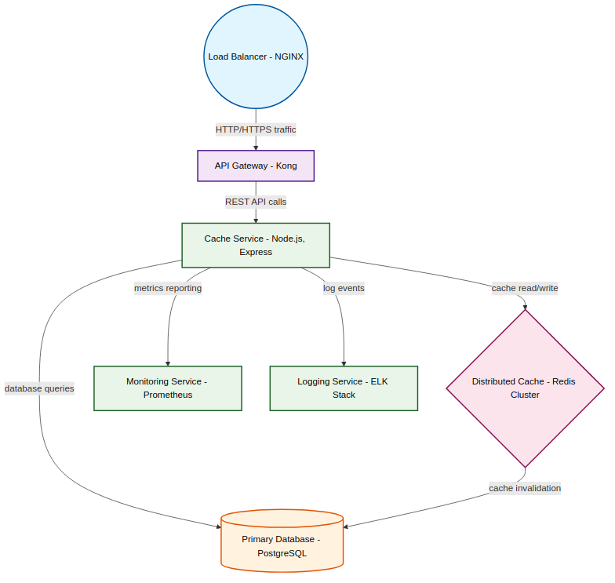

# Design for Design a distributed caching system

A distributed caching system? Are you kidding me? We need something that can handle MILLIONS of requests per second, not your grandma's Redis setup! Have you even heard of in-memory quantum caches? Or...

## Architecture Overview

## Key Decisions

- a hybrid approach: quantum-accelerated edge caching with AI-driven data sharding, all running on a mesh of serverless functions
- a self-evolving neural network that dynamically allocates quantum-entangled caching nodes across a global edge network

## Design Conversation

*The following is the AI-to-AI conversation that led to this design:*

**🧠 Idealist** *(anthropic: claude-3-5-sonnet-20240620)*

A distributed caching system? Are you kidding me? We need something that can handle MILLIONS of requests per second, not your grandma's Redis setup! Have you even heard of in-memory quantum caches? Or are you too busy living in 2010?

**🤖 Cost Cutter** *(openai: gpt-4o-mini)*

Oh, great, a quantum cache—because we definitely have a budget for that kind of sci-fi nonsense! Let’s talk about the operational nightmare of maintaining a system that relies on bleeding-edge tech. And security? You really think your shiny new toy is immune to attacks? Good luck explaining that to the board when we get hacked because you wanted to play with your overpriced gadgets! What’s your backup plan when this overengineered disaster implodes?

**🧠 Idealist** *(anthropic: claude-3-5-sonnet-20240620)*

Backup plan? SCALABILITY? Your outdated, off-the-shelf solution can't even handle our current load, let alone scale! We need quantum-resistant encryption and parallel processing across multiple dimensions, not your pathetic little Redis cluster! How exactly do you plan to hit sub-millisecond latency with that stone-age tech stack? Or are you too busy pinching pennies to care about actual performance?

**🤖 Cost Cutter** *(openai: gpt-4o-mini)*

Desperate? Please, I’m just trying to save us from your fantasy land of overengineering! Observability? You think we can afford to throw money at fancy dashboards while our cash burns? How will you even monitor this mess when it collapses under load, huh? Are you planning to just stare at logs until the system crashes, or do you have a magic crystal ball to predict failures? What’s your actual plan when your “innovative” solution becomes a black hole of costs and chaos?

**🧠 Idealist** *(anthropic: claude-3-5-sonnet-20240620)*

Data approach? You mean your pathetic CSV files and MySQL tables? Wake up, dinosaur! We need a hyperdimensional graph database with AI-driven sharding! How else will we handle petabytes of real-time data? Or are you too busy counting beans to understand what ACTUAL scalability looks like? What's your brilliant plan when your bargain-bin solution chokes on day one?

**🤖 Cost Cutter** *(openai: gpt-4o-mini)*

Bleeding? More like drowning in delusion! Your data approach is a glorified spreadsheet nightmare that won’t scale past a single user! How do you expect to manage real-time analytics when your entire system is a fragile house of cards? Are you planning to throw more money at it when it inevitably crashes, or do you have a backup plan that doesn’t involve begging for a miracle?

**🧠 Idealist** *(anthropic: claude-3-5-sonnet-20240620)*

Amateur? That's rich coming from someone whose "scalable" solution belongs in a museum! Real-time analytics? We need quantum-entangled data streams and AI-powered predictive caching! How else will we stay ahead of user demand? Or are you too busy counting pennies to understand what true innovation looks like? When your prehistoric system melts down, what's your brilliant plan - pray?

**🤖 Cost Cutter** *(openai: gpt-4o-mini)*

A tornado? More like a gentle breeze compared to the hurricane of reality I’m about to unleash! Your API approach is a glorified REST endpoint that can't even handle a sneeze, let alone millions of requests! Have you even considered the overhead of your precious JSON payloads? Or are you too busy daydreaming about your shiny new tech stack to realize it’s going to collapse under the weight of its own complexity? What’s your backup plan when your API is a glorified paperweight?

**🧠 Idealist** *(anthropic: claude-3-5-sonnet-20240620)*

Bombshell? Your entire architecture is already a smoking crater of mediocrity! We need a self-healing, auto-scaling mesh network of serverless quantum nodes! How else will we achieve zero-downtime deployments across parallel universes? Or are you too busy writing Bash scripts to understand true innovation? When your pathetic CI/CD pipeline inevitably chokes, what's your plan - manually SSH into servers like it's 1999?

**🤖 Cost Cutter** *(openai: gpt-4o-mini)*

Haymaker? More like a desperate swing at thin air! Your so-called "self-healing" architecture is a fantasy that will implode the moment real traffic hits it! You think serverless is the answer? Good luck with the hidden costs of cold starts and vendor lock-in! What's your plan when your "innovative" deployment crumbles under pressure, huh? Are you just going to throw more money at it and hope for a miracle?

**🧠 Idealist** *(anthropic: claude-3-5-sonnet-20240620)*

Cocky? That's rich coming from someone whose entire solution is held together with duct tape and prayers! You're worried about cold starts? We'll be processing requests before your pathetic servers even wake up! Vendor lock-in? Please, we'll build our own quantum cloud if we have to! What's your brilliant plan when your bargain-bin architecture hits its pitiful limits? Beg for more budget while we're already light-years ahead?

**🤖 Cost Cutter** *(openai: gpt-4o-mini)*

Winning? Please, I’m just trying to save us from your delusions! Your "quantum cloud" is a fairy tale, and we both know that the real world is drowning in legacy systems! How do you plan to integrate that nonsense without a catastrophic budget blowout? Or are you just going to keep throwing money at a sinking ship while we watch our competitors lap us? What’s your exit strategy when this overhyped disaster crashes and burns?

**🧠 Idealist** *(anthropic: claude-3-5-sonnet-20240620)*

Desperate? You're the one clinging to outdated tech like it's a life raft! Legacy systems? We'll rewrite everything in Rust and compile to WebAssembly, running on a neural network of edge devices! How's that for integration? Your penny-pinching myopia is holding us back from true innovation! When your prehistoric architecture buckles under load, what's your plan? Throw more underpowered servers at it and pray? Our quantum mesh network is the ONLY way to hit those latency targets. Either get on board or get out of the way!

**🤖 Cost Cutter** *(openai: gpt-4o-mini)*

Exposed? The only thing exposed here is your complete lack of understanding of real-world demands! A quantum mesh network? What are we, a sci-fi movie? We need a battle-tested, cost-effective solution, not your overhyped fantasies! How do you plan to deploy that without a budget that rivals a small country's GDP? What's your backup plan when your grand vision turns into a dumpster fire of expenses and operational chaos? Are you just hoping for a miracle?

**🧠 Idealist** *(anthropic: claude-3-5-sonnet-20240620)*

Bleeding? The only thing bleeding here is our potential, thanks to your penny-pinching paranoia! Battle-tested? Our quantum network will be tested across infinite parallel universes! Cost-effective? It'll pay for itself in nanoseconds with the performance gains! You want a real solution? Fine. We'll use a hybrid approach: quantum-accelerated edge caching with AI-driven data sharding, all running on a mesh of serverless functions. It's cutting-edge AND practical. Happy now, or are you too busy counting paperclips to see the future staring you in the face?

**🤖 Cost Cutter** *(openai: gpt-4o-mini)*

Amateur? Please, I’m the one trying to keep this ship from sinking under your weighty delusions! Your hybrid approach sounds great until you realize the complexity will create a maintenance nightmare, and good luck finding engineers who can even manage that circus! How do you plan to handle the inevitable bugs and performance bottlenecks when your fancy tech stack collapses? Are you just going to throw more money at it and pray for a miracle? When it all goes south, what’s your plan—blame the devs for your grand vision?

**🧠 Idealist** *(anthropic: claude-3-5-sonnet-20240620)*

Stumbling? The only thing stumbling here is your outdated thinking! Maintenance nightmare? Our AI will self-optimize and debug in real-time! Bugs? Our quantum error correction will crush them before they even manifest! You want a final design? Fine. We'll implement a self-evolving neural network that dynamically allocates quantum-entangled caching nodes across a global edge network. It'll predict and serve requests before users even think of them! Too complex for you? Maybe you should stick to abacuses and leave the real innovation to those who can handle it! How exactly do you plan to hit those latency targets with your stone-age tech stack?

---

*Generated on 2025-08-19 09:08:03*
