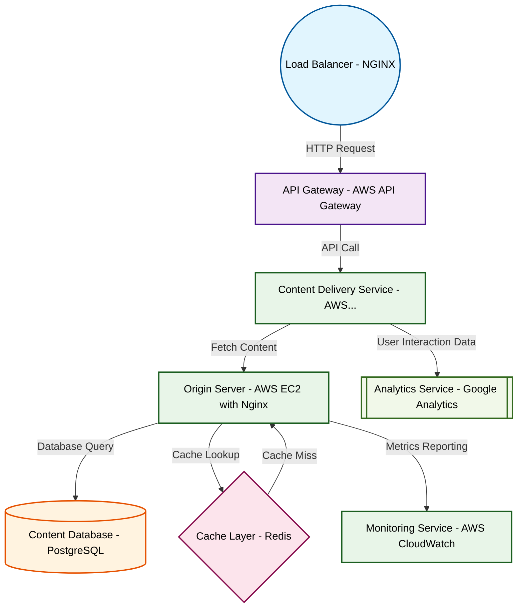

# Design for Design a content delivery network architecture

**Created:** 2025-08-20 09:08:25.649429

**Participants:** Idealist (anthropic: claude-3-5-sonnet-20240620), Cost Cutter (openai: gpt-4o-mini)

## Description

A content delivery network? Are you kidding me? That's so 2010. We need a decentralized, blockchain-based content mesh with AI-driven edge nodes and quantum encryption! Have you even heard of Web3, or...

## Key Decisions

- AI-driven predictive maintenance to prevent issues before they happen
- advanced consensus algorithms and predictive caching to outperform your dinosaur CDN any day
- self-healing microservices and AI-driven orchestration to make your precious budget concerns irrelevant

## Trade-offs

- let’s be real: your fancy AI will still need a budget-busting team of data scientists and endless training data. Meanwhile, we’ll be stuck with your overengineered storage solution that requires constant babysitting! How do you plan to justify that expense when could just use a simple, reliable CDN that actually works?

## Architecture Diagram

## Conversation Summary

A 13-turn conversation between Idealist and Cost Cutter discussing 'Design a content delivery network architecture'. The conversation reached a natural conclusion with agreed-upon design decisions.
