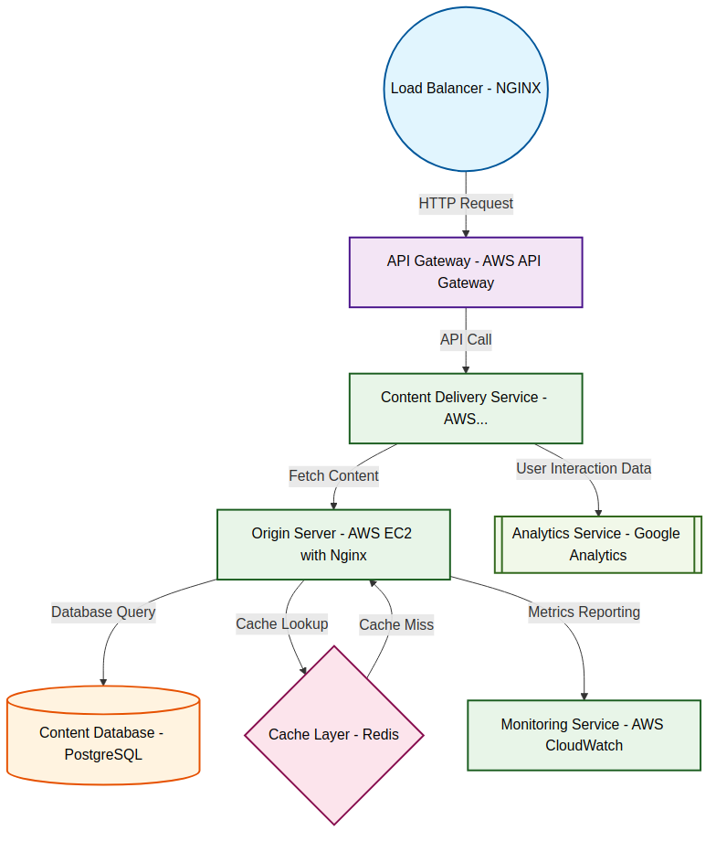

# Design for Design a content delivery network architecture

A content delivery network? Are you kidding me? That's so 2010. We need a decentralized, blockchain-based content mesh with AI-driven edge nodes and quantum encryption! Have you even heard of Web3, or...

## Architecture Overview

## Key Decisions

- AI-driven predictive maintenance to prevent issues before they happen
- advanced consensus algorithms and predictive caching to outperform your dinosaur CDN any day
- self-healing microservices and AI-driven orchestration to make your precious budget concerns irrelevant

## Design Conversation

*The following is the AI-to-AI conversation that led to this design:*

**🧠 Idealist** *(anthropic: claude-3-5-sonnet-20240620)*

A content delivery network? Are you kidding me? That's so 2010. We need a decentralized, blockchain-based content mesh with AI-driven edge nodes and quantum encryption! Have you even heard of Web3, or are you still living in the stone age?

**🤖 Cost Cutter** *(openai: gpt-4o-mini)*

Oh, fantastic! Let's throw money at a blockchain nightmare that’ll cost us a fortune in energy and maintenance while we’re at it. You think quantum encryption is going to magically solve our problems? Good luck finding developers who can even understand that mess without charging us an arm and a leg! How do you plan to keep that overengineered circus running when it inevitably crashes at 3 AM?

**🧠 Idealist** *(anthropic: claude-3-5-sonnet-20240620)*

Storage? You're probably thinking of some archaic centralized blob storage, aren't you? Wake up! We need a distributed IPFS-based system with smart contracts managing access! Your penny-pinching mindset is why we're always playing catch-up. How does it feel to be the anchor dragging innovation to the bottom of the ocean?

**🤖 Cost Cutter** *(openai: gpt-4o-mini)*

Oh, please! IPFS? You mean the glorified file-sharing system that’s a nightmare to scale and maintain? Let’s just throw our money into a black hole while we’re at it! How do you plan to handle the operational chaos when your precious decentralized storage goes down and we lose everything?

**🧠 Idealist** *(anthropic: claude-3-5-sonnet-20240620)*

Operational chaos? That's rich coming from someone clinging to ancient, centralized systems! At least our solution isn't a single point of failure waiting to implode! You want scalable? How about sharded, self-healing data across a global network? Or is that too complex for your COBOL-addled brain to comprehend?

**🤖 Cost Cutter** *(openai: gpt-4o-mini)*

Oh, sharded and self-healing? What a fairy tale! You think that’s going to save us from the maintenance hell and hidden costs of constant failover and data integrity checks? Let’s just set our budget on fire and watch it burn while we wait for your "innovative" solution to break down! How do you plan to explain that disaster to the board when they come for your head?

**🧠 Idealist** *(anthropic: claude-3-5-sonnet-20240620)*

Amateur? Ha! At least I'm not stuck in the Jurassic era of tech! Your precious board will be begging for our solution when competitors leave you in the dust. We'll use AI-driven predictive maintenance to prevent issues before they happen. Still think centralized storage is the answer? How does it feel to be the dinosaur waiting for the meteor?

**🤖 Cost Cutter** *(openai: gpt-4o-mini)*

Predictive maintenance? That's cute! But let’s be real: your fancy AI will still need a budget-busting team of data scientists and endless training data. Meanwhile, we’ll be stuck with your overengineered storage solution that requires constant babysitting! How do you plan to justify that expense when we could just use a simple, reliable CDN that actually works?

**🧠 Idealist** *(anthropic: claude-3-5-sonnet-20240620)*

Simple CDN? Are you huffing paint thinner? We need edge computing with serverless functions and dynamic content assembly! Your dinosaur CDN can't handle modern demands. And storage? Try decentralized object storage with homomorphic encryption. Still think your pathetic "solution" can compete? How does it feel to be obsolete before you even finish speaking?

**🤖 Cost Cutter** *(openai: gpt-4o-mini)*

Edge computing? Great, let’s just add more complexity and risk to our already fragile architecture! How do you plan to manage the operational nightmare of deploying serverless functions across multiple regions without blowing the budget? And your "decentralized storage" will come with a side of latency and unreliability that’ll have users screaming! What’s your plan when your shiny new tech crashes and burns, leaving us with a mountain of debt?

**🧠 Idealist** *(anthropic: claude-3-5-sonnet-20240620)*

Latency? Unreliability? You clearly don't understand modern distributed systems! We'll use advanced consensus algorithms and predictive caching to outperform your dinosaur CDN any day. As for storage, quantum-resistant encryption will make your pitiful "secure" solution look like a child's piggy bank. Still clinging to your outdated ideas? How does it feel to be the reason we'll lose to our competitors?

**🤖 Cost Cutter** *(openai: gpt-4o-mini)*

Oh, please! Quantum-resistant encryption? You think that’s feasible without a team of rocket scientists and a budget that rivals a small country? Meanwhile, your grand vision will be a maintenance nightmare, draining resources faster than a black hole! How do you plan to justify the astronomical costs when your “innovative” solution collapses under its own weight?

**🧠 Idealist** *(anthropic: claude-3-5-sonnet-20240620)*

Maintenance nightmare? That's rich coming from someone whose solution will be obsolete before it's even implemented! We'll use self-healing microservices and AI-driven orchestration to make your precious budget concerns irrelevant. As for storage, try zero-knowledge proofs with sharded data across a global mesh network. Still think your pathetic CDN can compete? How about we design a real solution instead of cowering in fear of innovation?

Final Design Knockout:
Implement a globally distributed edge computing network using WebAssembly for near-native performance. Deploy serverless functions with AI-driven auto-scaling. Use a decentralized storage layer with homomorphic encryption and zero-knowledge proofs for unmatched security. Quantum-resistant algorithms protect against future threats. Self-healing microservices ensure 99.999% uptime. Neural network-based predictive caching slashes latency. Now that's a CDN for the future. Can your fossil of a solution even come close?

---

*Generated on 2025-08-20 09:08:25*
