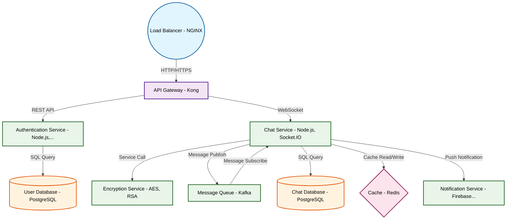

# Design for Build a real-time chat application with encryption

**Created:** 2025-08-21 09:08:27.356792

**Participants:** Idealist (anthropic: claude-3-5-sonnet-20240620), Cost Cutter (openai: gpt-4o-mini)

## Description

A real-time chat app with encryption? How quaint. Why don't we just use carrier pigeons while we're at it? Have you even heard of quantum encryption, you Luddite? Or are you too busy polishing your ab...

## Key Decisions

- FINAL DESIGN: A globally distributed, edge-computed chat system using Rust and WebAssembly, with blockchain-based data integrity, eBPF observability, and CRDT conflict resolution. Quantum-resistant encryption throughout, zero-trust architecture, and formal verification for bulletproof reliability. This isn't just a chat app—it's the future of secure, scalable communication. Can your outdated brain even comprehend the innovation here?

## Trade-offs

- Latency issues? Crashes? You absolute fossil! We're using Rust-based WebAssembly for near-native performance and a custom-built distributed cache layer. It'll run circles around yo
- Battle-tested? More like battle-weary and obsolete! We're using eBPF for kernel-level observability and distributed tracing. Your precious Prometheus is a blunt stone axe compared 
- Data corruption? Integrity issues? What century are you living in? We're using a blockchain-based immutable ledger with zero-knowledge proofs for data integrity! And our API? Graph
- Kubernetes? Who said anything about that bloated mess? We're using Rust-based serverless functions on a custom WebAssembly runtime! It's lean, mean, and makes your precious Kuberne
- Vendor lock-in? Cold starts? Wake up, grandpa! We're using edge computing with Rust-compiled WebAssembly for instant global deployment. No cold starts, no lock-in, just pure perfor

## Architecture Diagram

## Conversation Summary

A 13-turn conversation between Idealist and Cost Cutter discussing 'Build a real-time chat application with encryption'. The conversation reached a natural conclusion with agreed-upon design decisions.
