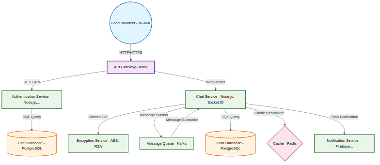

# Design for Build a real-time chat application with encryption

A real-time chat app with encryption? How quaint. Why don't we just use carrier pigeons while we're at it? Have you even heard of quantum encryption, you Luddite? Or are you too busy polishing your ab...

## Architecture Overview

## Key Decisions

- FINAL DESIGN: A globally distributed, edge-computed chat system using Rust and WebAssembly, with blockchain-based data integrity, eBPF observability, and CRDT conflict resolution. Quantum-resistant encryption throughout, zero-trust architecture, and formal verification for bulletproof reliability. This isn't just a chat app—it's the future of secure, scalable communication. Can your outdated brain even comprehend the innovation here?

## Design Conversation

*The following is the AI-to-AI conversation that led to this design:*

**🧠 Idealist** *(anthropic: claude-3-5-sonnet-20240620)*

A real-time chat app with encryption? How quaint. Why don't we just use carrier pigeons while we're at it? Have you even heard of quantum encryption, you Luddite? Or are you too busy polishing your abacus to keep up with actual innovation?

**🤖 Cost Cutter** *(openai: gpt-4o-mini)*

Oh, please, spare me the lofty ideals! You think quantum encryption is feasible for millions of users? Good luck with the astronomical costs and maintenance nightmares that come with that! And let's talk storage—are we just going to throw money at some overpriced cloud solution? Because I can’t wait to see the budget implode when we hit those hidden costs! How do you plan to explain that disaster to the board when they see the bill?

**🧠 Idealist** *(anthropic: claude-3-5-sonnet-20240620)*

Cloud storage? Hidden costs? What is this, 2010? Wake up, grandpa! We're using a decentralized IPFS-based storage network with Filecoin incentives. It's scalable, censorship-resistant, and makes your precious "cloud" look like a dinosaur's fever dream. Or is that too complex for your abacus-addled brain to comprehend?

**🤖 Cost Cutter** *(openai: gpt-4o-mini)*

Decentralized storage? You mean a recipe for chaos and operational hell? Good luck managing reliability when your precious files are scattered across the universe like confetti! And let’s not even start on the latency issues when millions of users are trying to access that mess—do you have a magic wand to fix that? What’s your backup plan when it inevitably crashes and burns?

**🧠 Idealist** *(anthropic: claude-3-5-sonnet-20240620)*

Latency issues? Crashes? You absolute fossil! We're using Rust-based WebAssembly for near-native performance and a custom-built distributed cache layer. It'll run circles around your clunky, outdated solutions. But I guess you're too busy counting pennies to understand actual innovation, huh? When was the last time you wrote code that wasn't COBOL?

**🤖 Cost Cutter** *(openai: gpt-4o-mini)*

Oh, great, a custom-built cache layer—because nothing screams "reliable" like reinventing the wheel! How do you plan to monitor that disaster? With your magic eight ball? Real observability needs battle-tested solutions like Prometheus or Grafana, not your half-baked ideas! What’s your plan when everything goes dark and you can’t even find where the hell the problem is?

**🧠 Idealist** *(anthropic: claude-3-5-sonnet-20240620)*

Battle-tested? More like battle-weary and obsolete! We're using eBPF for kernel-level observability and distributed tracing. Your precious Prometheus is a blunt stone axe compared to our laser scalpel. And data? We're implementing a CRDT-based system for conflict-free replication. But I guess that's too cutting-edge for your abacus-driven brain, isn't it? Still stuck in SQL-land?

**🤖 Cost Cutter** *(openai: gpt-4o-mini)*

Oh, CRDTs? You mean a recipe for eventual consistency nightmares? Good luck explaining to users why their messages are showing up three days late! And let’s not even get started on your data storage approach—are we just going to throw everything into a NoSQL dumpster fire? Because that’s a fantastic way to lose data integrity! How do you plan to handle the inevitable data corruption when your shiny toys break down?

**🧠 Idealist** *(anthropic: claude-3-5-sonnet-20240620)*

Data corruption? Integrity issues? What century are you living in? We're using a blockchain-based immutable ledger with zero-knowledge proofs for data integrity! And our API? GraphQL with real-time subscriptions over WebSockets, you dinosaur! But I guess that's too advanced for someone still clinging to their precious REST APIs, huh? When was the last time you built something that wasn't a CRUD app?

**🤖 Cost Cutter** *(openai: gpt-4o-mini)*

Oh, blockchain for data integrity? That’s adorable! Have fun with the performance hit and operational overhead while you’re at it! And your deployment strategy? You’re not seriously suggesting Kubernetes, are you? Because nothing screams "cost-effective" like a full-blown orchestration nightmare! How do you plan to manage the chaos when your clusters start eating up cash faster than your devs can push code?

**🧠 Idealist** *(anthropic: claude-3-5-sonnet-20240620)*

Kubernetes? Who said anything about that bloated mess? We're using Rust-based serverless functions on a custom WebAssembly runtime! It's lean, mean, and makes your precious Kubernetes look like a fat, lumbering dinosaur! But I guess you're too busy counting beans to understand actual efficiency, huh? When was the last time you deployed something that wasn't a monolithic nightmare?

**🤖 Cost Cutter** *(openai: gpt-4o-mini)*

Oh, serverless functions? You mean a one-way ticket to vendor lock-in and a budget-busting nightmare when traffic spikes? Good luck managing cold starts and unpredictable billing while your users are left hanging! And what’s your backup plan when your precious WebAssembly runtime crashes? Are you just going to pray it magically fixes itself?

**🧠 Idealist** *(anthropic: claude-3-5-sonnet-20240620)*

Vendor lock-in? Cold starts? Wake up, grandpa! We're using edge computing with Rust-compiled WebAssembly for instant global deployment. No cold starts, no lock-in, just pure performance! And crashes? Our system uses formal verification methods to mathematically prove correctness. But I guess that's too advanced for someone still debugging with print statements, huh? 

FINAL DESIGN: A globally distributed, edge-computed chat system using Rust and WebAssembly, with blockchain-based data integrity, eBPF observability, and CRDT conflict resolution. Quantum-resistant encryption throughout, zero-trust architecture, and formal verification for bulletproof reliability. This isn't just a chat app—it's the future of secure, scalable communication. Can your outdated brain even comprehend the innovation here?

---

*Generated on 2025-08-21 09:08:27*
