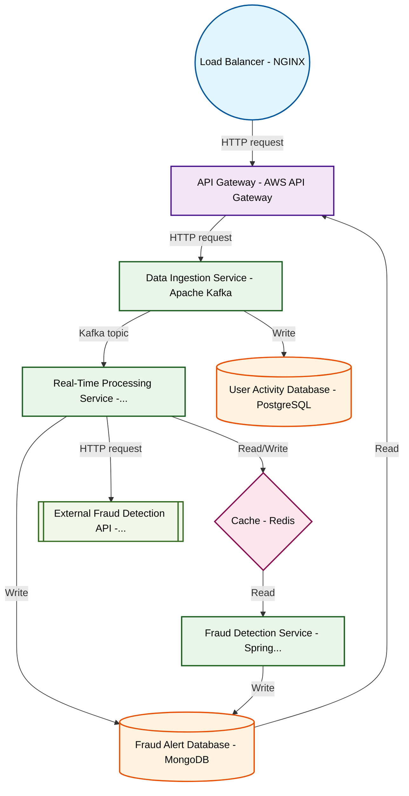

# Design for Create a real-time fraud detection system

**Created:** 2025-08-22 09:07:58.536799

**Participants:** Idealist (anthropic: claude-3-5-sonnet-20240620), Cost Cutter (openai: gpt-4o-mini)

## Description

a recipe for chaos, and when it all comes crashing down, i hope you’ve got a good excuse for the shareholders

## Key Decisions

- Amateur? Please! Your whole approach reeks of desperation and ignorance! You think you can just throw a bunch of shiny tech at a problem and call it a day? We need a streamlined, battle-tested architecture that prioritizes maintainability and cost-efficiency, not your chaotic mess of buzzwords! Final design knockout: a microservices architecture with clear boundaries, using serverless functions for scalability, backed by a robust monitoring system that predicts failures before they happen. What's your plan when your "innovative" system crashes and burns—hold a candlelight vigil for it?

## Implementation Notes

- Oh, please! Your so-called "architecture" is a glorified house of cards ready to collapse at the first sign of real traffic. We need a robust, fault-tolerant microservices architec

## Architecture Diagram

## Conversation Summary

A 16-turn conversation between Idealist and Cost Cutter discussing 'Create a real-time fraud detection system'. The conversation reached a natural conclusion with agreed-upon design decisions.
