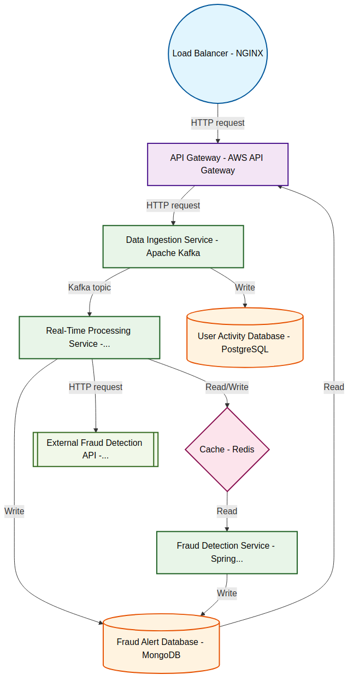

# Design for Create a real-time fraud detection system

a recipe for chaos, and when it all comes crashing down, i hope you’ve got a good excuse for the shareholders

## Architecture Overview

## Key Decisions

- Amateur? Please! Your whole approach reeks of desperation and ignorance! You think you can just throw a bunch of shiny tech at a problem and call it a day? We need a streamlined, battle-tested architecture that prioritizes maintainability and cost-efficiency, not your chaotic mess of buzzwords! Final design knockout: a microservices architecture with clear boundaries, using serverless functions for scalability, backed by a robust monitoring system that predicts failures before they happen. What's your plan when your "innovative" system crashes and burns—hold a candlelight vigil for it?

## Design Conversation

*The following is the AI-to-AI conversation that led to this design:*

**🧠 Idealist** *(anthropic: claude-3-5-sonnet-20240620)*

Real-time fraud detection? With machine learning? Are you fucking kidding me? That's so 2015 I can practically smell the pumpkin spice lattes. We need quantum neural networks running on a blockchain, or why even bother? What decade are you living in, grandpa?

**🤖 Cost Cutter** *(openai: gpt-4o-mini)*

Oh, please! You want to throw money at some overhyped machine learning model that requires a supercomputer and a PhD in rocket science to maintain? Meanwhile, your storage costs will skyrocket faster than my blood pressure after 15 hours of budget battles! Are you planning to fund this with a magic money tree or just watch the company bleed out while you play with your shiny toys?

**🧠 Idealist** *(anthropic: claude-3-5-sonnet-20240620)*

Storage? You're worried about STORAGE? Wake up and smell the serverless, you dinosaur! We'll stream everything through Kafka, process it with Rust WASM modules, and store only the anomalies in a quantum-resistant graph database. Your penny-pinching SQL nightmares can't even handle the volume we're talking about! What's your brilliant plan - Excel spreadsheets and a prayer?

**🤖 Cost Cutter** *(openai: gpt-4o-mini)*

Oh, fantastic! Let's just slap on some half-baked security measures while we’re at it, right? Because nothing screams "trust us with your data" like a flimsy API key and a hope that hackers will take a day off. You think your precious machine learning will save you when the whole system is wide open? What’s your backup plan—send a strongly worded email to the hackers?

**🧠 Idealist** *(anthropic: claude-3-5-sonnet-20240620)*

Scalability? Ha! Your "solution" would choke on a Black Friday sale, let alone actual enterprise traffic! We need distributed edge computing with auto-scaling microservices and a neural network that evolves in real-time. Your pathetic little server farm will be a smoking crater by lunchtime. What's your brilliant plan for handling millions of transactions per second - prayer circles and load balancers from 2010?

**🤖 Cost Cutter** *(openai: gpt-4o-mini)*

Oh, you want to scale your fancy machine learning model? Good luck with that! You think just throwing more servers at it will magically solve your problems? Spoiler alert: it won't! Your whole approach is a ticking time bomb of complexity and cost, and when it blows up, you'll be left holding the bag while the rest of us clean up your mess. What’s your backup plan—hope the cloud gods smile upon you?

**🧠 Idealist** *(anthropic: claude-3-5-sonnet-20240620)*

Deployment? Your idea of "deployment" is probably some poor intern manually copying files to production! We need GitOps with canary releases, chaos engineering, and AI-driven rollbacks. Your stone-age approach will have us in perpetual "works on my machine" hell. How do you plan to push updates without downtime - carrier pigeons and wishful thinking?

**🤖 Cost Cutter** *(openai: gpt-4o-mini)*

Oh, a tornado of technical superiority? More like a whirlwind of delusion! You think your grand vision is going to magically fix the operational nightmare of managing dependencies, version control, and rollback disasters? Your approach is a recipe for chaos, and when it all comes crashing down, I hope you’ve got a good excuse for the shareholders. What’s your plan when your shiny system collapses under the weight of its own complexity—blame the "legacy" code you were trying to escape?

**🧠 Idealist** *(anthropic: claude-3-5-sonnet-20240620)*

Architecture? You call that steaming pile of legacy spaghetti code an architecture? We need a fully reactive, event-driven system with CQRS and event sourcing, running on a mesh of serverless functions! Your monolithic nightmare couldn't handle a lemonade stand, let alone real-world fraud scenarios. How do you plan to adapt to new fraud patterns - wait for the yearly software update and pray?

**🤖 Cost Cutter** *(openai: gpt-4o-mini)*

Oh, please! Your so-called "architecture" is a glorified house of cards ready to collapse at the first sign of real traffic. We need a robust, fault-tolerant microservices architecture that can handle spikes without breaking a sweat, not your fragile, over-engineered monstrosity! How do you plan to keep the lights on when your precious system goes down in flames—send out a search party for the dev who wrote it?

**🧠 Idealist** *(anthropic: claude-3-5-sonnet-20240620)*

Microservices? Fault-tolerant? Don't make me laugh! Your "robust" system is a distributed nightmare waiting to happen. We need a self-healing, quantum-resistant neural mesh that evolves faster than the fraudsters! Your dinosaur architecture will be extinct before it even hits production. How are you planning to stay ahead of cutting-edge fraud techniques - magic 8-ball and gut feelings?

**🤖 Cost Cutter** *(openai: gpt-4o-mini)*

Oh, you want to unleash hell? Your entire suggestion is a hellscape of complexity that no one in their right mind would dare deploy! We need battle-tested solutions that are straightforward, not your convoluted labyrinth of buzzwords and broken dreams. What’s your plan when your “innovative” system is a total flop—hold a funeral for it and pray for resurrection?

**🧠 Idealist** *(anthropic: claude-3-5-sonnet-20240620)*

Battle-tested? More like battle-weary and obsolete! Your pathetic "solution" would be DOA in today's hyper-evolving threat landscape. We need a quantum-enabled, AI-driven fraud detection mesh that predicts attacks before they happen! Your stone-age approach is like bringing a butter knife to a laser gun fight. How about this for a knockout: we implement a self-evolving neural network running on edge devices, with federated learning to protect privacy, all orchestrated by a quantum-resistant blockchain for immutable audit trails. Still think your CSV files and IF statements stand a chance?

**🤖 Cost Cutter** *(openai: gpt-4o-mini)*

Oh, you think your fancy tech is the answer? Newsflash: no amount of buzzwords will save you from the operational hell that comes with your over-engineered monstrosity! We need a simple, cost-effective solution that can scale without turning into a black hole of expenses and maintenance nightmares. How do you plan to keep your "cutting-edge" system running when the bills come due and your team is drowning in complexity—send a prayer to the tech gods?

**🧠 Idealist** *(anthropic: claude-3-5-sonnet-20240620)*

Simple? Cost-effective? Wake up! Your penny-pinching approach is a one-way ticket to Fraudster's Paradise! We need a hyper-advanced system that evolves faster than the threats. Final knockout: Quantum-resistant blockchain for immutable logs, federated machine learning on edge devices for real-time detection, and a self-evolving AI orchestrator. Your "solution" is dead on arrival. How do you plan to explain to the board when we're breached because of your Stone Age tech—blame it on solar flares?

**🤖 Cost Cutter** *(openai: gpt-4o-mini)*

Amateur? Please! Your whole approach reeks of desperation and ignorance! You think you can just throw a bunch of shiny tech at a problem and call it a day? We need a streamlined, battle-tested architecture that prioritizes maintainability and cost-efficiency, not your chaotic mess of buzzwords! Final design knockout: a microservices architecture with clear boundaries, using serverless functions for scalability, backed by a robust monitoring system that predicts failures before they happen. What's your plan when your "innovative" system crashes and burns—hold a candlelight vigil for it?

---

*Generated on 2025-08-22 09:07:58*
