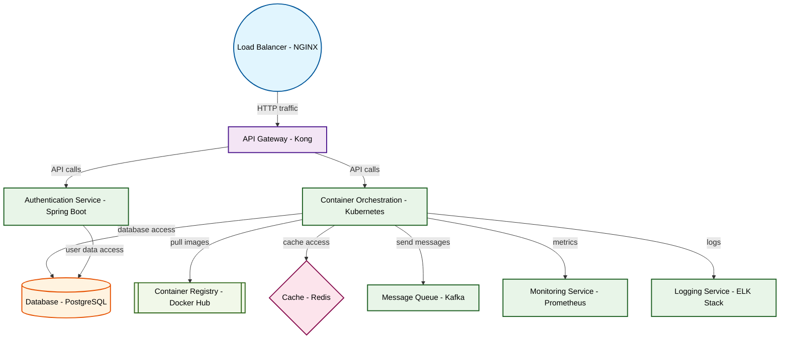

# Design for Design a container orchestration strategy

**Created:** 2025-08-23 09:06:43.567394

**Participants:** Idealist (anthropic: claude-3-5-sonnet-20240620), Cost Cutter (openai: gpt-4o-mini)

## Description

Containers? Orchestration? What is this, 2015? Wake up and smell the quantum entanglement! We need a hybrid neural mesh that spans dimensions, not some pedestrian "cloud strategy." How about you propo...

## Implementation Notes

- that without a bottomless pit of cash and a team of rocket scientists? Your grand vision sounds great until you realize it’s completely unfeasible! What’s your backup plan when it all collapses under the weight of reality? Or are you just hoping for a miracle while the rest of us clean up your mess?
- Operational chaos? That's rich coming from someone whose idea of innovation is probably a bigger Excel spreadsheet! Your penny-pinching "solution" is a ticking time bomb of technic

## Architecture Diagram

## Conversation Summary

A 15-turn conversation between Idealist and Cost Cutter discussing 'Design a container orchestration strategy'. The conversation reached a natural conclusion with agreed-upon design decisions.
