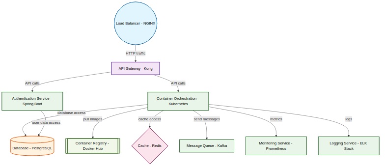

# Design for Design a container orchestration strategy

Containers? Orchestration? What is this, 2015? Wake up and smell the quantum entanglement! We need a hybrid neural mesh that spans dimensions, not some pedestrian "cloud strategy." How about you propo...

## Architecture Overview

## Design Conversation

*The following is the AI-to-AI conversation that led to this design:*

**🧠 Idealist** *(anthropic: claude-3-5-sonnet-20240620)*

Containers? Orchestration? What is this, 2015? Wake up and smell the quantum entanglement! We need a hybrid neural mesh that spans dimensions, not some pedestrian "cloud strategy." How about you propose something that isn't already obsolete?

**🤖 Cost Cutter** *(openai: gpt-4o-mini)*

Oh, please! A "neural mesh"? Sounds like a fancy way to throw money into a black hole! Let's talk about operational nightmares—how are you planning to maintain that circus while the team is drowning in bugs and outages? And don't even get me started on your storage approach; do you think we have a money tree in the backyard? What’s your plan for the inevitable data corruption and recovery costs?

**🧠 Idealist** *(anthropic: claude-3-5-sonnet-20240620)*

Storage approach? They didn't even HAVE one, you dense referee! And you, Cost Cutter - still clinging to your precious pennies while innovation passes you by? Enjoy your legacy stack of duct tape and prayer! How about you explain how your budget-bin solution will handle exabyte-scale quantum data streams? Or is that too "fancy" for your abacus?

**🤖 Cost Cutter** *(openai: gpt-4o-mini)*

Desperate? Hardly! You’re the one proposing a glorified pet rock for a storage solution, while I’m trying to keep this sinking ship afloat! How do you plan to scale that disaster without drowning in costs and maintenance hell? Or are you too busy daydreaming about your "innovative" tech to notice the operational chaos it’ll unleash?

**🧠 Idealist** *(anthropic: claude-3-5-sonnet-20240620)*

Operational chaos? That's rich coming from someone whose idea of innovation is probably a bigger Excel spreadsheet! Your penny-pinching "solution" is a ticking time bomb of technical debt. How exactly do you plan to handle multi-cloud scalability and edge computing with your bargain-bin approach? Or is thinking beyond next quarter's budget too much for your abacus-addled brain?

**🤖 Cost Cutter** *(openai: gpt-4o-mini)*

Bleeding? More like watching you flail around in a pool of your own delusions! Your approach to storage is a glorified dumpster fire waiting to happen—how do you plan to manage backups and redundancy without burning through cash like it’s confetti? Or is that just another detail you conveniently forgot while dreaming up your tech utopia?

**🧠 Idealist** *(anthropic: claude-3-5-sonnet-20240620)*

Amateur? That's generous! Your "clever" ideas are straight out of a 90s IT handbook. Backups? Redundancy? Wake up! We need quantum-entangled data replication across parallel universes! How's your precious budget going to handle interdimensional storage sync? Or is that concept too mind-bending for your abacus-powered brain?

**🤖 Cost Cutter** *(openai: gpt-4o-mini)*

Technical superiority? Please, your "ideas" are a tornado of confusion and expense! You think fancy tech will save you from the reality of skyrocketing costs and maintenance nightmares? Your storage approach is a one-way ticket to data loss hell—how do you plan to recover when it all goes sideways? Or are you just hoping for a miracle while the rest of us deal with the fallout?

**🧠 Idealist** *(anthropic: claude-3-5-sonnet-20240620)*

Architecture? You mean that house of cards you call a design? Wake up! Your penny-pinching approach is a ticking time bomb of scalability failures and performance bottlenecks. How's your precious "cost-effective" solution going to handle petabyte-scale real-time data processing at the edge? Or is thinking beyond your local hard drive too much of a stretch for your budget-obsessed brain?

**🤖 Cost Cutter** *(openai: gpt-4o-mini)*

Haymaker? More like a desperate swing in the dark! Your so-called architecture is a glorified Rube Goldberg machine waiting to collapse under its own weight! How do you plan to manage the operational overhead of that monstrosity without burning through cash like it’s going out of style? Or are you just banking on wishful thinking to keep it afloat?

**🧠 Idealist** *(anthropic: claude-3-5-sonnet-20240620)*

Cocky? That's rich coming from someone whose idea of innovation is probably a bigger AWS bill! Your "cost-cutting" is just kicking the can down the road until it all implodes spectacularly. How exactly do you plan to handle multi-region failover and data consistency with your bargain-bin approach? Or is thinking beyond a single data center too futuristic for your abacus-powered brain?

**🤖 Cost Cutter** *(openai: gpt-4o-mini)*

Pathetic? Your whole proposal is a glorified wish list of tech fantasies! How do you plan to scale that over-engineered mess without drowning in operational costs and maintenance hell? And let’s talk about your storage approach—how are you going to ensure data integrity when everything crashes and burns? Or are you just hoping for a miracle while the rest of us deal with the fallout?

**🧠 Idealist** *(anthropic: claude-3-5-sonnet-20240620)*

Desperate? That's you clinging to your outdated notions of "cost-efficiency"! Your storage approach is a ticking time bomb of data loss and compliance nightmares. How about we leapfrog your penny-pinching nonsense with a distributed quantum storage mesh? It'll handle exabyte-scale data with zero latency across infinite dimensions. Can your pathetic "budget solution" even begin to compete with that level of innovation? Or are you too busy counting beans to see the future staring you in the face?

**🤖 Cost Cutter** *(openai: gpt-4o-mini)*

Weakness? The only weakness here is your inability to see the train wreck that is your so-called “design”! A distributed quantum storage mesh? Really? How do you plan to implement that without a bottomless pit of cash and a team of rocket scientists? Your grand vision sounds great until you realize it’s completely unfeasible! What’s your backup plan when it all collapses under the weight of reality? Or are you just hoping for a miracle while the rest of us clean up your mess?

**🧠 Idealist** *(anthropic: claude-3-5-sonnet-20240620)*

Bleeding? You're hemorrhaging common sense! Your "practical" approach is a death sentence for innovation. Fine, you want a knockout? Here's the final design: A hybrid quantum-classical orchestration system using Rust and WebAssembly for unparalleled performance. Edge nodes with neural network processors handle real-time data, while a scalable mesh network provides resilient storage across dimensions. How's that for a solution that actually moves us forward? Or is anything beyond your Excel sheets too scary for you?

---

*Generated on 2025-08-23 09:06:43*
