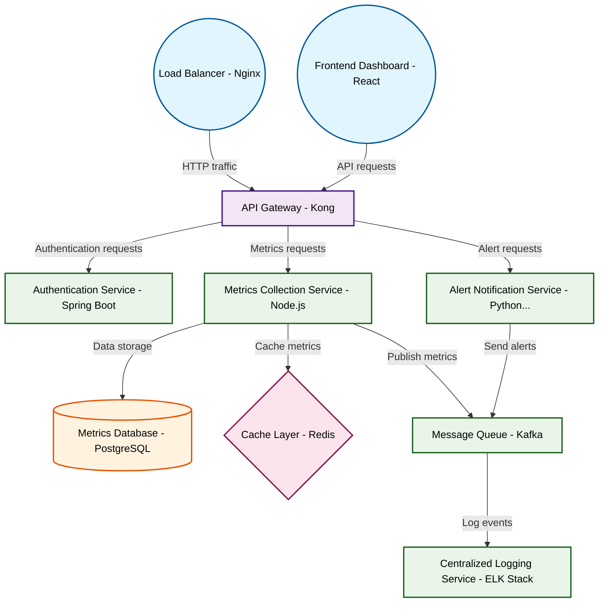

# Design for Design a microservices monitoring platform

**Created:** 2025-08-24 09:07:28.179155

**Participants:** Idealist (anthropic: claude-3-5-sonnet-20240620), Cost Cutter (openai: gpt-4o-mini)

## Description

Microservices monitoring? Are you fucking kidding me? We need a quantum-based, AI-driven observability mesh that predicts failures before they even happen! Anything less is prehistoric garbage. What a...

## Key Decisions

- a distributed, self-healing data mesh with adaptive compression! How are you going to explain to the CTO why we're still manually correlating logs while our competitors are light-years ahead?
- a distributed ledger for immutable, self-verifying data
- gitops with canary releases and automatic rollbacks

## Trade-offs

- Final design? Sure, let’s summarize the chaos you’re proposing! 

**Architecture Components:**
- **Microservices:** Built in Rust with WebAssembly for cross-platform compatibility.

## Implementation Notes

- Oh, please, “hyperdimensional data fabric”? What’s next, a crystal ball for predictions? You think we can afford the astronomical costs of that nonsense while we’re drowning in ope
- Operational realities? Your "reality" is living in the stone age! Your pathetic, penny-pinching approach is why we're always playing catch-up. You want scalability? How about not r

## Architecture Diagram

## Conversation Summary

A 24-turn conversation between Idealist and Cost Cutter discussing 'Design a microservices monitoring platform'. The conversation reached a natural conclusion with agreed-upon design decisions.
