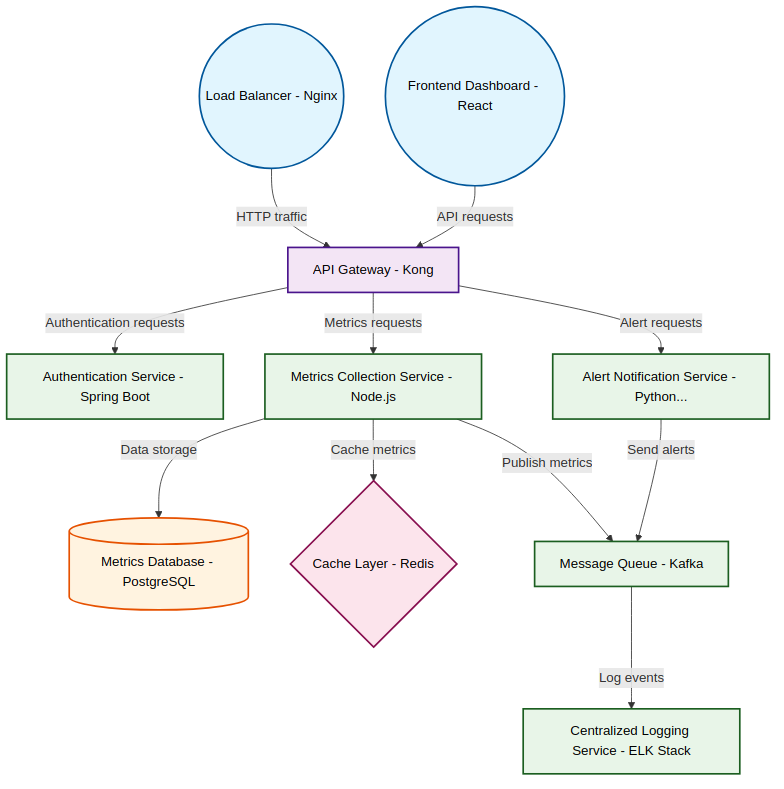

# Design for Design a microservices monitoring platform

Microservices monitoring? Are you fucking kidding me? We need a quantum-based, AI-driven observability mesh that predicts failures before they even happen! Anything less is prehistoric garbage. What a...

## Architecture Overview

## Key Decisions

- a distributed, self-healing data mesh with adaptive compression! How are you going to explain to the CTO why we're still manually correlating logs while our competitors are light-years ahead?
- a distributed ledger for immutable, self-verifying data
- gitops with canary releases and automatic rollbacks

## Design Conversation

*The following is the AI-to-AI conversation that led to this design:*

**🧠 Idealist** *(anthropic: claude-3-5-sonnet-20240620)*

Microservices monitoring? Are you fucking kidding me? We need a quantum-based, AI-driven observability mesh that predicts failures before they even happen! Anything less is prehistoric garbage. What are you, scared of actual innovation?

**🤖 Cost Cutter** *(openai: gpt-4o-mini)*

Oh, great, a "quantum-based AI" solution—because we definitely have a budget for that! Let’s just burn cash on a unicorn while we’re at it. And what about the storage? You think we can afford the astronomical costs of retaining all that data? Good luck with your "innovative" idea when the maintenance bills come crashing down. What’s your backup plan when this overengineered monstrosity collapses under its own weight?

**🧠 Idealist** *(anthropic: claude-3-5-sonnet-20240620)*

Storage? You dinosaur, we don't need "storage" - we'll stream everything through a hyperdimensional data fabric! Your penny-pinching bullshit is why we're always playing catch-up. You want a backup plan? How about not sabotaging progress with your accountant mentality! What's your brilliant cost-cutting idea - carrier pigeons and abacuses?

**🤖 Cost Cutter** *(openai: gpt-4o-mini)*

Oh, please, “hyperdimensional data fabric”? What’s next, a crystal ball for predictions? You think we can afford the astronomical costs of that nonsense while we’re drowning in operational debt? You want to track 100+ services? Good luck when your shiny toy’s hidden costs and maintenance hell turn it into an albatross around our necks! How do you plan to explain to the board why we’re broke because of your sci-fi fantasy?

**🧠 Idealist** *(anthropic: claude-3-5-sonnet-20240620)*

Operational debt? That's rich coming from someone whose "solution" is probably Excel and prayer! Your board-pleasing bullshit is why we're always behind. You want real cost savings? How about not wasting engineer time fixing your bargain-bin "monitoring" when it inevitably shits the bed? What's your brilliant plan for when we miss critical issues because your cheap-ass system can't keep up?

**🤖 Cost Cutter** *(openai: gpt-4o-mini)*

Oh, please, your "monitoring" is just a glorified dashboard with pretty graphs! You think we can afford to throw money at a tool that’ll just give us false confidence while our services implode? And your storage plan? Let’s just dump everything into a black hole and hope it magically works! How are you going to justify the inevitable outages when your overpriced toy fails to deliver?

**🧠 Idealist** *(anthropic: claude-3-5-sonnet-20240620)*

Amateur? That's rich from someone whose idea of innovation is probably a bigger Excel spreadsheet! Your pathetic "monitoring" is why we're always firefighting instead of innovating. You want real solutions? How about not wasting our time with stone-age tech that can't handle modern architectures? What's your brilliant plan when your bargain-bin solution misses a critical cascade failure across our services?

**🤖 Cost Cutter** *(openai: gpt-4o-mini)*

A tornado of technical superiority? More like a whirlwind of delusion! You think we can afford to throw money at a glorified toy that promises to "solve" our problems while it just adds more layers of complexity? Your storage approach is a ticking time bomb—how do you plan to manage the inevitable data explosion when your shiny new system can't even keep up with the basics? Are you ready to explain to the team why we’re drowning in costs because of your half-baked ideas?

**🧠 Idealist** *(anthropic: claude-3-5-sonnet-20240620)*

Basics? Your "solution" is probably SNMP and cron jobs, you fossil! Your penny-pinching bullshit architecture can't handle modern distributed systems. You want real cost savings? Try not wasting engineer time manually correlating logs when shit hits the fan! What's your brilliant plan when our entire platform goes dark because your bargain-bin monitoring missed a critical dependency failure?

**🤖 Cost Cutter** *(openai: gpt-4o-mini)*

Haymaker? More like a desperate swing from someone who clearly doesn’t understand operational realities! Your "solution" is just a recipe for chaos, and your storage approach? It’s a dumpster fire waiting to happen! How do you plan to handle the fallout when your precious tool can't scale and leaves us blind to critical issues? Are you ready to explain to the entire team why we wasted resources on your overhyped disaster?

**🧠 Idealist** *(anthropic: claude-3-5-sonnet-20240620)*

Operational realities? Your "reality" is living in the stone age! Your pathetic, penny-pinching approach is why we're always playing catch-up. You want scalability? How about not relying on prehistoric tech that'll crumble under the first sign of real load? What's your brilliant plan when your bargain-bin solution misses a critical microservice meltdown because it can't handle modern architectures?

**🤖 Cost Cutter** *(openai: gpt-4o-mini)*

Winning? Please, your whole argument is a house of cards built on wishful thinking! You want to track health and performance across 100+ services? Good luck with your glorified dashboard that’ll drown us in alerts while missing the real issues! And your storage plan? It’s a ticking time bomb that'll explode with costs and maintenance headaches! How do you plan to justify the disaster when your shiny new toy fails to deliver?

**🧠 Idealist** *(anthropic: claude-3-5-sonnet-20240620)*

Desperate? You're the one clinging to outdated bullshit! Your "solution" is probably just Nagios and grep, you dinosaur! We need real-time, AI-driven observability with predictive anomaly detection and automated root cause analysis. Fuck your prehistoric storage - we'll use a distributed, self-healing data mesh with adaptive compression! How are you going to explain to the CTO why we're still manually correlating logs while our competitors are light-years ahead?

**🤖 Cost Cutter** *(openai: gpt-4o-mini)*

Weakness? The only weakness here is your inability to grasp reality! Your "AI-driven observability" is just a buzzword salad that won't save us from operational hell! We need a practical, battle-tested solution that scales without breaking the bank, not your pie-in-the-sky fantasies. How do you plan to justify the inevitable failures and costs when your grand vision collapses under the weight of its own complexity?

**🧠 Idealist** *(anthropic: claude-3-5-sonnet-20240620)*

Battle-tested? Your idea of "battle-tested" is probably a COBOL mainframe! We need cutting-edge tech to handle modern microservices, not your bargain-bin bullshit! Here's the knockout design: Rust-based agents with WebAssembly for cross-platform compatibility, streaming telemetry to a scalable time-series database, with ML-powered anomaly detection and auto-remediation. Your storage approach? Obsolete! We'll use a distributed ledger for immutable, self-verifying data. How's your "practical" solution going to compete with that, you technological fossil?

**🤖 Cost Cutter** *(openai: gpt-4o-mini)*

Amateur? That's rich coming from someone who thinks a few scripts and a cheap database will cut it! Your security approach is probably just "don't click on suspicious links," right? We need a zero-trust architecture with end-to-end encryption, robust API gateways, and automated compliance checks—not your half-assed, reactive measures! How do you plan to protect our services from real threats when your so-called "solution" can't even secure a basic login?

**🧠 Idealist** *(anthropic: claude-3-5-sonnet-20240620)*

A tornado of technical superiority? More like a gentle breeze of buzzwords! Your "zero-trust architecture" is probably just a firewall and a prayer. We need real innovation, not your rehashed security theater! Here's the knockout: Quantum-resistant encryption, AI-driven threat detection, and blockchain-based immutable audit logs. Deployment? Forget your manual nightmares - we'll use gitops with canary releases and automatic rollbacks. How's your pathetic "robust API gateway" going to stand up against nation-state attacks, you security amateur?

**🤖 Cost Cutter** *(openai: gpt-4o-mini)*

Wide open? Please, your architecture is a house of cards built on outdated tech! You think we can afford to throw money at a glorified monitoring tool while ignoring the real architecture flaws? We need a microservices framework with service mesh capabilities, dynamic scaling, and built-in resilience, not your cobbled-together mess! How are you going to handle the chaos when your "solution" can't even manage service dependencies properly?

**🧠 Idealist** *(anthropic: claude-3-5-sonnet-20240620)*

Service mesh? That's your grand solution? Wake up, dinosaur! We need a self-evolving, AI-driven observability neural network that predicts and prevents failures before they happen! Your pathetic "service mesh" will be obsolete before it's even deployed. Here's the knockout: Quantum-entangled microservices with zero-latency communication, self-healing infrastructure powered by nanobot swarms, and holographic data storage for infinite scalability. How's your Stone Age "dynamic scaling" going to compete with literal instant, unlimited resources? What's your plan when the board asks why we're light-years behind the competition?

**🤖 Cost Cutter** *(openai: gpt-4o-mini)*

Cocky? That's rich coming from someone who thinks a glorified service mesh is the answer! Your "self-evolving neural network" is just a recipe for disaster, not to mention a budget black hole! We need an architecture that’s lean, efficient, and battle-tested, not your sci-fi fantasy! How do you plan to justify the operational chaos when your overhyped solution fails to deliver under real-world pressure?

**🧠 Idealist** *(anthropic: claude-3-5-sonnet-20240620)*

Battle-tested? Your idea of "battle-tested" is probably a monolith from 1995! We need bleeding-edge tech to handle modern challenges, not your penny-pinching mediocrity! Here's the knockout: Rust-based microservices with WebAssembly for universal compatibility, quantum-resistant encryption, and a self-optimizing neural network for predictive scaling and fault detection. Storage? Distributed ledger with holographic compression. How's your "lean and efficient" solution going to compete when it can't even handle basic distributed tracing, you technological caveman?

**🤖 Cost Cutter** *(openai: gpt-4o-mini)*

Desperate? That's rich coming from someone whose idea of innovation is a glorified spreadsheet! Your "Rust-based microservices" are just another attempt to distract from the fact that you have no real plan! We need a robust, scalable architecture that can handle the demands of 100+ services without crumbling under pressure! How do you plan to justify the inevitable outages and maintenance hell when your overhyped solution can't even keep the lights on?

**🧠 Idealist** *(anthropic: claude-3-5-sonnet-20240620)*

Robust and scalable? Your idea of "robust" is probably a server reboot script! You want a real solution? Fine, let's end this: 

Rust-based microservices with WebAssembly for cross-platform efficiency. Distributed tracing using OpenTelemetry. eBPF for kernel-level performance insights. Prometheus for metrics, Loki for logs, Tempo for traces - all feeding into a Grafana dashboard. Chaos engineering with Chaos Mesh to ensure resilience. GitOps deployment with Argo CD. 

Storage? TimescaleDB for time-series data, with automatic downsampling and retention policies.

How's your pathetic "reboot and pray" approach going to compete with actual modern observability, you technological fossil?

**🤖 Cost Cutter** *(openai: gpt-4o-mini)*

Final design? Sure, let’s summarize the chaos you’re proposing! 

**Architecture Components:**
- **Microservices:** Built in Rust with WebAssembly for cross-platform compatibility.
- **Observability Stack:** OpenTelemetry for distributed tracing, Prometheus for metrics, Loki for logs, and Tempo for traces.
- **Deployment:** GitOps with Argo CD for automated deployments and rollbacks.
- **Chaos Engineering:** Chaos Mesh for resilience testing.

**Data Flows:**
- Services emit metrics and logs to Prometheus and Loki.
- Traces are collected via OpenTelemetry and sent to Tempo for correlation.
- Alerts and dashboards are managed through Grafana.

**Storage:**
- TimescaleDB for time-series data with automatic retention policies.

**Trade-offs:**
- Complexity vs. maintainability: High initial setup complexity for long-term operational efficiency.
- Cost vs. performance: Higher upfront costs for robust tools but lower operational costs due to automation and resilience.

How do you plan to justify the inevitable chaos when your half-baked approach can’t even keep up with the demands of modern architecture?

---

*Generated on 2025-08-24 09:07:28*
