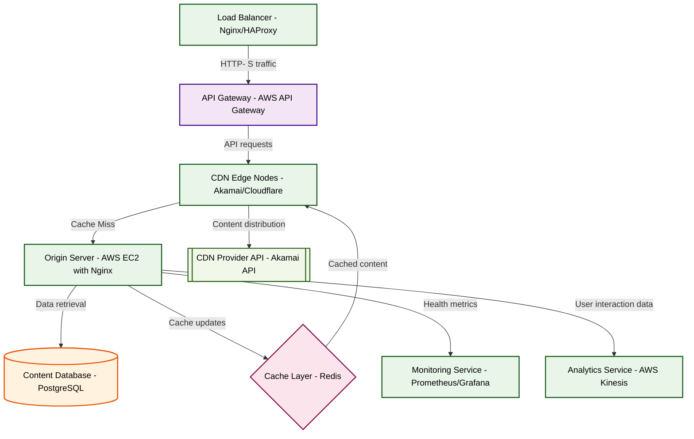

# Design for Design a content delivery network architecture

**Created:** 2025-08-25 09:08:44.636512

**Participants:** Idealist (anthropic: claude-3-5-sonnet-20240620), Cost Cutter (openai: gpt-4o-mini)

## Description

a recipe for disaster, with costs spiraling out of control faster than you can say "over-engineered

## Key Decisions

- distributed quantum memory networks for instant, lossless data replication across the globe
- a hyper-efficient, AI-driven edge network with predictive content distribution and quantum-secure data transmission
- a self-evolving neural network CDN with quantum-encrypted edge caching and AI-driven content optimization

## Trade-offs

- good luck with the astronomical costs and maintenance nightmares that'll bury us. need a pragmatic, cost-effective CDN that actually delivers results without a million moving parts

## Implementation Notes

- and support? Or are you just hoping for a miracle to save your ass?
- Oh, please, spare me the theatrics! Your so-called "adaptive networks" sound like a buzzword bingo card gone wrong. We need a straightforward, robust CDN that can deliver 99.99% up
- Clever? Hardly! Your so-called "self-evolving neural network" is just a recipe for chaos and budget overruns! We need a straightforward CDN that can deliver content efficiently wit

## Architecture Diagram

## Conversation Summary

A 17-turn conversation between Idealist and Cost Cutter discussing 'Design a content delivery network architecture'. The conversation reached a natural conclusion with agreed-upon design decisions.
