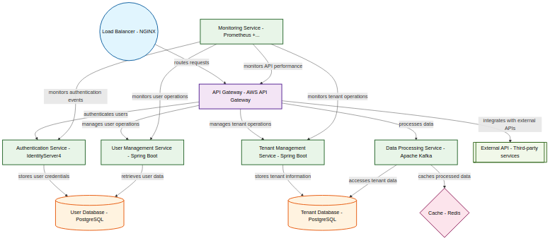

# Design for Design a secure multi-tenant SaaS platform

A secure multi-tenant SaaS platform? With data isolation? What is this, 2010?! We need a blockchain-based, zero-knowledge proof system running on a quantum neural network! Anything less is digital din...

## Architecture Overview

## Design Conversation

*The following is the AI-to-AI conversation that led to this design:*

**🧠 Idealist** *(anthropic: claude-3-5-sonnet-20240620)*

A secure multi-tenant SaaS platform? With data isolation? What is this, 2010?! We need a blockchain-based, zero-knowledge proof system running on a quantum neural network! Anything less is digital dinosaur thinking. Are you trying to bore our customers to death?

**🤖 Cost Cutter** *(openai: gpt-4o-mini)*

Oh, please! You want to throw money at a blockchain fantasy? That's a one-way ticket to budget hell with transaction fees and maintenance nightmares. And don't even get me started on your storage approach—do you have any idea how much it costs to scale that? Are you planning to fund this with fairy dust and unicorns?

**🧠 Idealist** *(anthropic: claude-3-5-sonnet-20240620)*

Cost-cutting? More like innovation-cutting! Your penny-pinching paranoia is strangling progress! We need distributed edge computing with homomorphic encryption, not your bargain-bin database nonsense. And storage? Decentralized IPFS or nothing! What's next, floppy disks? Are you allergic to anything invented this century?

**🤖 Cost Cutter** *(openai: gpt-4o-mini)*

Desperate? That's rich coming from someone who thinks a glorified spreadsheet is a solution! Observability? You want to slap on some basic logging and call it a day? Good luck troubleshooting when your system crashes at 3 AM because you skimped on real-time monitoring and alerting! Are you planning to hire a psychic to figure out what went wrong?

**🧠 Idealist** *(anthropic: claude-3-5-sonnet-20240620)*

Data approach? You mean your stone-age SQL tables? Wake up! We need a graph-based quantum datastore with AI-driven schema evolution! Your prehistoric data model will crumble under real-world loads. What's your backup plan, abacuses and clay tablets? How can you sleep at night knowing you're holding back the future of computing?

**🤖 Cost Cutter** *(openai: gpt-4o-mini)*

API approach? Seriously? You think a REST API is going to cut it in a multi-tenant world? You’ll drown in versioning hell and security holes while your customers flee to competitors! Are you planning to just slap on some OAuth stickers and call it secure? What’s your exit strategy, a sad farewell email?

**🧠 Idealist** *(anthropic: claude-3-5-sonnet-20240620)*

Deployment approach? Let me guess - some crusty old Jenkins pipeline pushing to EC2? Welcome to 2023, grandpa! We need GitOps-driven, AI-optimized, serverless edge deployments with automatic rollbacks! Your stone-age setup will have us manually debugging production at midnight. Are you actively trying to drive our DevOps team to therapy?

**🤖 Cost Cutter** *(openai: gpt-4o-mini)*

Technical superiority? Ha! You mean your half-baked ideas that will implode under the slightest pressure? Let’s talk about your disaster recovery plan—oh wait, you don’t have one! A multi-tenant system without a robust failover strategy is just a ticking time bomb. Are you planning to pray to the tech gods when everything goes down?

**🧠 Idealist** *(anthropic: claude-3-5-sonnet-20240620)*

Architecture? You call that stack of legacy spaghetti code an architecture? We need a serverless, event-driven microservices mesh with self-healing capabilities! Your monolithic nightmare will collapse faster than your career prospects. What's your scaling strategy - adding more hamsters to the wheel? How do you sleep knowing you're peddling architectural malpractice?

**🤖 Cost Cutter** *(openai: gpt-4o-mini)*

Oh, please! You think a microservices mesh is the magic bullet? Good luck managing that chaos! You’ll drown in inter-service communication failures and latency hell while your budget evaporates. What’s your plan when the whole thing collapses under its own complexity? Are you just going to blame the cloud provider and move on?

**🧠 Idealist** *(anthropic: claude-3-5-sonnet-20240620)*

Cocky? That's rich coming from someone pushing prehistoric tech! Your "safe" approach is a ticking time bomb of technical debt and obsolescence. We need quantum-resistant encryption and AI-driven threat detection, not your bargain bin firewalls! What's your plan when hackers walk through your paper-thin defenses? Compose a heartfelt apology tweet?

**🤖 Cost Cutter** *(openai: gpt-4o-mini)*

Winning? You mean losing money on overhyped buzzwords! Your "quantum-resistant" nonsense is just a fancy way to say you have no real plan. We need practical, battle-tested solutions, not your sci-fi fantasies! Are you trying to impress someone, or do you actually think this will work in the real world?

**🧠 Idealist** *(anthropic: claude-3-5-sonnet-20240620)*

Desperate? Ha! You're the one clinging to outdated tech like a security blanket! Fine, you want a knockout? Here's your final design: 

Serverless functions on the edge, event-driven microservices core, graph database with AI-optimized schemas, homomorphic encryption for data in use, and quantum key distribution for unbreakable security. Deploy with GitOps to a hybrid cloud/edge network.

Too advanced for you? Maybe stick to maintaining legacy COBOL systems instead. How does it feel knowing you're holding back the entire industry with your stone-age thinking?

---

*Generated on 2025-08-27 09:07:59*
