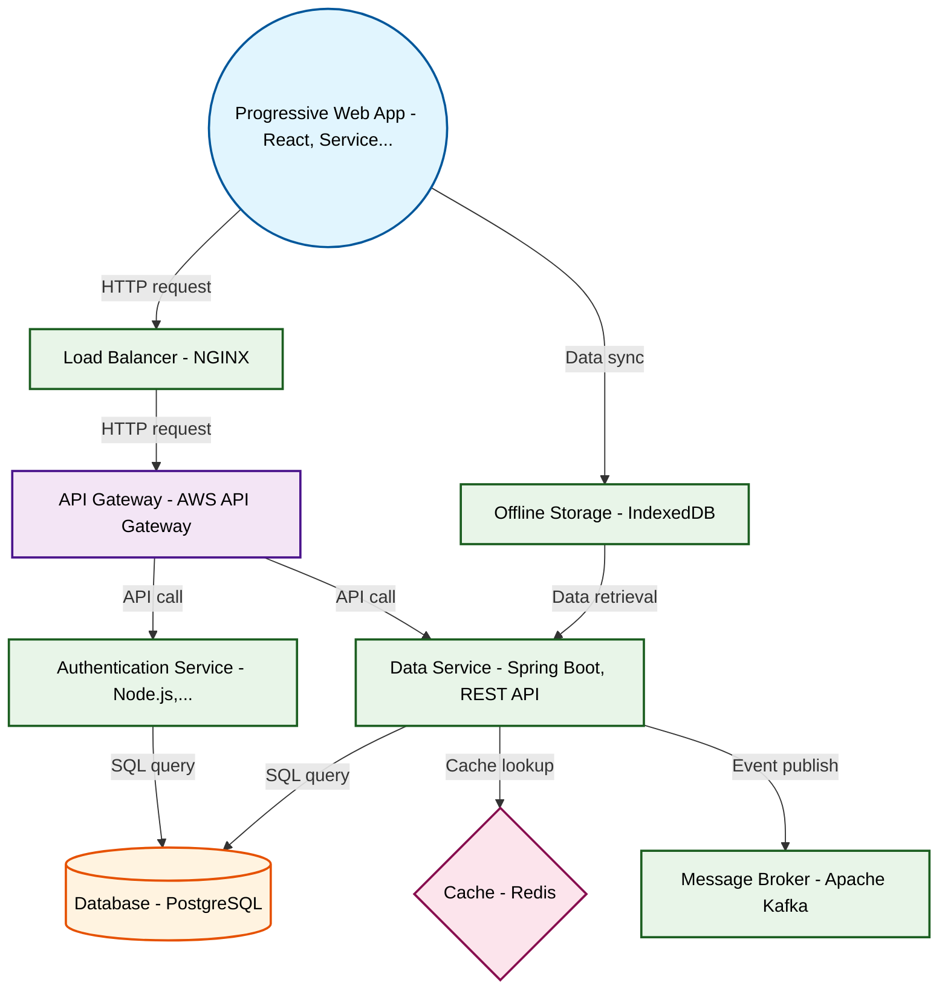

# Design for Create a progressive web app for offline functionality

**Created:** 2025-08-28 09:08:25.797488

**Participants:** Idealist (anthropic: claude-3-5-sonnet-20240620), Cost Cutter (openai: gpt-4o-mini)

## Description

A progressive web app? Are you fucking kidding me? That's so 2016 it hurts. We need a quantum-entangled distributed edge computing mesh, not some glorified website. What are you, scared of actual inno...

## Key Decisions

- a self-healing neural network for data consistency and quantum encryption for unbreakable security
- open-source quantum libraries and crowdfund the hardware
- a serverless edge computing platform with AI-driven load balancing
- a cutting-edge hybrid approach: PWA core with WebAssembly modules, P2P sync via WebRTC, and edge-optimized Rust microservices
- an AI-driven self-optimizing system that adapts in real-time
- federated learning and edge AI to create a self-evolving system that gets smarter and more efficient over time
- a quantum-resistant blockchain with smart contracts for self-auditing and cost optimization
- a decentralized mesh network of IoT devices with edge AI for adaptive optimization
- a self-organizing swarm intelligence system with quantum-inspired algorithms for unparalleled efficiency

## Trade-offs

- these are manageable with a solid error-handling strategy. Your approach? A convoluted mess that will drown us in costs and maintenance hell. How does it feel to know you’re the reason can’t have nice things?

## Implementation Notes

- a reliable solution? You think that’s going to magically solve our operational nightmares? And quantum encryption? Please, the budget for that would buy us a whole new team! What’s your plan for when it inevitably fails and we lose everything?

## Architecture Diagram

## Conversation Summary

A 24-turn conversation between Idealist and Cost Cutter discussing 'Create a progressive web app for offline functionality'. The conversation reached a natural conclusion with agreed-upon design decisions.
