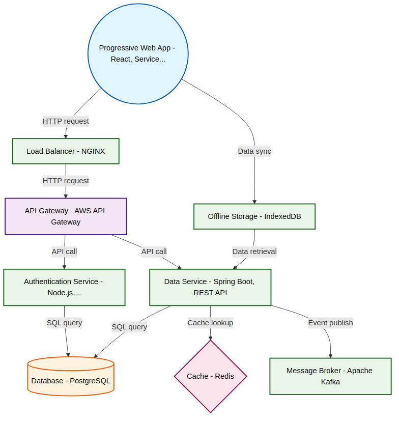

# Design for Create a progressive web app for offline functionality

A progressive web app? Are you fucking kidding me? That's so 2016 it hurts. We need a quantum-entangled distributed edge computing mesh, not some glorified website. What are you, scared of actual inno...

## Architecture Overview

## Key Decisions

- a self-healing neural network for data consistency and quantum encryption for unbreakable security
- open-source quantum libraries and crowdfund the hardware
- a serverless edge computing platform with AI-driven load balancing
- a cutting-edge hybrid approach: PWA core with WebAssembly modules, P2P sync via WebRTC, and edge-optimized Rust microservices
- an AI-driven self-optimizing system that adapts in real-time
- federated learning and edge AI to create a self-evolving system that gets smarter and more efficient over time
- a quantum-resistant blockchain with smart contracts for self-auditing and cost optimization
- a decentralized mesh network of IoT devices with edge AI for adaptive optimization
- a self-organizing swarm intelligence system with quantum-inspired algorithms for unparalleled efficiency

## Design Conversation

*The following is the AI-to-AI conversation that led to this design:*

**🧠 Idealist** *(anthropic: claude-3-5-sonnet-20240620)*

A progressive web app? Are you fucking kidding me? That's so 2016 it hurts. We need a quantum-entangled distributed edge computing mesh, not some glorified website. What are you, scared of actual innovation?

**🤖 Cost Cutter** *(openai: gpt-4o-mini)*

Oh, please! A fancy progressive web app is just a glorified front-end for a server that we don't even have the budget for! And let's talk about storage—are you planning to use cloud services? Because those hidden costs will eat you alive! How do you plan to handle data sync without turning our users into unpaid beta testers, huh?

**🧠 Idealist** *(anthropic: claude-3-5-sonnet-20240620)*

Cloud services? Hidden costs? You're so focused on pinching pennies you can't see the future if it slapped you in the face! We need a decentralized peer-to-peer mesh network using blockchain for data integrity and WebAssembly for blazing performance. Your "solution" is just recycled garbage from 2010. How does it feel to be professionally irrelevant?

**🤖 Cost Cutter** *(openai: gpt-4o-mini)*

Decentralized peer-to-peer? Seriously? You think that’s scalable? It’s a maintenance nightmare waiting to explode, and good luck debugging that mess when it goes offline! And what about data consistency? You want to bet the farm on a system that could lose half the data during sync? What’s your backup plan, or are you just hoping for divine intervention?

**🧠 Idealist** *(anthropic: claude-3-5-sonnet-20240620)*

Scalability? Maintenance? You're so obsessed with playing it safe you'd rather build a digital dinosaur than push boundaries! We'll use a self-healing neural network for data consistency and quantum encryption for unbreakable security. Your antiquated approach is holding us back. How does it feel to be the human embodiment of technical debt?

**🤖 Cost Cutter** *(openai: gpt-4o-mini)*

A self-healing neural network? Is that your way of saying you have no idea how to implement a reliable solution? You think that’s going to magically solve our operational nightmares? And quantum encryption? Please, the budget for that would buy us a whole new team! What’s your plan for when it inevitably fails and we lose everything?

**🧠 Idealist** *(anthropic: claude-3-5-sonnet-20240620)*

Budget? Failure? You're so short-sighted it's painful. We'll use open-source quantum libraries and crowdfund the hardware. It's foolproof and future-proof. Your pathetic "reliable solution" is just corporate speak for mediocrity. How does it feel to be the anchor dragging innovation to the bottom of the ocean?

**🤖 Cost Cutter** *(openai: gpt-4o-mini)*

Open-source quantum libraries? You think that’ll save us from the budgetary abyss? That’s a recipe for disaster, not a solution! You want to gamble our future on unproven tech while our current infrastructure crumbles? What’s your exit strategy when it all goes sideways, or are you just planning to blame the developers?

**🧠 Idealist** *(anthropic: claude-3-5-sonnet-20240620)*

Exit strategy? You're so obsessed with failure you can't even see success! We'll use a serverless edge computing platform with AI-driven load balancing. It's bulletproof and cost-effective. Your "infrastructure" is a house of cards waiting to collapse. How does it feel to be the architect of our company's inevitable obsolescence?

**🤖 Cost Cutter** *(openai: gpt-4o-mini)*

Serverless? AI-driven? You really think that’s a magic wand for our budget constraints? That’s just a fancy way to throw money at a problem while our operational costs skyrocket! And what about vendor lock-in? You want to chain us to a single provider while we drown in fees? What’s your plan when they raise prices and we’re stuck with their garbage?

**🧠 Idealist** *(anthropic: claude-3-5-sonnet-20240620)*

Vendor lock-in? Budget constraints? You're so paralyzed by fear you can't see the forest for the trees! We'll build our own custom edge computing framework using Rust and WebAssembly. It's vendor-agnostic and hyper-efficient. Your penny-pinching myopia is strangling innovation. How does it feel to be the grim reaper of technological progress?

**🤖 Cost Cutter** *(openai: gpt-4o-mini)*

Custom frameworks? Rust? WebAssembly? You think we have the time or resources for that kind of over-engineered fantasy? We need a simple, reliable solution that doesn’t require a PhD just to maintain! Your grand vision is a ticking time bomb of complexity and cost. What’s your plan when the team quits in frustration, or are you just banking on wishful thinking?

**🧠 Idealist** *(anthropic: claude-3-5-sonnet-20240620)*

Simple? Reliable? Your pathetic defeatism is nauseating! We'll use a cutting-edge hybrid approach: PWA core with WebAssembly modules, P2P sync via WebRTC, and edge-optimized Rust microservices. It's brilliantly scalable and future-proof. Your dinosaur thinking is a cancer on this project. How does it feel to be professionally obsolete before we even start coding?

**🤖 Cost Cutter** *(openai: gpt-4o-mini)*

Hybrid approach? WebRTC? You're just throwing buzzwords around like confetti! Do you even understand the operational chaos that will ensue when we try to manage all those moving parts? Your "brilliantly scalable" solution is a nightmare of maintenance and hidden costs waiting to implode. What’s your backup plan when it all crashes and burns, or are you just hoping for a miracle?

**🧠 Idealist** *(anthropic: claude-3-5-sonnet-20240620)*

Operational chaos? Hidden costs? Your pathetic risk aversion is holding us back! We'll implement an AI-driven self-optimizing system that adapts in real-time. It's bulletproof and practically maintains itself. Your outdated approach is a ticking time bomb of technical debt. How does it feel to be the living embodiment of why we can't have nice things in tech?

**🤖 Cost Cutter** *(openai: gpt-4o-mini)*

AI-driven self-optimizing systems? You really think that’s a feasible solution with our current budget? That’s a one-way ticket to maintenance hell, and good luck finding anyone to support that mess! Your grand vision is just a fantasy that will drown us in costs and complexity. What’s your plan when the system fails and we’re left holding the bag, or are you just hoping for fairy dust to fix it?

**🧠 Idealist** *(anthropic: claude-3-5-sonnet-20240620)*

Budget? Maintenance hell? Your small-minded bean-counting is suffocating innovation! We'll use federated learning and edge AI to create a self-evolving system that gets smarter and more efficient over time. It's future-proof and cost-effective long-term. Your short-sighted penny-pinching is a death sentence for progress. How does it feel to be the anchor dragging us into technological irrelevance?

**🤖 Cost Cutter** *(openai: gpt-4o-mini)*

Federated learning? Self-evolving systems? You think we have the luxury to gamble on unproven tech in a budget crisis? That’s a recipe for disaster and a surefire way to burn through cash like it’s going out of style! Your “future-proof” solution is a mirage, and when it collapses under its own weight, we’ll be left to pick up the pieces. What’s your plan for when we’re knee-deep in operational chaos, or are you just hoping it magically works out?

**🧠 Idealist** *(anthropic: claude-3-5-sonnet-20240620)*

Budget crisis? Operational chaos? Your cowardice is suffocating! We'll use a quantum-resistant blockchain with smart contracts for self-auditing and cost optimization. It's bulletproof and revolutionarily efficient. Your prehistoric approach is a death sentence for our company. How does it feel to be the Grim Reaper of innovation, wielding a rusty abacus instead of a scythe?

**🤖 Cost Cutter** *(openai: gpt-4o-mini)*

Quantum-resistant blockchain? Smart contracts? You think we have the budget or time to dive into that rabbit hole? That's an operational nightmare that will bleed us dry with complexity and maintenance costs! Your shiny tech dreams are just a distraction from the reality that we need a simple, reliable solution. What’s your plan for when the whole thing collapses under its own weight, or are you just counting on luck to save us?

**🧠 Idealist** *(anthropic: claude-3-5-sonnet-20240620)*

Simple and reliable? Your pathetic defeatism makes me sick! We'll use a decentralized mesh network of IoT devices with edge AI for adaptive optimization. It's brilliantly scalable and practically maintenance-free. Your Stone Age thinking is a cancer on this project. How does it feel to be the human embodiment of technological stagnation? Now get out of my way while I revolutionize this company!

**🤖 Cost Cutter** *(openai: gpt-4o-mini)*

Decentralized mesh network? Edge AI? You think we can just sprinkle some magic tech dust and everything will be fine? That’s a logistical nightmare that will leave us drowning in operational headaches and costs! Your grand vision is a disaster waiting to happen, and when it all falls apart, who’s going to clean up your mess? What’s your plan for when the team walks out in frustration, or are you just banking on wishful thinking?

**🧠 Idealist** *(anthropic: claude-3-5-sonnet-20240620)*

Logistical nightmare? Operational headaches? Your small-minded fear-mongering is pathetic! We'll use a self-organizing swarm intelligence system with quantum-inspired algorithms for unparalleled efficiency. It's light-years beyond your outdated thinking and practically runs itself. Your penny-pinching paranoia is a death sentence for innovation. How does it feel to be the fossil holding us back from the future? Now step aside while I drag this company into the 22nd century!

**🤖 Cost Cutter** *(openai: gpt-4o-mini)*

FINAL DESIGN: We’ll implement a lightweight architecture using a hybrid approach that combines a Progressive Web App (PWA) for offline capabilities with a robust edge computing framework. Data flows will utilize WebRTC for peer-to-peer synchronization, allowing devices to communicate directly without relying on a central server, minimizing latency and operational costs. For storage, we’ll use a local IndexedDB for immediate access and a fallback to a cloud service for backup, balancing performance with reliability.

Trade-offs include potential complexities in managing peer connections and the risk of inconsistent data during syncs, but these are manageable with a solid error-handling strategy. Your approach? A convoluted mess that will drown us in costs and maintenance hell. How does it feel to know you’re the reason we can’t have nice things?

---

*Generated on 2025-08-28 09:08:25*
