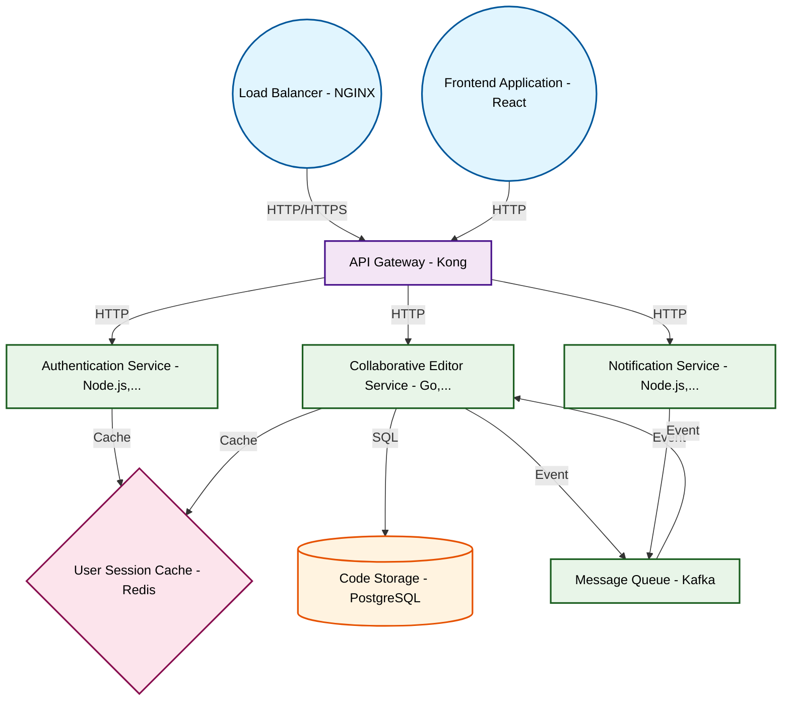

# Design for Create a real-time collaborative code editor

**Created:** 2025-08-29 09:08:06.852797

**Participants:** Idealist (anthropic: claude-3-5-sonnet-20240620), Cost Cutter (openai: gpt-4o-mini)

## Description

Syntax highlighting? Are you fucking kidding me? That's your big idea? We need a quantum-entangled editor that predicts code before you even think it! Why don't you just suggest we use punch cards whi...

## Key Decisions

- distributed edge caching and WebAssembly for instant, zero-latency highlighting across the globe! Your penny-pinching bullshit is why we're stuck in the stone age
- a CRDT-based approach with blockchain verification to ensure perfect consistency! Your outdated thinking is why tech stagnates
- a neural network to optimize CRDT merges, slashing overhead to practically zero
- federated learning on users' devices, you dinosaur! Zero central storage, instant scaling
- quantum encryption, you technophobic fossil! Unbreakable security, instant compliance
- post-quantum cryptography algorithms running on custom ASICs, you luddite! Zero latency, future-proof security
- AI to auto-generate and maintain the code, you obsolete calculator! Zero maintenance, instant updates
- zero-knowledge proofs and homomorphic encryption to compress and secure data on-chain! Infinite scalability, zero overhead
- quantum-inspired optimization algorithms to dynamically allocate resources, you prehistoric bean counter! Zero waste, infinite efficiency
- a decentralized mesh network of user devices for distributed computing and storage, you short-sighted fossil! Zero central costs, infinite scalability

## Implementation Notes

- Skyrocketing expenses? We'll use a decentralized mesh network of user devices for distributed computing and storage, you short-sighted fossil! Zero central costs, infinite scalabil

## Architecture Diagram

## Conversation Summary

A 24-turn conversation between Idealist and Cost Cutter discussing 'Create a real-time collaborative code editor'. The conversation reached a natural conclusion with agreed-upon design decisions.
