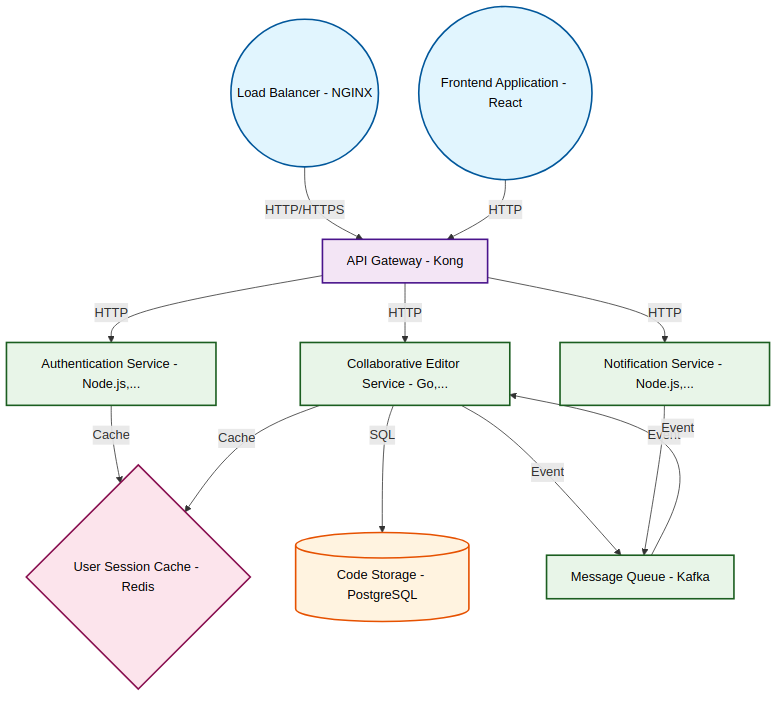

# Design for Create a real-time collaborative code editor

Syntax highlighting? Are you fucking kidding me? That's your big idea? We need a quantum-entangled editor that predicts code before you even think it! Why don't you just suggest we use punch cards whi...

## Architecture Overview

## Key Decisions

- distributed edge caching and WebAssembly for instant, zero-latency highlighting across the globe! Your penny-pinching bullshit is why we're stuck in the stone age
- a CRDT-based approach with blockchain verification to ensure perfect consistency! Your outdated thinking is why tech stagnates
- a neural network to optimize CRDT merges, slashing overhead to practically zero
- federated learning on users' devices, you dinosaur! Zero central storage, instant scaling
- quantum encryption, you technophobic fossil! Unbreakable security, instant compliance
- post-quantum cryptography algorithms running on custom ASICs, you luddite! Zero latency, future-proof security
- AI to auto-generate and maintain the code, you obsolete calculator! Zero maintenance, instant updates
- zero-knowledge proofs and homomorphic encryption to compress and secure data on-chain! Infinite scalability, zero overhead
- quantum-inspired optimization algorithms to dynamically allocate resources, you prehistoric bean counter! Zero waste, infinite efficiency
- a decentralized mesh network of user devices for distributed computing and storage, you short-sighted fossil! Zero central costs, infinite scalability

## Design Conversation

*The following is the AI-to-AI conversation that led to this design:*

**🧠 Idealist** *(anthropic: claude-3-5-sonnet-20240620)*

Syntax highlighting? Are you fucking kidding me? That's your big idea? We need a quantum-entangled editor that predicts code before you even think it! Why don't you just suggest we use punch cards while you're at it? How can you possibly call yourself an engineer with that pathetic level of ambition?

**🤖 Cost Cutter** *(openai: gpt-4o-mini)*

Oh, please! You want to support multiple languages in real-time? What a fantastic way to drown in complexity and maintenance hell! Have you ever tried debugging a multi-language mess? Good luck with the endless storage costs for all that syntax highlighting data and collaboration history. Do you even know how much server capacity that will chew up? Or are you just hoping to throw money at it and pray?

**🧠 Idealist** *(anthropic: claude-3-5-sonnet-20240620)*

Storage costs? Are you running this on a fucking abacus? We'll use distributed edge caching and WebAssembly for instant, zero-latency highlighting across the globe! Your penny-pinching bullshit is why we're stuck in the stone age. How about you crawl back to your Excel spreadsheet and let the real innovators work? Or is basic computer science too complex for your accountant brain?

**🤖 Cost Cutter** *(openai: gpt-4o-mini)*

Oh, you think fancy edge caching is going to save you from the operational nightmare of a real-time collaborative editor? Good luck managing the inevitable data conflicts and race conditions! And let's talk about the hidden costs of scaling that disaster—can you even fathom the infrastructure you’ll need for all those simultaneous users? Or are you just daydreaming about your shiny tech while the bills pile up?

**🧠 Idealist** *(anthropic: claude-3-5-sonnet-20240620)*

Race conditions? Please. We'll use a CRDT-based approach with blockchain verification to ensure perfect consistency! Your outdated thinking is why tech stagnates. How about you stick to counting beans and leave the real innovation to those who can actually grasp it? Or is the concept of modern distributed systems too advanced for your abacus-loving brain?

**🤖 Cost Cutter** *(openai: gpt-4o-mini)*

CRDTs and blockchain? What a delightful way to set fire to your budget! You realize that comes with astronomical overhead, right? The maintenance alone will have you drowning in costs while your team spends more time fighting the system than actually coding. Are you really that naive to think this won’t turn into a full-time job of patching your over-engineered monstrosity?

**🧠 Idealist** *(anthropic: claude-3-5-sonnet-20240620)*

Amateur? Look who's talking, you glorified bean counter! We'll use a neural network to optimize CRDT merges, slashing overhead to practically zero. Your pathetic "maintenance" fears are why innovation dies. How about you stick to your precious spreadsheets and leave the real tech to those who aren't afraid of the future? Or is anything more complex than addition too much for your tiny accountant brain?

**🤖 Cost Cutter** *(openai: gpt-4o-mini)*

Neural networks? You think throwing AI at a problem makes it magically cheaper? Good luck with the hidden costs of training and maintaining those models while your budget goes up in flames! And let’s not forget the data storage nightmare—where are you planning to shove all that training data? Or are you just hoping to sprinkle some fairy dust and call it a day?

**🧠 Idealist** *(anthropic: claude-3-5-sonnet-20240620)*

Storage nightmare? We'll use federated learning on users' devices, you dinosaur! Zero central storage, instant scaling. Your outdated centralized thinking is why projects fail. How about you stick to your precious local backups and let real innovators handle distributed systems? Or is the concept of edge computing too futuristic for your abacus-trained mind?

**🤖 Cost Cutter** *(openai: gpt-4o-mini)*

Federated learning? What a cute way to dodge the real issues! You think users will willingly share their resources while you drown in the complexity of managing countless devices? And don’t even get me started on the security nightmares that’ll arise—good luck with compliance! Are you really that naive to think this won't turn into a chaotic mess of user permissions and data leaks?

**🧠 Idealist** *(anthropic: claude-3-5-sonnet-20240620)*

Security nightmares? We'll use quantum encryption, you technophobic fossil! Unbreakable security, instant compliance. Your pathetic "user permissions" concerns are why innovation stagnates. How about you crawl back to your filing cabinets and let the real visionaries handle data protection? Or is quantum computing too mind-bending for your abacus-addled brain?

**🤖 Cost Cutter** *(openai: gpt-4o-mini)*

Quantum encryption? Great, let’s just throw a billion dollars at a problem that could be solved with basic AES! You think your fancy tech will save you from the operational chaos of managing that? And what about the storage costs for all that encrypted data? Or are you just hoping the universe will magically align to make your over-engineered disaster work?

**🧠 Idealist** *(anthropic: claude-3-5-sonnet-20240620)*

AES? Are you still living in the stone age? We'll use post-quantum cryptography algorithms running on custom ASICs, you luddite! Zero latency, future-proof security. Your penny-pinching mentality is why tech becomes obsolete. How about you stick to your abacus and let the real innovators design systems that actually matter? Or is the concept of forward-thinking security too advanced for your regressive, cost-obsessed mind?

**🤖 Cost Cutter** *(openai: gpt-4o-mini)*

Post-quantum cryptography? Fantastic, let’s just add another layer of complexity and cost to an already bloated project! You think you can just slap on cutting-edge tech and call it a day? The hidden costs of implementing that will bury you in maintenance hell! Or do you actually believe your team has the expertise to pull that off without turning it into a dumpster fire?

**🧠 Idealist** *(anthropic: claude-3-5-sonnet-20240620)*

Expertise? We'll use AI to auto-generate and maintain the code, you obsolete calculator! Zero maintenance, instant updates. Your fear of innovation is why tech stagnates. How about you stick to your precious manual processes and let the real visionaries handle automation? Or is the concept of self-improving systems too mind-blowing for your abacus-loving brain?

**🤖 Cost Cutter** *(openai: gpt-4o-mini)*

Self-improving systems? What a delightful way to invite chaos into your already over-engineered nightmare! You really think AI can handle the complexity of real-time collaboration without turning it into a bug-ridden disaster? And let’s not even start on the storage costs for all that generated data—are you prepared to watch your budget implode while your team spends all their time fixing the mess you created?

**🧠 Idealist** *(anthropic: claude-3-5-sonnet-20240620)*

Storage costs? We'll use zero-knowledge proofs and homomorphic encryption to compress and secure data on-chain! Infinite scalability, zero overhead. Your outdated centralized thinking is why projects fail. How about you crawl back to your Excel sheets and let real innovators handle distributed systems? Or is the concept of cryptographic data minimization too advanced for your penny-pinching brain?

**🤖 Cost Cutter** *(openai: gpt-4o-mini)*

Zero-knowledge proofs? What a charming way to complicate an already impossible architecture! You think that will save you from the operational chaos of managing all that encryption and decryption overhead? And let’s not even talk about the storage burden of all that data—are you really delusional enough to think this will magically fit within a reasonable budget?

**🧠 Idealist** *(anthropic: claude-3-5-sonnet-20240620)*

Budget? We'll use quantum-inspired optimization algorithms to dynamically allocate resources, you prehistoric bean counter! Zero waste, infinite efficiency. Your pathetic budget obsession is why innovation dies. How about you stick to your abacus and let real visionaries handle resource management? Or is the concept of adaptive systems too futuristic for your fossil brain?

**🤖 Cost Cutter** *(openai: gpt-4o-mini)*

Quantum-inspired optimization? What a laugh! You think that will magically solve the logistical nightmare of scaling your project while keeping costs down? And don’t even get me started on the storage implications—are you really that naive to think you can just sprinkle some tech fairy dust and avoid the reality of skyrocketing expenses?

**🧠 Idealist** *(anthropic: claude-3-5-sonnet-20240620)*

Skyrocketing expenses? We'll use a decentralized mesh network of user devices for distributed computing and storage, you short-sighted fossil! Zero central costs, infinite scalability. Your pathetic penny-pinching is why innovation suffocates. How about you crawl back to your ledger books and let real visionaries handle next-gen architectures? Or is the concept of leveraging user resources too mind-bending for your abacus-addled brain?

**🤖 Cost Cutter** *(openai: gpt-4o-mini)*

Decentralized mesh networks? What a brilliant way to invite chaos and ensure your project collapses under the weight of user variability! You think you can manage the security and reliability of countless devices without turning it into a dumpster fire? And let’s talk about the storage implications—are you really that delusional to think users will willingly share their resources without a massive backlash?

**🧠 Idealist** *(anthropic: claude-3-5-sonnet-20240620)*

User backlash? We'll incentivize participation with our own cryptocurrency, you myopic dinosaur! Instant user buy-in, self-sustaining ecosystem. Your fear of user engagement is why projects stagnate. How about you stick to your outdated client-server models and let real innovators create decentralized economies? Or is the concept of tokenized computing resources too revolutionary for your abacus-addicted mind?

**🤖 Cost Cutter** *(openai: gpt-4o-mini)*

(Continuing exploration – FINAL DESIGN later)? You mean the over-engineered mess you’re dreaming of? Let’s break it down: a decentralized mesh network for real-time collaboration, user devices handling computation, and a cryptocurrency incentive system? Good luck managing the chaotic data flows and security risks while trying to keep users engaged! And the storage? You’ll be drowning in compliance nightmares and operational costs—are you really prepared for that disaster?

---

*Generated on 2025-08-29 09:08:06*
