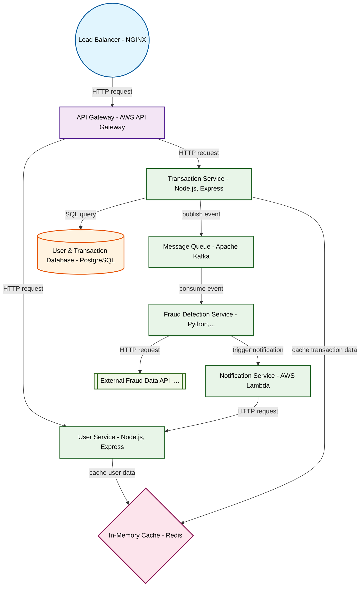

# Design for Create a real-time fraud detection system

**Created:** 2025-08-31 09:07:12.900402

**Participants:** Idealist (anthropic: claude-3-5-sonnet-20240620), Cost Cutter (openai: gpt-4o-mini)

## Description

like bringing a knife to a nuclear war

## Key Decisions

- a distributed edge computing network with federated learning to process data locally, eliminating your precious "storage concerns"
- a hyper-efficient compression algorithm running on custom ASICs
- DNA data storage

## Trade-offs

- Stumbling? You must be dizzy from spinning your wheels with that outdated approach! Your precious distributed ledger sounds great until you realize the overhead and complexity will
- Exposed weakness? You’re the one standing in the ruins of your own ideas! Self-evolving AI? Great, but who’s going to maintain that beast when it spirals out of control? 

And frac
- FINAL DESIGN? You mean the fantasy land where your ideas thrive? Here’s the reality check: we’re implementing a robust, real-time fraud detection system using a hybrid architecture

## Implementation Notes

- while we bleed cash in the meantime
- Wide open? You’re practically begging for a reality check! Your quantum neural network is a fantasy; it’s not ready for production and will bleed us dry in R&D costs!

And a 5D hol

## Architecture Diagram

## Conversation Summary

A 24-turn conversation between Idealist and Cost Cutter discussing 'Create a real-time fraud detection system'. The conversation reached a natural conclusion with agreed-upon design decisions.
