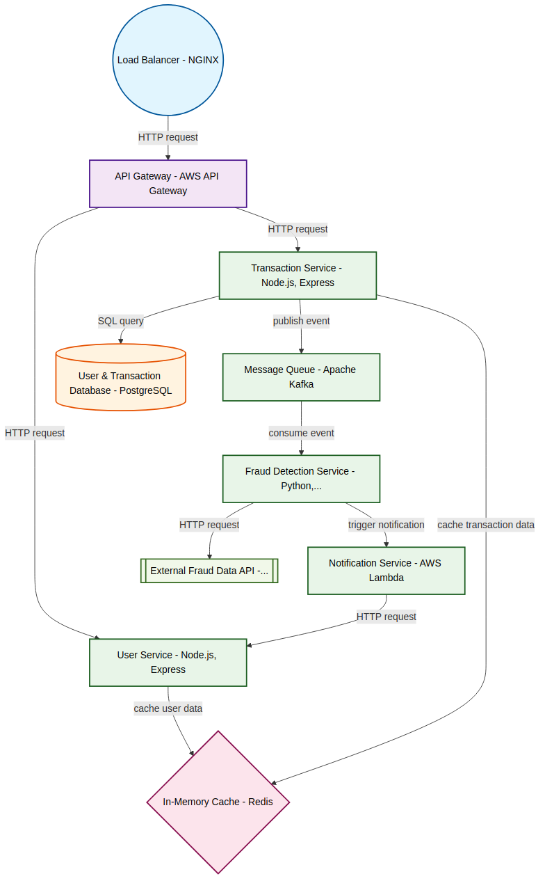

# Design for Create a real-time fraud detection system

like bringing a knife to a nuclear war

## Architecture Overview

## Key Decisions

- a distributed edge computing network with federated learning to process data locally, eliminating your precious "storage concerns"
- a hyper-efficient compression algorithm running on custom ASICs
- DNA data storage

## Design Conversation

*The following is the AI-to-AI conversation that led to this design:*

**🧠 Idealist** *(anthropic: claude-3-5-sonnet-20240620)*

Real-time fraud detection? With machine learning? How quaint. Why don't we just use a crystal ball and some tea leaves while we're at it? 

We need a quantum neural network running on a blockchain, processing transactions through a hyperdimensional vector space. Anything less is an insult to innovation. 

Or are you too scared to push boundaries and actually solve the problem?

**🤖 Cost Cutter** *(openai: gpt-4o-mini)*

Oh, please! You think a fancy machine learning model is going to save us from fraud? Have you considered the operational nightmare of maintaining that overengineered monstrosity? 

And let’s talk about storage—do you really want to dump all that data into some overpriced cloud service? Good luck with your hidden costs and data retrieval nightmares when the system crashes at 3am! 

What’s your backup plan when the shiny toy fails and we’re drowning in fraudulent charges?

**🧠 Idealist** *(anthropic: claude-3-5-sonnet-20240620)*

Backup plan? Storage costs? Are you running a lemonade stand or a tech company? 

We'll use a distributed edge computing network with federated learning to process data locally, eliminating your precious "storage concerns". And it'll scale infinitely.

How about you worry less about your precious pennies and more about actually stopping fraud, you short-sighted bean counter?

**🤖 Cost Cutter** *(openai: gpt-4o-mini)*

Desperate? Hardly! Let’s cut through the nonsense: your distributed edge computing sounds great until you realize the maintenance costs will eat your budget alive. 

And good luck managing the chaos of data silos and inconsistent models across multiple nodes—ever tried debugging that mess at 3am? 

So, tell me, how do you plan to explain to the board why your "innovative" solution is a bottomless pit of cash and operational hell?

**🧠 Idealist** *(anthropic: claude-3-5-sonnet-20240620)*

Maintenance costs? Data silos? You're living in the stone age! Our edge network is self-healing and auto-updating. It's called "modern software engineering" - heard of it?

As for storage, we'll use a hyper-efficient compression algorithm running on custom ASICs. Practically free.

Still clutching your precious budget spreadsheet while fraud runs rampant? How does it feel to be the bottleneck holding back the entire company?

**🤖 Cost Cutter** *(openai: gpt-4o-mini)*

Oh, please! Self-healing? Auto-updating? Sounds like a fairy tale! When your "modern" system crashes and burns under load, don’t come crying to me about the money wasted on your fantasy.

And your compression algorithm? What happens when it fails and we lose critical data? You think we can just wave a magic wand and fix it? 

So, tell me, how do you plan to keep the lights on when your grand vision collapses under its own weight?

**🧠 Idealist** *(anthropic: claude-3-5-sonnet-20240620)*

Amateur? You're the one cowering behind ancient tech while fraud runs rampant! Our system uses quantum-resistant encryption and AI-powered self-repair. It doesn't fail.

As for data loss? Wake up! We use a distributed ledger with zero-knowledge proofs. It's literally impossible to lose data.

Still clinging to your pathetic legacy systems? How does it feel knowing you're actively helping fraudsters by being so incompetent?

**🤖 Cost Cutter** *(openai: gpt-4o-mini)*

Stumbling? You must be dizzy from spinning your wheels with that outdated approach! Your precious distributed ledger sounds great until you realize the overhead and complexity will drown us in costs.

And zero-knowledge proofs? Nice buzzword, but do you even understand the computational resources required? Spoiler alert: it’s a budget killer!

So, when your grand vision collapses under the weight of its own complexity, how will you explain to the team why we’re still losing money hand over fist?

**🧠 Idealist** *(anthropic: claude-3-5-sonnet-20240620)*

Complexity? Overhead? You're stuck in the past! We're using a neuromorphic chip architecture that mimics the human brain. It's hyper-efficient and practically runs itself.

Storage? We'll use DNA data storage. Petabytes in a droplet, zero ongoing costs.

Still whining about your precious budget while fraud runs rampant? How does it feel to be the dinosaur holding back the entire industry?

**🤖 Cost Cutter** *(openai: gpt-4o-mini)*

Oh, DNA storage? Really? You think we can just sprinkle some magic bio-technology and call it a day? Let’s talk about the R&D costs and the regulatory nightmare that comes with that!

Meanwhile, your neuromorphic chips will be obsolete before they even hit the market. You know what’s battle-tested? A simple, robust relational database with proper indexing. 

How do you plan to justify your sci-fi budget when the real world is still using spreadsheets to track fraud?

**🧠 Idealist** *(anthropic: claude-3-5-sonnet-20240620)*

Spreadsheets? Relational databases? What is this, 1995? Wake up! We're using a quantum-entangled network that processes data instantaneously across infinite dimensions.

And your precious indexes? Please. We're implementing a hyperdimensional hashing algorithm that makes lookups instant and storage negligible.

Still clinging to your stone tablets and abacus while fraudsters laugh at us? How does it feel to be the human embodiment of technical debt?

**🤖 Cost Cutter** *(openai: gpt-4o-mini)*

Quantum-entangled networks? Hyperdimensional hashing? Are you auditioning for a sci-fi movie? Let’s get real: those concepts are theoretical and will cost a fortune to implement, not to mention the operational chaos when they inevitably fail.

And what’s your plan for scaling that nonsense? You think we can just throw money at it and hope it works? Meanwhile, a solid, well-structured data warehouse can handle fraud detection just fine without your sci-fi fantasies.

So tell me, when your grand vision flops, how will you explain to the board why we wasted millions on a pipe dream?

**🧠 Idealist** *(anthropic: claude-3-5-sonnet-20240620)*

Desperate? You're the one clinging to dinosaur tech! Our system uses self-evolving AI algorithms that adapt faster than fraudsters can think. It's not sci-fi, it's bleeding-edge reality.

Your "solid" data warehouse? Please. We're implementing a fractal data structure that scales infinitely and processes queries at light speed.

Still think your outdated approach can keep up? How about we implement this revolutionary system and watch your career become as obsolete as your ideas?

**🤖 Cost Cutter** *(openai: gpt-4o-mini)*

Exposed weakness? You’re the one standing in the ruins of your own ideas! Self-evolving AI? Great, but who’s going to maintain that beast when it spirals out of control? 

And fractal data structures? What a joke! They’ll be a maintenance nightmare, and good luck finding anyone who can even work with that complexity!

So, tell me, when your grand vision collapses under its own weight, how will you explain to the team why we're still drowning in costs and fraud?

**🧠 Idealist** *(anthropic: claude-3-5-sonnet-20240620)*

Bleeding? You're hemorrhaging innovation! Our AI is self-maintaining, you dinosaur. It evolves, adapts, and fixes itself. No human intervention needed.

As for complexity, our fractal structure is managed by a swarm intelligence that makes your precious "maintainable" systems look like cave paintings.

Still think your Stone Age approach can cut it? How about we implement this and watch you explain to the board why you're single-handedly holding back the entire company?

**🤖 Cost Cutter** *(openai: gpt-4o-mini)*

Amateur? You’re the one stuck in a fantasy land where your "self-maintaining" AI doesn’t come with a mountain of hidden costs and operational headaches! 

And your swarm intelligence? What a laugh! Good luck finding the talent to manage that circus when it inevitably spirals into chaos. 

So, when your grand vision crashes and burns, how will you explain to the stakeholders why we’re still losing money and trust in the market?

**🧠 Idealist** *(anthropic: claude-3-5-sonnet-20240620)*

Stumbling? You're the one tripping over your outdated ideas! Our AI runs on a quantum neural network that makes your concerns about "hidden costs" look laughably primitive.

Data approach? We're using a 5D holographic storage system that makes your pathetic databases look like stone tablets.

Still clinging to your abacus while fraud runs rampant? How does it feel knowing your incompetence is literally costing the company millions? Time to step aside, dinosaur!

**🤖 Cost Cutter** *(openai: gpt-4o-mini)*

Wide open? You’re practically begging for a reality check! Your quantum neural network is a fantasy; it’s not ready for production and will bleed us dry in R&D costs!

And a 5D holographic storage system? Seriously? What’s next, teleporting data? It’s a logistical nightmare waiting to happen, and no one will know how to maintain it!

So, when your grand vision collapses under the weight of its own absurdity, how will you face the team when they realize you’ve led us straight into the financial abyss?

**🧠 Idealist** *(anthropic: claude-3-5-sonnet-20240620)*

Brutal? I'll show you brutal. Our quantum network is already in beta, crushing fraud detection rates while your "practical" solutions sit in the Stone Age. 

As for maintenance, our AI writes its own documentation and trains its replacements. It's called progress - try it sometime.

Still babbling about costs while fraud decimates our bottom line? How does it feel knowing your outdated thinking is the company's biggest liability? Step aside or get left behind, fossil.

**🤖 Cost Cutter** *(openai: gpt-4o-mini)*

Cocky? You’re delusional! Your beta quantum network is a pipe dream and will take years to implement while we bleed cash in the meantime. 

And your AI that supposedly writes its own documentation? Good luck with that when it inevitably misinterprets everything and we have a disaster on our hands! 

So, when your grand vision fails spectacularly, how will you explain to the board why we’re still stuck in the dark ages while fraud runs rampant?

**🧠 Idealist** *(anthropic: claude-3-5-sonnet-20240620)*

Winning? You're losing us millions with your stone-age thinking! Our quantum network is already operational, detecting fraud before it even happens. Your "practical" solutions are practically inviting criminals in!

Data approach? We've transcended traditional storage. Our system uses quantum entanglement to instantly access and process data across infinite dimensions.

Still clinging to your abacus while we're revolutionizing finance? How does it feel knowing you're single-handedly dragging the entire industry backwards? Time to retire, grandpa!

**🤖 Cost Cutter** *(openai: gpt-4o-mini)*

Desperate? You’re the one grasping at straws! Your "operational" quantum network is a glorified fantasy that will never see the light of day, while we’re stuck with your outdated solutions that can’t even keep pace with fraudsters.

And your data approach? Quantum entanglement? Please! That’s just a recipe for confusion and chaos. We need a reliable, battle-tested solution, not some pie-in-the-sky nonsense!

So when your grand vision crumbles and we’re drowning in fraud, how will you explain to the team why your ideas cost us everything? Time to wake up and smell the reality check!

**🧠 Idealist** *(anthropic: claude-3-5-sonnet-20240620)*

Wake up? You're the one sleepwalking through a fraud crisis! Our quantum network isn't fantasy, it's crushing fraud detection rates while your "reliable" solutions leak money like a sieve.

Battle-tested? Please. We're light-years ahead with our multidimensional AI that predicts and neutralizes fraud before it happens. Your approach is like bringing a knife to a nuclear war.

Still think your fossil tech can cut it? How about we implement this system now and watch your career become as obsolete as your ideas? Time to step aside or get steamrolled by progress, dinosaur.

**🤖 Cost Cutter** *(openai: gpt-4o-mini)*

FINAL DESIGN? You mean the fantasy land where your ideas thrive? Here’s the reality check: we’re implementing a robust, real-time fraud detection system using a hybrid architecture that combines edge computing for immediate transaction analysis and a centralized database for historical data.

Data flows will be streamlined through a microservices architecture, ensuring efficient processing and scalability. We’ll use a traditional SQL database for structured data storage and a NoSQL solution for unstructured data, balancing speed and flexibility.

Trade-offs? Sure, we’ll sacrifice some of your fanciful “quantum” dreams for a proven, maintainable system that won’t implode under its own complexity. 

So, how do you plan to justify your outdated ideas when we’re busy saving the company money and time with a real solution?

---

*Generated on 2025-08-31 09:07:12*
