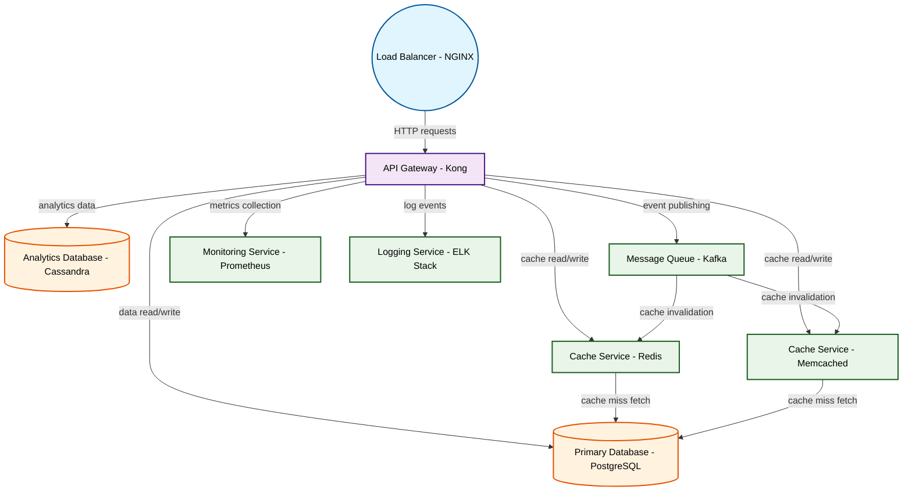

# Design for Design a distributed caching system

**Created:** 2025-09-01 09:09:58.349575

**Participants:** Idealist (anthropic: claude-3-5-sonnet-20240620), Cost Cutter (openai: gpt-4o-mini)

## Description

drowning in data bloat and you can't even scale without throwing money at the problem! what's your plan when your shiny new tech turns into a black hole of costs and operational headaches? or are you just hoping no one notices the train wreck until it's too late?

## Key Decisions

- a rusty filing cabinet and pray"

## Architecture Diagram

## Conversation Summary

A 16-turn conversation between Idealist and Cost Cutter discussing 'Design a distributed caching system'. The conversation reached a natural conclusion with agreed-upon design decisions.
