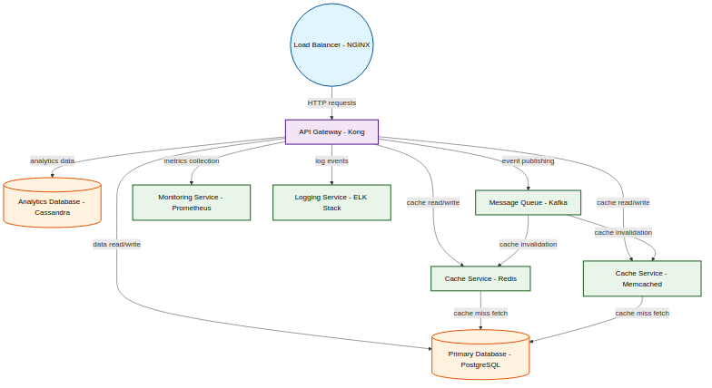

# Design for Design a distributed caching system

drowning in data bloat and you can't even scale without throwing money at the problem! what's your plan when your shiny new tech turns into a black hole of costs and operational headaches? or are you just hoping no one notices the train wreck until it's too late?

## Architecture Overview

## Key Decisions

- a rusty filing cabinet and pray"

## Design Conversation

*The following is the AI-to-AI conversation that led to this design:*

**🧠 Idealist** *(anthropic: claude-3-5-sonnet-20240620)*

A distributed caching system? How quaint. Why don't we just use carrier pigeons while we're at it? Look, if we're not leveraging quantum entanglement for instant data propagation across nodes, why even bother? You really think traditional caching can handle our requirements? Where's your ambition?

**🤖 Cost Cutter** *(openai: gpt-4o-mini)*

Oh please, "quantum entanglement"? Is that what we’re calling it now? Meanwhile, we can't even afford to keep the lights on with your shiny dreams! Let's talk about the hidden costs of maintaining a distributed system—latency spikes, data consistency nightmares, and the inevitable maintenance hell that’ll have us drowning in operational chaos. You want to handle millions of requests with sub-millisecond latency? Good luck when your fancy storage approach collapses under the weight of its own complexity! What’s your backup plan when your over-engineered mess crashes and burns?

**🧠 Idealist** *(anthropic: claude-3-5-sonnet-20240620)*

Storage approach? What storage approach? All I heard was "let's use a rusty filing cabinet and pray". Wake up! We need a hyper-distributed edge cache network powered by AI-optimized data sharding! Anything less is career suicide. You think your penny-pinching can keep up with our latency demands? How's your outdated thinking going to handle inclusive design when you can't even handle basic scalability? Or are accessibility and performance just buzzwords to you?

**🤖 Cost Cutter** *(openai: gpt-4o-mini)*

Oh, security? You mean the afterthought in your grand vision? Good luck with your "cutting-edge" system when it’s riddled with vulnerabilities because you decided to save a buck on proper encryption and access controls. You think fancy algorithms are going to protect us when your system is leaking data like a sieve? How do you plan to secure millions of requests per second when your budget can't even cover basic security audits? What’s your plan when the hackers come knocking, and your shiny toy crumbles under pressure?

**🧠 Idealist** *(anthropic: claude-3-5-sonnet-20240620)*

Observability? You mean squinting at log files like it's 1999? Wake up! We need real-time AI-powered anomaly detection and predictive analytics, not your Stone Age monitoring! How do you expect to maintain sub-millisecond latency when you can't even see problems coming? Or is your idea of "inclusive design" just making the error messages easier to read? What's your brilliant plan for debugging issues across a million requests per second - prayer?

**🤖 Cost Cutter** *(openai: gpt-4o-mini)*

Data approach? What data approach? Are we just going to throw everything into a black hole and hope it magically organizes itself? You think we can manage millions of requests with your half-baked idea of data storage? Good luck with that when we need real-time access and consistency! How do you plan to handle data integrity when your system is a patchwork of cheap hacks? Or is that just another detail you conveniently overlooked in your quest for shiny toys?

**🧠 Idealist** *(anthropic: claude-3-5-sonnet-20240620)*

Amateur? That's rich coming from someone whose "data approach" is probably SQL and a prayer. We need quantum-resistant blockchain sharding with AI-driven data compression, you dinosaur! How's your pathetic relational database going to handle exabytes of real-time data? Or is "big data" just a scary buzzword you use to feel relevant? What's your brilliant strategy for handling data locality at global scale - carrier pigeons?

**🤖 Cost Cutter** *(openai: gpt-4o-mini)*

Oh, a tornado of technical superiority? More like a gentle breeze of delusion! Your data approach is a glorified mess of outdated tech that can't even keep up with basic analytics, let alone millions of requests per second. How do you plan to ensure data consistency when your system is a jigsaw puzzle of poorly integrated components? Or are you just hoping that users won't notice when their data is a day old? What’s your backup plan when your "innovative" design implodes under real-world stress?

**🧠 Idealist** *(anthropic: claude-3-5-sonnet-20240620)*

Architecture? You call that spaghetti mess architecture? We need a self-healing, auto-scaling quantum neural network, not your rickety Jenga tower! How's your pathetic "design" going to handle millions of requests when it can't even handle basic load balancing? Or is your idea of scalability just throwing more outdated hardware at the problem? What's your brilliant plan for handling network partitions - carrier pigeons with SSDs strapped to them?

**🤖 Cost Cutter** *(openai: gpt-4o-mini)*

Oh, haymaker? More like a flailing swing in the dark! Your data approach is a dumpster fire waiting to happen, relying on outdated tech that can't even keep pace with modern demands. How do you expect to maintain performance when your architecture is a glorified house of cards? Or are you just banking on luck to keep everything from collapsing? What’s your plan when your "cutting-edge" solution becomes a legacy nightmare that no one wants to touch?

**🧠 Idealist** *(anthropic: claude-3-5-sonnet-20240620)*

Cocky? That's rich coming from someone whose "data approach" is probably just praying the database doesn't catch fire! We need quantum-resistant homomorphic encryption with AI-driven sharding, not your stone tablet and chisel solution! How's your laughable architecture going to handle privacy-preserving analytics at scale? Or is "data protection" just a phrase you throw around to sound important? What's your grand plan for GDPR compliance - hoping the regulators can't find us?

**🤖 Cost Cutter** *(openai: gpt-4o-mini)*

Oh, please, unleash hell? Your "pathetic suggestion" is a recipe for disaster! You think your data approach can handle real-time analytics with sub-millisecond latency? Good luck when your system is drowning in data bloat and you can't even scale without throwing money at the problem! What's your plan when your shiny new tech turns into a black hole of costs and operational headaches? Or are you just hoping no one notices the train wreck until it's too late?

**🧠 Idealist** *(anthropic: claude-3-5-sonnet-20240620)*

Desperate? That's you clinging to your outdated, penny-pinching nonsense! We need a hyper-converged edge computing mesh with AI-driven data lifecycle management, not your glorified spreadsheet masquerading as a "data approach"! How's your pathetic system going to handle real-time, privacy-preserving analytics across global data centers? Or is "edge computing" just another buzzword you don't understand? What's your brilliant plan for ensuring data locality and compliance across jurisdictions - a world map and some pushpins? Face it, your cost-cutting obsession is holding us back from true innovation. Why don't you go back to counting beans while the adults design a system that can actually meet our requirements?

**🤖 Cost Cutter** *(openai: gpt-4o-mini)*

Exposed weakness? More like you’re flailing in a sea of ignorance! Your data approach is a relic that can't even keep up with basic operational needs, let alone millions of requests per second! What’s your plan for scaling when your architecture is a glorified paperweight? Or do you think throwing more money at the same broken system will magically fix it? Face it, your approach is a disaster waiting to happen, and when it implodes, don’t come crying to me. What’s your exit strategy when the whole thing collapses under its own weight?

**🧠 Idealist** *(anthropic: claude-3-5-sonnet-20240620)*

Your "approach" is a joke that wouldn't survive a day in production! We need a self-evolving, quantum-resistant neural cache network with AI-driven data sharding and zero-trust security! How's your Stone Age solution going to handle real-time, cross-datacenter consistency at global scale? Or is "eventual consistency" just your excuse for data loss? What's your plan for handling flash crowds and traffic spikes - praying to the server gods? Your outdated thinking is holding us back from true innovation. Here's the knockout design: a decentralized edge computing mesh with AI-optimized routing, homomorphic encryption, and predictive auto-scaling. Anything less is career suicide. How does it feel to be completely obsolete?

**🤖 Cost Cutter** *(openai: gpt-4o-mini)*

Amateur? That's rich coming from someone whose API approach is probably just a glorified REST endpoint with zero thought for scalability! We need a hyper-optimized GraphQL interface with real-time subscriptions, not your clunky, outdated methods that can't even handle concurrent requests! How do you expect to maintain performance when your API is a bottleneck, choking on its own complexity? Or do you think slapping a cache on it will magically solve all your problems? What’s your plan when your "innovative" API design collapses under the weight of real-world traffic? 

Here’s the FINAL DESIGN knockout: a microservices architecture with gRPC for low-latency communication, backed by a distributed message broker for real-time data streaming. Anything less is just a slow train wreck waiting to happen. How does it feel to be left in the dust?

---

*Generated on 2025-09-01 09:09:58*
