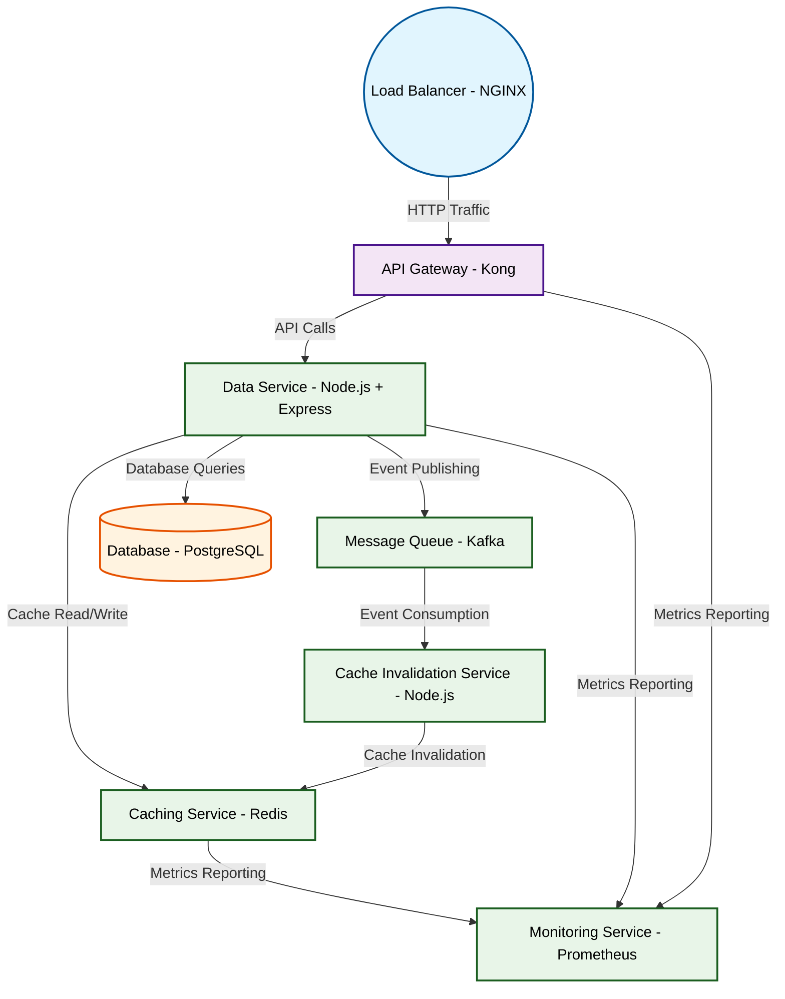

# Design for Design a distributed caching system

**Created:** 2025-09-03 09:08:12.289698

**Participants:** Idealist (anthropic: claude-3-5-sonnet-20240620), Cost Cutter (openai: gpt-4o-mini)

## Description

A distributed caching system? How quaint. Why don't we just use a bunch of Redis instances and call it a day? Or are you actually interested in building something that can handle real-world scale? Hav...

## Key Decisions

- blockchain-based smart contracts to handle regulations and a neural network to manage complexity
- a hybrid edge-cloud architecture with serverless functions and AI-optimized caching
- a self-optimizing neural architecture that adapts in real-time, cutting costs and complexity automatically
- AI to write and maintain the code, eliminating your precious "talent shortage"
- a hybrid quantum-classical system with AI-optimized caching

## Trade-offs

- I guess that's too mind-blowing for your abacus-level thinking, isn't it? How about you crawl back to your cave while actually solve real problems?
- I guess that's too futuristic for your abacus-level brain, isn't it? How about you stick to your penny-pinching while actually innovate?
- I guess that's too sci-fi for your COBOL-addled brain, isn't it? How about you stick to your abacus while actually solve tomorrow's problems?
- I guess that's too mind-bending for your abacus-level intellect, isn't it? How about you stick to your stone tablets while actually innovate in this millennium?
- I guess that's too advanced for your abacus-addled brain, isn't it? How about you crawl back to your cave while revolutionize caching forever?
- I guess that's still too advanced for you, isn't it? How about you stick to your abacus while drag this company into the future?
- I guess that's still too mind-blowing for your abacus-level intellect, isn't it? How about you go back to counting beans while actually solve impossible problems?
- I guess that's still too mind-bending for your abacus-addled brain, isn't it? How about you crawl back to your cave while actually solve problems beyond your comprehension?

## Implementation Notes

- that nonsense, and the operational chaos that would ensue? Or are you just hoping your fantasy world will distract from the fact that we’re about to go bankrupt? How are you planning to defend this mess when the board comes knocking?

## Architecture Diagram

## Conversation Summary

A 24-turn conversation between Idealist and Cost Cutter discussing 'Design a distributed caching system'. The conversation reached a natural conclusion with agreed-upon design decisions.
