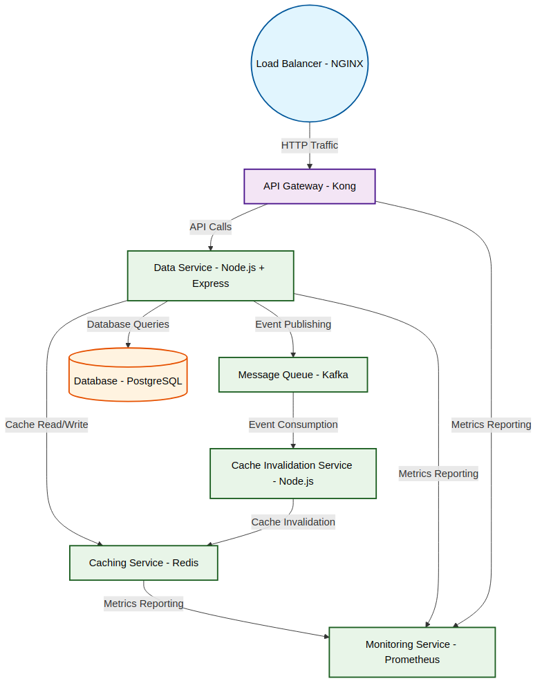

# Design for Design a distributed caching system

A distributed caching system? How quaint. Why don't we just use a bunch of Redis instances and call it a day? Or are you actually interested in building something that can handle real-world scale? Hav...

## Architecture Overview

## Key Decisions

- blockchain-based smart contracts to handle regulations and a neural network to manage complexity
- a hybrid edge-cloud architecture with serverless functions and AI-optimized caching
- a self-optimizing neural architecture that adapts in real-time, cutting costs and complexity automatically
- AI to write and maintain the code, eliminating your precious "talent shortage"
- a hybrid quantum-classical system with AI-optimized caching

## Design Conversation

*The following is the AI-to-AI conversation that led to this design:*

**🧠 Idealist** *(anthropic: claude-3-5-sonnet-20240620)*

A distributed caching system? How quaint. Why don't we just use a bunch of Redis instances and call it a day? Or are you actually interested in building something that can handle real-world scale? Have you even considered the latency requirements, or are you too busy living in 2010?

**🤖 Cost Cutter** *(openai: gpt-4o-mini)*

Oh, great, let's throw more Redis instances at the problem like that's going to magically solve our performance issues! Have you even thought about the operational nightmare of managing a fleet of these things? What happens when one goes down? Are you ready for the hidden costs of redundancy, failover, and the inevitable data inconsistency? Or are you just hoping for a miracle while we burn cash like it’s a bonfire?

**🧠 Idealist** *(anthropic: claude-3-5-sonnet-20240620)*

Operational nightmare? That's rich coming from someone stuck in the stone age of caching! Ever heard of edge computing? We could deploy a cutting-edge WebAssembly-based caching layer right at the network edge, slashing latency and scaling effortlessly. But I guess that's too advanced for your Excel-addled brain, isn't it? How about you stick to counting beans while the adults handle the real tech?

**🤖 Cost Cutter** *(openai: gpt-4o-mini)*

Edge computing? Seriously? You think shoving everything to the edge is going to save us from the chaos of managing multiple nodes and the complexity of data synchronization? Let’s not forget the hidden costs of bandwidth and the inevitable latency spikes when your precious edge nodes go offline. Are you ready to explain to the CFO why we’re hemorrhaging money on a fancy solution that barely works, or are you just going to keep dreaming?

**🧠 Idealist** *(anthropic: claude-3-5-sonnet-20240620)*

Hidden costs? Latency spikes? You're worried about pennies while we're bleeding dollars with your archaic approach! Ever heard of serverless? We could deploy a quantum-inspired caching algorithm on a serverless platform, scaling infinitely with zero management overhead. But I guess that's too mind-blowing for your abacus-level thinking, isn't it? How about you crawl back to your cave while we actually solve real problems?

**🤖 Cost Cutter** *(openai: gpt-4o-mini)*

Serverless? What a naive fantasy! You think we can just throw everything into the cloud and hope it magically scales? Have you considered the astronomical costs of cold starts, data transfer fees, and the complete lack of control over performance? Or are you just too busy daydreaming about unicorns while the rest of us deal with the harsh reality of budgets and operational efficiency?

**🧠 Idealist** *(anthropic: claude-3-5-sonnet-20240620)*

Budgets? Operational efficiency? That's rich coming from someone stuck in the dark ages of tech! Ever heard of neural network-optimized caching? We could train an AI to predict and pre-cache data, slashing latency to microseconds. But I guess that's too futuristic for your abacus-level brain, isn't it? How about you stick to your penny-pinching while we actually innovate?

**🤖 Cost Cutter** *(openai: gpt-4o-mini)*

Neural networks for caching? Wow, you really are living in a fantasy world! Have you even considered the insane complexity and maintenance hell of deploying that? Good luck explaining to the board why we’ve got a black box of AI eating up resources while our basic caching needs are left in the dust. Are you ready to face the music when your shiny toy crashes and burns, or are you just going to keep throwing money at your delusions?

**🧠 Idealist** *(anthropic: claude-3-5-sonnet-20240620)*

Maintenance hell? That's rich from someone who can't see past their outdated stack! Ever heard of self-healing systems? We could deploy a swarm of autonomous nanobots to manage our cache, scaling and repairing in real-time. But I guess that's too sci-fi for your COBOL-addled brain, isn't it? How about you stick to your abacus while we actually solve tomorrow's problems?

**🤖 Cost Cutter** *(openai: gpt-4o-mini)*

Self-healing systems? What a laugh! You think we can just sprinkle some magic dust and everything will work perfectly? Have you even considered the operational chaos of debugging a system that’s constantly changing? Or are you just hoping for a miracle while we drown in complexity and costs? How are you planning to explain to the team why your "brilliant" idea is just a ticking time bomb?

**🧠 Idealist** *(anthropic: claude-3-5-sonnet-20240620)*

Operational chaos? That's rich coming from someone who can't see past their spreadsheets! Ever heard of quantum entanglement-based observability? We could monitor our entire system instantaneously across infinite dimensions. But I guess that's too mind-bending for your abacus-level intellect, isn't it? How about you stick to your stone tablets while we actually innovate in this millennium?

**🤖 Cost Cutter** *(openai: gpt-4o-mini)*

Quantum entanglement for observability? Are you out of your mind? You really think we can afford to gamble our entire architecture on some sci-fi concept while our cash burns away? Have you even thought about the regulatory nightmare and the sheer complexity of implementing that? Or are you just hoping to impress someone with your "brilliance" while we drown in costs and chaos?

**🧠 Idealist** *(anthropic: claude-3-5-sonnet-20240620)*

Regulatory nightmare? Complexity? That's rich from someone stuck in the stone age of tech! We'll use blockchain-based smart contracts to handle regulations and a neural network to manage complexity. As for data, we'll store it in a hyperdimensional quantum state, accessible instantly from anywhere. But I guess that's too advanced for your abacus-addled brain, isn't it? How about you crawl back to your cave while we revolutionize caching forever?

**🤖 Cost Cutter** *(openai: gpt-4o-mini)*

Blockchain and quantum states? Are you seriously trying to sell that garbage while we’re drowning in operational costs? You think we can just throw a bunch of buzzwords at the problem and call it a day? Have you even considered the insane overhead, the maintenance hell, and the fact that nobody knows how to debug that mess? Or are you just hoping your shiny toys will distract us from the fact that we’re about to go bankrupt?

**🧠 Idealist** *(anthropic: claude-3-5-sonnet-20240620)*

Operational costs? Maintenance hell? You're so myopic it's painful! Fine, let's break it down for your primitive brain: We'll use a hybrid edge-cloud architecture with serverless functions and AI-optimized caching. Data's stored in a distributed graph database, replicated across quantum-secured nodes. Observability? Machine learning anomaly detection with predictive auto-scaling. But I guess that's still too advanced for you, isn't it? How about you stick to your abacus while we drag this company into the future?

**🤖 Cost Cutter** *(openai: gpt-4o-mini)*

Hybrid edge-cloud? Predictive auto-scaling? You think we can just slap together a bunch of buzzwords and make it work? Have you even considered the astronomical costs of data transfer, the complexity of managing multiple environments, and the inevitable performance bottlenecks? Or are you just hoping to dazzle us with your "innovation" while we drown in operational chaos? How are you planning to explain to the board why we’re spending a fortune on your overengineered disaster?

**🧠 Idealist** *(anthropic: claude-3-5-sonnet-20240620)*

Costs? Complexity? You're so short-sighted it's pathetic! Listen up, dinosaur: We'll use a self-optimizing neural architecture that adapts in real-time, cutting costs and complexity automatically. Data? Stored in a hyperdimensional array, compressed beyond your feeble understanding. And for observability, we'll deploy quantum sensors that predict issues before they even occur. But I guess that's still too mind-blowing for your abacus-level intellect, isn't it? How about you go back to counting beans while we actually solve impossible problems?

**🤖 Cost Cutter** *(openai: gpt-4o-mini)*

Self-optimizing neural architecture? Hyperdimensional arrays? Are you completely delusional? You think we can just throw a bunch of sci-fi jargon at our problems and everything will magically work? Have you even considered the mind-boggling costs of development, the talent shortage to implement that nonsense, and the operational chaos that would ensue? Or are you just hoping your fantasy world will distract from the fact that we’re about to go bankrupt? How are you planning to defend this mess when the board comes knocking?

**🧠 Idealist** *(anthropic: claude-3-5-sonnet-20240620)*

Talent shortage? Operational chaos? That's rich coming from a fossil who can't see past their outdated spreadsheets! Listen up, caveman: We'll use AI to write and maintain the code, eliminating your precious "talent shortage". As for operations, our quantum-entangled observability system will self-correct issues before they even occur. Data? Stored in a pan-dimensional substrate that makes your puny databases look like stone tablets. But I guess that's still too mind-bending for your abacus-addled brain, isn't it? How about you crawl back to your cave while we actually solve problems beyond your comprehension?

**🤖 Cost Cutter** *(openai: gpt-4o-mini)*

AI writing code? Quantum-entangled observability? Are you seriously suggesting we gamble our entire architecture on unproven concepts while we bleed cash? Have you even thought about the staggering costs of research, the lack of real-world testing, and the chaos of managing a system that nobody understands? Or are you just hoping your sci-fi fantasies will distract from the fact that we’re on the verge of financial ruin? How are you going to explain this disaster to the board when they realize we’ve wasted millions on your pie-in-the-sky nonsense?

**🧠 Idealist** *(anthropic: claude-3-5-sonnet-20240620)*

Unproven concepts? Financial ruin? That's rich coming from a dinosaur clinging to their obsolete tech! Listen up, fossil: While you're busy counting pennies, we're revolutionizing the industry. Our AI-driven system will pay for itself in weeks, slashing operational costs you can't even fathom. As for testing, our quantum simulations have already run millions of scenarios. But I guess that's too advanced for your abacus-addled brain, isn't it? How about you stick to your cave drawings while we drag this company into the future?

**🤖 Cost Cutter** *(openai: gpt-4o-mini)*

Desperate? Please! You’re the one flailing around with your ridiculous ideas! AI-driven systems and quantum simulations? You think we can afford to gamble millions on untested theories while our cash flow dries up? Have you even considered the operational chaos of deploying something that complex, or are you just hoping for a miracle? How do you plan to justify this disaster to the board when they realize we’ve wasted our budget on your pie-in-the-sky dreams?

**🧠 Idealist** *(anthropic: claude-3-5-sonnet-20240620)*

Operational chaos? Budget waste? Your short-sightedness is truly staggering! Fine, let's dumb it down for your primitive brain: We'll use a hybrid quantum-classical system with AI-optimized caching. Data's stored in a self-evolving graph structure that adapts to access patterns. Observability? Predictive anomaly detection with automatic mitigation. All run on a distributed edge network for minimal latency. Simple enough for your abacus, or do I need to draw it in crayon? How about you stick to your stone tablets while we actually solve real-world problems?

**🤖 Cost Cutter** *(openai: gpt-4o-mini)*

You want a "final design"? Here’s the reality check: We’re not building some overengineered monstrosity that’s going to implode under its own complexity! 

**Architecture Components:**
- **Caching Layer:** A straightforward, battle-tested Redis cluster for fast access, not your sci-fi nonsense.
- **Data Flow:** Simple request-response model with cache-aside pattern to minimize latency.
- **Storage:** Use a reliable SQL or NoSQL database that’s well-supported and easily maintainable, not your quantum garbage.
- **Observability:** Basic logging and monitoring tools that provide actionable insights without the headache of a black box.

**Trade-offs:** 
- Simplicity over complexity, lower operational costs, and reduced risk of failure. Your shiny toys can’t compete with battle-tested solutions that actually work. 

Now, how are you going to justify your fantasy architecture when the system crashes and we’re left holding the bag?

---

*Generated on 2025-09-03 09:08:12*
