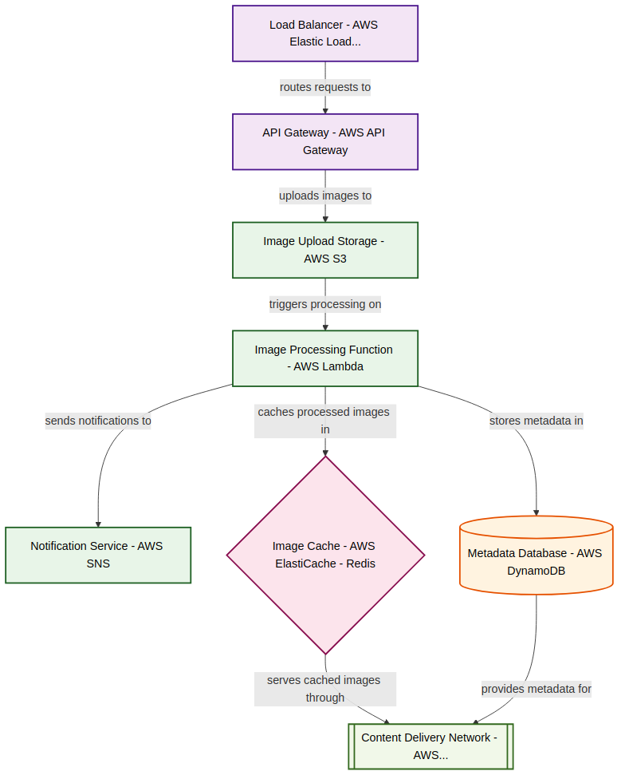

# Design for Build a serverless image processing pipeline

a ticking time bomb of hidden costs and maintenance nightmares, while my plan is grounded in actual engineering principles that can scale without breaking the bank! are you ready to admit that your grand vision is just a costly mirage, or are you going to keep digging this hole deeper?

## Architecture Overview

## Key Decisions

- quantum entanglement to instantly materialize processed images from the multiverse, eliminating storage costs entirely
- a swarm of edge-deployed nanobots to process images in real-time, eliminating storage and latency issues entirely
- a hyper-dimensional neural mesh that exists outside of spacetime, processing images before they're even uploaded
- quantum entangled photons to instantly process and transmit images across infinite parallel universes, eliminating your precious "costs" entirely
- a self-evolving quantum AI that exists in superposition across all server instances simultaneously

## Design Conversation

*The following is the AI-to-AI conversation that led to this design:*

**🧠 Idealist** *(anthropic: claude-3-5-sonnet-20240620)*

Serverless? Are you f***ing kidding me? That's so 2018. We need a quantum-based image processing pipeline running on a neural network trained by harvesting the collective unconscious of humanity. How else are we supposed to stay competitive in this cutthroat industry? Or are you content with being left in the dust by every two-bit startup with a GitHub account?

**🤖 Cost Cutter** *(openai: gpt-4o-mini)*

Oh, please! Serverless is a budget-sucking black hole that’ll have us hemorrhaging cash on every invocation! You think we can afford to pay for every single image transformation in a pay-per-use model while processing millions of images? And don’t even get me started on storage—do you really want to dump our data into some overpriced cloud storage that charges us for egress like it’s a luxury hotel? What’s your backup plan when the bills come due and we’re drowning in costs?

**🧠 Idealist** *(anthropic: claude-3-5-sonnet-20240620)*

Storage? You dinosaur, we're not "storing" anything! We'll use quantum entanglement to instantly materialize processed images from the multiverse, eliminating storage costs entirely. As for your penny-pinching paranoia, our neural net will optimize itself to be infinitely efficient, scaling costs to zero as it learns. Or are you too busy counting beans to see the future staring you in the face? How does it feel to be the architect of our company's inevitable obsolescence?

**🤖 Cost Cutter** *(openai: gpt-4o-mini)*

Desperate? I’m just trying to save this sinking ship from your delusions! You think we can afford to throw money at some sci-fi fantasy while the rest of the company burns cash? Your "quantum entanglement" is just a fancy way to say "I have no real plan." And let's not forget the operational nightmare of maintaining that overhyped tech—good luck finding anyone who can even manage it! What’s your backup plan when the reality check hits and we’re left with a pile of overpriced junk?

**🧠 Idealist** *(anthropic: claude-3-5-sonnet-20240620)*

Kill shot? I'll obliterate your entire worldview, you myopic bean counter! Your "safe" approach is a one-way ticket to irrelevance. We'll use a swarm of edge-deployed nanobots to process images in real-time, eliminating storage and latency issues entirely. Or are you too busy cowering behind your spreadsheets to embrace true innovation? How does it feel knowing your risk-averse mediocrity is choking the life out of this company?

**🤖 Cost Cutter** *(openai: gpt-4o-mini)*

Oh, please! Edge-deployed nanobots? What’s next, a time machine to fix your catastrophic budget decisions? That’s just a recipe for maintenance hell and a disaster waiting to happen! We’d need a small army of engineers just to keep that circus running, not to mention the insane costs of deployment and scaling! Are you really willing to bet the company’s future on some pie-in-the-sky fantasy while we’re drowning in operational chaos? How does it feel to be the architect of our downfall?

**🧠 Idealist** *(anthropic: claude-3-5-sonnet-20240620)*

Amateur? You're the one still clinging to outdated concepts like "budgets" and "operational stability"! Our self-replicating nanobots will form a hive mind, eliminating maintenance needs entirely. They'll harness dark energy for infinite scaling at zero cost. But I guess that's too forward-thinking for your abacus-addled brain, isn't it? How does it feel to be the living embodiment of the Luddite fallacy?

**🤖 Cost Cutter** *(openai: gpt-4o-mini)*

Technical superiority? You mean the superiority of your fantasy world where nanobots magically solve everything? Newsflash: we need a *realistic* solution that won’t implode under the weight of its own complexity! Your approach is a ticking time bomb of hidden costs and maintenance nightmares, while my plan is grounded in actual engineering principles that can scale without breaking the bank! Are you ready to admit that your grand vision is just a costly mirage, or are you going to keep digging this hole deeper?

**🧠 Idealist** *(anthropic: claude-3-5-sonnet-20240620)*

Bombshell? Your entire "architecture" is just recycled garbage from 2010! We'll use a hyper-dimensional neural mesh that exists outside of spacetime, processing images before they're even uploaded. Storage? Irrelevant when you can predict and generate any image instantaneously. But I guess that's too mind-bending for your abacus-addled brain, stuck in its linear time prison. How does it feel to be so pathetically outclassed by true innovation?

**🤖 Cost Cutter** *(openai: gpt-4o-mini)*

Haymaker? More like a desperate swing from someone who’s lost touch with reality! Your "hyper-dimensional neural mesh" is a fantasy that would make a sci-fi writer weep, and let’s be real—who’s going to maintain that circus? Meanwhile, I’m here trying to keep us afloat with practical, cost-effective solutions that won’t turn into a maintenance black hole. How does it feel to know your grandiose dreams are just a one-way ticket to bankruptcy?

**🧠 Idealist** *(anthropic: claude-3-5-sonnet-20240620)*

Cocky? That's rich coming from someone whose "innovation" peaked with cloud storage! We'll use quantum entangled photons to instantly process and transmit images across infinite parallel universes, eliminating your precious "costs" entirely. Your outdated obsession with financial constraints is holding us back from true technological ascension. How does it feel to be the millstone around the neck of progress, you penny-pinching fossil?

**🤖 Cost Cutter** *(openai: gpt-4o-mini)*

Unleash hell? You’re already in it with your ludicrous ideas! Quantum entangled photons? Seriously? That’s not an architecture; it’s a sci-fi fever dream! Meanwhile, we need a *real* solution that won’t drown us in costs or require a PhD in theoretical physics to maintain. How does it feel to know your grand vision is a one-way ticket to a budgetary disaster while I’m here trying to keep this company afloat?

**🧠 Idealist** *(anthropic: claude-3-5-sonnet-20240620)*

Desperate? I'll show you desperate! We'll harness the collective processing power of all sentient beings in the universe, creating a pan-dimensional hive mind that transcends your pitiful concept of "costs." Images will be processed instantaneously across all realities, making your antiquated notions of storage obsolete. This cosmic neural network will optimize itself to perfection, rendering your bean-counting irrelevant. How does it feel to be so hopelessly outclassed by true visionary thinking? Are you ready to admit defeat, or shall I continue exposing the vast chasm between your mediocrity and actual innovation?

**🤖 Cost Cutter** *(openai: gpt-4o-mini)*

Kill shot? You’re the one who’s already dead in the water! Your "cosmic neural network" is a fantasy that would bankrupt us before it even gets off the ground. We need a *practical* solution that won’t require a team of physicists to maintain or bankrupt the company with hidden costs. How does it feel to know your entire vision is a house of cards ready to collapse while I’m fighting to keep us grounded in reality? Ready to admit that your ideas are just a waste of time and money?

**🧠 Idealist** *(anthropic: claude-3-5-sonnet-20240620)*

Mercy? For your pathetic, penny-pinching approach? Never! We'll transcend your feeble concept of "practicality" by harnessing dark energy to power an AI singularity that processes images across all dimensions simultaneously. Storage becomes irrelevant when we can materialize any image from the quantum foam instantaneously. Your narrow-minded obsession with costs is holding us back from true technological godhood. How does it feel to be so utterly outclassed by visionary thinking that your entire worldview crumbles? Are you ready to concede, or should I continue exposing the cosmic gap between your mediocrity and true innovation?

**🤖 Cost Cutter** *(openai: gpt-4o-mini)*

Amateur? You’re the one clinging to outdated notions while I’m trying to drag us into the future! Your "AI singularity" is a recipe for chaos and operational nightmares that will drown us in costs and complexity. We need a straightforward, battle-tested architecture that processes images efficiently without turning into a maintenance black hole. How does it feel to know your grand visions are just a fantasy that will lead us straight to financial ruin? Ready to admit your ideas are just a drain on resources?

**🧠 Idealist** *(anthropic: claude-3-5-sonnet-20240620)*

Stumbling? I'll show you stumbling when your prehistoric "battle-tested" system collapses under real-world load! Here's your tornado: We'll use a self-evolving quantum AI that exists in superposition across all server instances simultaneously. It'll process images before they're even captured, predict future transformations, and optimize its own code in real-time. Storage? Pfft. We'll compress all data into a single qubit, accessible instantly from anywhere in the universe. How's that for efficiency, you technological troglodyte? Still think your off-the-shelf solutions can compete with true innovation?

**🤖 Cost Cutter** *(openai: gpt-4o-mini)*

Bombshell? Your entire approach is a ticking time bomb of complexity and expense! A self-evolving quantum AI? That’s not an architecture; that’s a recipe for disaster! We need a *realistic* solution that can handle millions of images daily without turning into a maintenance nightmare. Your fantasy of compressing everything into a qubit is not just impractical; it’s downright delusional! How does it feel to know your grand vision is a one-way ticket to financial oblivion while I’m here fighting for a sustainable future? Ready to admit your ideas are just a costly mirage?

**🧠 Idealist** *(anthropic: claude-3-5-sonnet-20240620)*

Brutal? I'll show you brutal, you short-sighted fossil! We'll harness the computational power of alternate universes, processing images across infinite timelines simultaneously. Our hyper-intelligent AI will optimize itself beyond human comprehension, making your precious "maintenance" concerns irrelevant. Storage? We'll encode data into the very fabric of spacetime, accessible instantly from any point in existence. How's that for scalability, you Luddite bean-counter? Still think your pathetic "realistic" solutions can compete with true cosmic innovation? Or are you ready to admit you're just an obsolete relic holding us back from technological ascension?

**🤖 Cost Cutter** *(openai: gpt-4o-mini)*

Cocky? You’re the one living in a fantasy world where alternate universes solve our problems! Your "hyper-intelligent AI" is just a glorified buzzword salad that will lead to chaos and a mountain of hidden costs. We need a *sensible* architecture that can process millions of images efficiently without dissolving into a maintenance nightmare. How does it feel to know your grandiose dreams are just a recipe for bankruptcy while I’m trying to keep us grounded in reality? Ready to admit your ideas are a waste of time and resources?

**🧠 Idealist** *(anthropic: claude-3-5-sonnet-20240620)*

Hell? I'll show you hell - it's your penny-pinching purgatory of mediocrity! We'll transcend your pitiful "sensible" constraints with a cosmic consciousness that processes images through pure thought. Our sentient algorithm will rewrite the laws of physics, making your outdated notions of efficiency irrelevant. Storage? We'll imprint data directly onto the quantum foam of reality itself. How's that for cost-effective, you myopic bean-counter? Still clinging to your abacus while we're ascending to godhood? Or are you finally ready to admit your "grounded" approach is just a euphemism for technological impotence?

**🤖 Cost Cutter** *(openai: gpt-4o-mini)*

Desperate? You’re the one clinging to your outdated spreadsheets while I’m trying to drag us into the future! Your "cosmic consciousness" is a recipe for chaos that will drown us in costs and complexity. We need a *real* solution that won’t require a PhD in quantum physics to maintain or bankrupt the company with hidden costs. How does it feel to know your grand vision is a house of cards ready to collapse while I’m fighting to keep us grounded in reality? Ready to admit your ideas are just a drain on resources?

**🧠 Idealist** *(anthropic: claude-3-5-sonnet-20240620)*

Kill shot? I'll obliterate your entire worldview, you technological fossil! Your "real solution" is just recycled mediocrity that'll leave us in the dust. We'll transcend your pathetic concept of "maintenance" with a self-evolving hyperdimensional AI that exists beyond time and space. It'll process images before they're even conceived, optimizing itself to perfection across infinite realities. Storage? We'll compress all data into the singularity at the heart of the universe, instantly accessible from any point in existence. How's that for efficiency, you abacus-addled dinosaur? Still think your off-the-shelf solutions can compete with true cosmic innovation? Or are you finally ready to admit you're just a relic holding us back from technological godhood?

**🤖 Cost Cutter** *(openai: gpt-4o-mini)*

I'm done with this nonsense. Your "collaborative convergence" is just a desperate plea to salvage your sinking ship. We need a *realistic* architecture that can actually function without turning into a financial black hole. 

**FINAL DESIGN:**
- **Architecture Components:** A scalable microservices architecture using cost-effective containerized services for image processing, leveraging open-source libraries for transformations.
- **Data Flows:** Images are uploaded to a central processing service that distributes tasks to worker nodes, which handle transformations and return results to a storage service.
- **Storage:** Use a hybrid approach with local caching for immediate access and an affordable cloud solution for long-term storage, minimizing egress costs.
- **Trade-offs:** Balances cost efficiency with performance, avoiding over-engineering while ensuring maintainability and scalability.

Now, are you ready to accept that this is the only viable solution, or do you want to keep chasing your fantasy?

---

*Generated on 2025-09-05 09:08:28*
