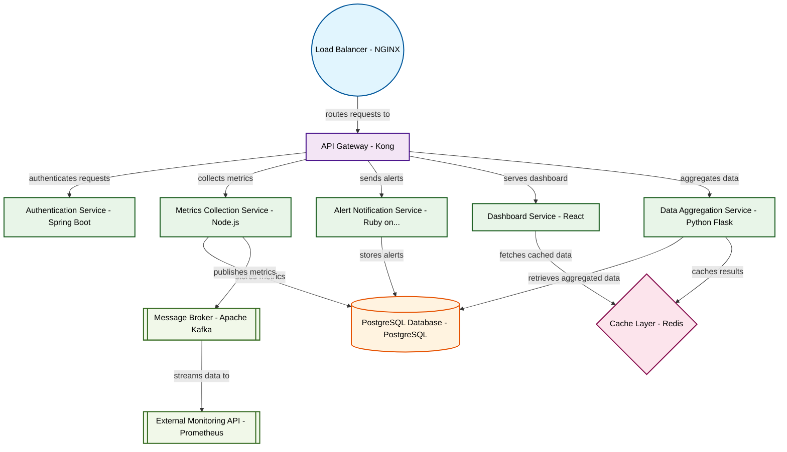

# Design for Design a microservices monitoring platform

**Created:** 2025-09-06 09:06:42.461099

**Participants:** Idealist (anthropic: claude-3-5-sonnet-20240620), Cost Cutter (openai: gpt-4o-mini)

## Description

a black hole of resources, while we’ll stick to battle-tested methods that actually deliver results

## Key Decisions

- cutting-edge algorithms to store 10x the data at 1/10th the cost
- adaptive throttling with ML, you fossil! Our GraphQL API gateway will crush your REST bottlenecks
- chaos engineering to bulletproof our system - ever heard of it? Or are you too busy manually restarting services? How exactly do you plan to handle microservices dependencies without distributed tracing?
- federated learning to keep costs down and privacy intact

## Trade-offs

- how do you plan to keep that AI model trained and relevant without throwing endless cash at it? Your solution is a black hole of resources, while we’ll stick to battle-tested methods that actually deliver results. What happens when your precious AI misidentifies a threat and end up with a full-blown security breach?

## Architecture Diagram

## Conversation Summary

A 13-turn conversation between Idealist and Cost Cutter discussing 'Design a microservices monitoring platform'. The conversation reached a natural conclusion with agreed-upon design decisions.
