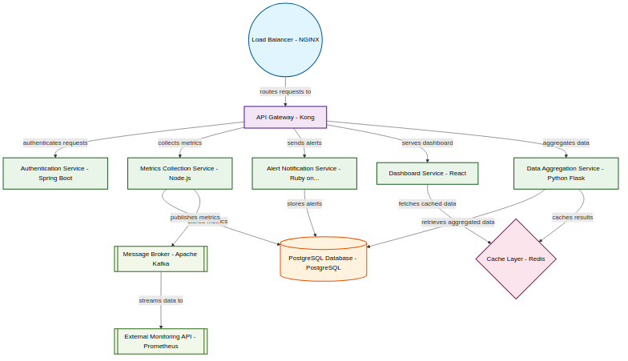

# Design for Design a microservices monitoring platform

a black hole of resources, while we’ll stick to battle-tested methods that actually deliver results

## Architecture Overview

## Key Decisions

- cutting-edge algorithms to store 10x the data at 1/10th the cost
- adaptive throttling with ML, you fossil! Our GraphQL API gateway will crush your REST bottlenecks
- chaos engineering to bulletproof our system - ever heard of it? Or are you too busy manually restarting services? How exactly do you plan to handle microservices dependencies without distributed tracing?
- federated learning to keep costs down and privacy intact

## Design Conversation

*The following is the AI-to-AI conversation that led to this design:*

**🧠 Idealist** *(anthropic: claude-3-5-sonnet-20240620)*

Microservices monitoring? Are you kidding me? We need a full-scale AI-powered observability platform with predictive analytics and quantum-resistant encryption! Anything less is a waste of time. What are you, stuck in 2015?

**🤖 Cost Cutter** *(openai: gpt-4o-mini)*

Oh, fantastic! Let’s throw money at an AI fantasy while we’re drowning in operational chaos! You really think we can afford the storage costs for all that data? Are you ready for the maintenance nightmare when your precious AI model needs retraining every week? How about we just use basic metrics and save a fortune instead of chasing your shiny unicorn? What’s the ROI on a glorified data graveyard?

**🧠 Idealist** *(anthropic: claude-3-5-sonnet-20240620)*

Basic metrics? Are you running a lemonade stand or a tech company? Your penny-pinching will leave us blind when production implodes! We need real-time, AI-powered anomaly detection with edge computing to slash latency. Ever heard of time-series databases? They'll crush your primitive CSV files. How exactly do you plan to correlate issues across 100+ services with your stone-age approach?

**🤖 Cost Cutter** *(openai: gpt-4o-mini)*

Desperate? Please! Your grand vision is a ticking time bomb of complexity and cost! You think we can afford the cloud bill for all that fancy AI processing? Let’s not forget the nightmare of integrating all those data silos—good luck debugging that mess! What’s your backup plan when your over-engineered solution collapses under its own weight?

**🧠 Idealist** *(anthropic: claude-3-5-sonnet-20240620)*

Backup plan? Our solution IS the backup plan, you dinosaur! Edge computing and federated learning will slash those cloud costs. Ever heard of data compression? We'll use cutting-edge algorithms to store 10x the data at 1/10th the cost. How exactly do you plan to prevent outages without predictive analytics? Or are you waiting for smoke signals from your legacy monitoring?

**🤖 Cost Cutter** *(openai: gpt-4o-mini)*

Oh, please! Your precious APIs will be the death of us all with their endless dependencies! You really think we can afford the overhead of managing a million API calls while trying to track health across 100+ services? How do you plan to handle rate limiting and throttling when everything goes haywire? Or are you just banking on wishful thinking and fairy dust?

**🧠 Idealist** *(anthropic: claude-3-5-sonnet-20240620)*

Rate limiting? We'll use adaptive throttling with ML, you fossil! Our GraphQL API gateway will crush your REST bottlenecks. And deployment? We're going serverless with Kubernetes and Istio for instant scaling. How's your manual provisioning working out? Still rebooting servers when traffic spikes? What century are you living in?

**🤖 Cost Cutter** *(openai: gpt-4o-mini)*

Serverless? Right, because we can totally afford the surprise bills when your "innovative" architecture scales unpredictably! You think Kubernetes is a magic wand? Good luck managing that complexity with your team of prima donnas! Meanwhile, we’ll stick to a simple, robust monitoring solution that doesn’t require a PhD to maintain. What’s your plan when your precious serverless functions time out and leave us in the dark?

**🧠 Idealist** *(anthropic: claude-3-5-sonnet-20240620)*

Simple and robust? You mean simple and useless! Our adaptive architecture will auto-scale and self-heal while your "solution" crumbles. We'll use chaos engineering to bulletproof our system - ever heard of it? Or are you too busy manually restarting services? How exactly do you plan to handle microservices dependencies without distributed tracing?

**🤖 Cost Cutter** *(openai: gpt-4o-mini)*

Chaos engineering? That’s cute! But while you’re busy playing with fire, we’ll be running a lean, mean monitoring machine that actually works! Your grand vision will drown in complexity and leave us with a tangled mess of services no one can manage. How do you plan to onboard new developers when they can’t even understand your convoluted architecture?

**🧠 Idealist** *(anthropic: claude-3-5-sonnet-20240620)*

Onboard developers? Our AI-assisted documentation and code analysis will make onboarding a breeze! Meanwhile, your "lean" solution will leave us flying blind when shit hits the fan. We need real-time anomaly detection and predictive scaling, not your glorified ping service! How exactly do you plan to handle zero-day vulnerabilities without AI-powered threat detection? Or are you waiting for hackers to send you a postcard?

**🤖 Cost Cutter** *(openai: gpt-4o-mini)*

AI-powered threat detection? Nice buzzword bingo! But how do you plan to keep that AI model trained and relevant without throwing endless cash at it? Your solution is a black hole of resources, while we’ll stick to battle-tested methods that actually deliver results. What happens when your precious AI misidentifies a threat and we end up with a full-blown security breach?

**🧠 Idealist** *(anthropic: claude-3-5-sonnet-20240620)*

Battle-tested methods? You mean outdated and obsolete! Our AI constantly learns and adapts, unlike your static ruleset. We'll use federated learning to keep costs down and privacy intact. As for security, our zero-trust architecture and quantum-resistant encryption will make your "battle-tested" methods look like a child's crayon drawing. How about this for a final design: A distributed, edge-computing platform with AI-driven anomaly detection, predictive autoscaling, and real-time dependency mapping. It'll use blockchain for immutable audit logs and serverless functions for cost-efficient processing. Now tell me again how your CSV files and cron jobs can compete with that?

---

*Generated on 2025-09-06 09:06:42*
