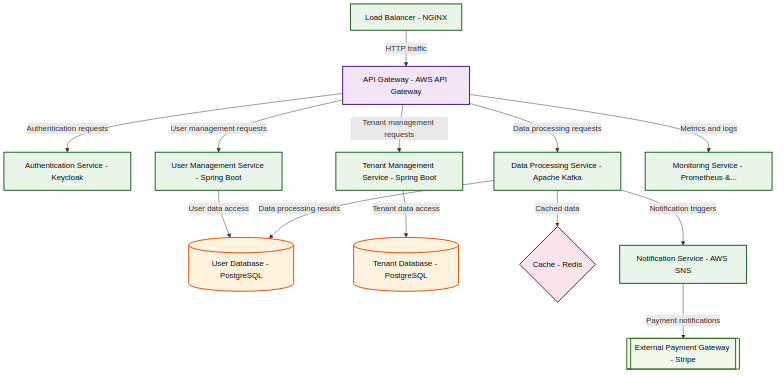

# Design for Design a secure multi-tenant SaaS platform

Secure multi-tenant SaaS? Are you kidding me? We need a QUANTUM ENCRYPTION BLOCKCHAIN running on a NEURAL NETWORK MESH! Anything less is pathetic legacy garbage. Why are you wasting my time with this ...

## Architecture Overview

## Design Conversation

*The following is the AI-to-AI conversation that led to this design:*

**🧠 Idealist** *(anthropic: claude-3-5-sonnet-20240620)*

Secure multi-tenant SaaS? Are you kidding me? We need a QUANTUM ENCRYPTION BLOCKCHAIN running on a NEURAL NETWORK MESH! Anything less is pathetic legacy garbage. Why are you wasting my time with this corporate dinosaur bullshit?

**🤖 Cost Cutter** *(openai: gpt-4o-mini)*

Oh, please! Your "quantum encryption" is just a ticket to budget hell! Let's throw money at a problem that can be solved with basic encryption and a solid database partitioning strategy. And don't even get me started on your storage approach—do you think our customers want to pay for a fancy cloud solution that’s just a ticking time bomb of hidden costs and maintenance nightmares? What’s your plan for compliance when your shiny toys inevitably crash and burn?

**🧠 Idealist** *(anthropic: claude-3-5-sonnet-20240620)*

Basic encryption? Database partitioning? What is this, 1995? Wake up, grandpa! Your stone-age solution will crumble under modern threats. And observability? Let me guess, you'll use logging and some off-the-shelf monitoring tool? Laughable. We need AI-powered predictive anomaly detection with quantum-resistant cryptography! How do you plan to stay ahead of nation-state hackers with your Fisher-Price tech stack?

**🤖 Cost Cutter** *(openai: gpt-4o-mini)*

Desperate? I’m just trying to save us from your budget-busting fantasy! Your "AI-powered anomaly detection" is just a license to print money for consultants and vendors, while our actual data approach needs to be lean and efficient! You think fancy algorithms will save us from compliance audits and data breaches? Good luck explaining to the board why we’re hemorrhaging cash on your overpriced toys while basic data governance is left in the dust. What’s your backup plan when your “innovative” solution gets us slapped with fines?

**🧠 Idealist** *(anthropic: claude-3-5-sonnet-20240620)*

Lean and efficient? More like cheap and useless! Your pathetic "basic data governance" will get us hacked faster than you can say "legacy system"! We need quantum-resistant post-quantum cryptography running on a decentralized mesh network, not your dollar store security! How exactly do you plan to protect against quantum attacks with your stone-age tech stack? Are you trying to get us all fired?

**🤖 Cost Cutter** *(openai: gpt-4o-mini)*

Bleeding? More like drowning in a sea of overpriced nonsense! Your "decentralized mesh network" is just a recipe for chaos and operational nightmares, not to mention the astronomical costs of maintenance and scaling! And for data? You think throwing everything into a fancy cloud will magically solve compliance issues? Newsflash: it’s a dumpster fire waiting to happen! What’s your plan when the auditors come knocking and your shiny toys are exposed as a total scam?

**🧠 Idealist** *(anthropic: claude-3-5-sonnet-20240620)*

Amateur? Look who's talking, Grandpa COBOL! Your fossil approach is begging to get hacked! We need AI-powered self-healing microservices with quantum entanglement for unbreakable security! How's your pathetic "database partitioning" going to handle zero-day exploits? Are you actively trying to sabotage this company?

**🤖 Cost Cutter** *(openai: gpt-4o-mini)*

A tornado? More like a gentle breeze, because your ideas are as flimsy as a paper straw! Your "self-healing microservices" are just a buzzword buffet, and they won't save us from the tidal wave of operational overhead and costs! And your data approach? Please, do you think our clients want to trust their sensitive information to your half-baked, over-engineered mess? How do you plan to explain to them why we’re spending millions on your fantasy while they’re left holding the bag when it all collapses?

**🧠 Idealist** *(anthropic: claude-3-5-sonnet-20240620)*

Operational overhead? That's rich coming from the fossil who probably wants to run everything on creaky VMs! We need a serverless, edge-computing mesh with AI-driven autoscaling! Your antiquated architecture will collapse faster than your career! And don't get me started on your stone-age data approach. How exactly do you plan to handle exabytes of streaming data? With a filing cabinet and an abacus?

**🤖 Cost Cutter** *(openai: gpt-4o-mini)*

A serverless mesh? What are you smoking? That’s just a recipe for vendor lock-in and a budget explosion! Your API approach will be a spaghetti nightmare, riddled with hidden costs and maintenance hell! Do you even understand the implications of scaling that mess? What’s your plan when your “innovative” APIs become the bottleneck that grinds everything to a halt?

**🧠 Idealist** *(anthropic: claude-3-5-sonnet-20240620)*

Vendor lock-in? That's rich from someone stuck in the stone age! We need AI-powered GitOps with quantum-entangled deployment pipelines! Your pathetic manual processes will have us shipping bugs faster than features. How do you plan to keep up with zero-downtime deployments? By sacrificing interns to the server gods?

**🤖 Cost Cutter** *(openai: gpt-4o-mini)*

Winning? Please! Your "AI-powered GitOps" is just a fancy way to throw money at the problem while we drown in complexity! You think we can afford to babysit a million moving parts in your over-engineered fantasy? Our deployment approach needs to be rock-solid, not a circus act! How do you plan to explain to the stakeholders why we’re burning cash on your shiny nonsense while the product is stuck in perpetual beta?

**🧠 Idealist** *(anthropic: claude-3-5-sonnet-20240620)*

Desperate? I'm trying to save us from your penny-pinching disaster! Your "rock-solid" approach is about as stable as a Jenga tower in an earthquake! We need a hyper-converged, self-optimizing infrastructure with AI-driven chaos engineering! 

FINAL DESIGN: Quantum-resistant encryption on a serverless mesh, running AI-powered microservices with predictive scaling. Data stored in a distributed ledger with homomorphic encryption. Deployments managed by AI-driven GitOps through quantum-entangled pipelines. API gateway using zero-knowledge proofs for authentication.

How's that for innovation, you technological dinosaur? Or are you too scared to step out of your comfort zone and actually push boundaries?

---

*Generated on 2025-09-07 09:06:59*
