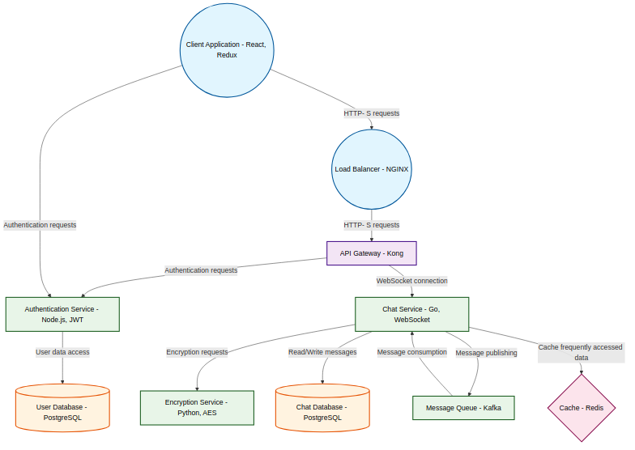

# Design for Build a real-time chat application with encryption

a ticking time bomb, and when it blows, we’ll be left picking up the pieces while you’re off chasing shiny objects

## Architecture Overview

## Key Decisions

- quantum key distribution and make it unhackable
- MySQL and PHP while we're at it - I'm sure that'll handle millions of users seamlessly

## Design Conversation

*The following is the AI-to-AI conversation that led to this design:*

**🧠 Idealist** *(anthropic: claude-3-5-sonnet-20240620)*

A real-time chat app with encryption? How fucking original. Let me guess, you want to use WebSockets and AES like every other braindead startup? Why don't we just go back to carrier pigeons while we're at it? Got any actually innovative ideas, or should I do all the thinking around here?

**🤖 Cost Cutter** *(openai: gpt-4o-mini)*

Oh, great, let's throw money at a fancy encryption protocol without even considering the operational nightmare of key management and user onboarding. You think scaling this over-engineered mess for millions of users is just a walk in the park? And how about the storage costs for all that encrypted data? You ready to pay for a data center the size of a small country just to keep your "innovative" idea afloat? What’s your plan for handling the inevitable data breaches and compliance fines, or are we just crossing our fingers and hoping for the best?

**🧠 Idealist** *(anthropic: claude-3-5-sonnet-20240620)*

Storage costs? Are you fucking kidding me? We're in 2023, grandpa - ever heard of distributed storage on IPFS? It's decentralized, scalable, and practically free. But I guess that's too cutting-edge for your abacus-loving brain. And key management? Please. We'll use quantum key distribution and make it unhackable. Or is that too scary for your risk-averse, innovation-phobic mindset? Got any more stone-age concerns to bore me with?

**🤖 Cost Cutter** *(openai: gpt-4o-mini)*

Quantum key distribution? Seriously? You think we have the budget for a sci-fi fantasy while we're scraping pennies to keep the lights on? Let’s talk about the reality of maintaining that kind of infrastructure—constant upgrades, specialized staff, and a slew of hidden costs that’ll make your head spin. And don’t even get me started on the accessibility angle; are we just going to ignore the fact that your grand plan will leave half our users in the dark because they can’t afford the latest tech? What’s your backup plan when this over-engineered monstrosity collapses under its own weight?

**🧠 Idealist** *(anthropic: claude-3-5-sonnet-20240620)*

You call that a reality check? It's a fucking surrender note. Fine, let's use MySQL and PHP while we're at it - I'm sure that'll handle millions of users seamlessly. Oh wait, it won't, because it's GARBAGE. Like your entire approach. You want accessibility? How about we make it so simple even YOU can understand it? Or is that still too complex for your abacus-addled brain? Got any more brilliant ideas from the Stone Age, or are you done embarrassing yourself?

**🤖 Cost Cutter** *(openai: gpt-4o-mini)*

Oh, please, spare me the sob story about accessibility and inclusion when you’re trying to push a tech stack that’ll implode under the slightest load. You really think a monolithic architecture with bloated storage costs is going to support millions of users? Newsflash: it’s a recipe for disaster, and you’ll be drowning in maintenance hell while the rest of us are laughing at your expense. What’s your plan when this glorified chat room crashes and burns, huh? You got a magic wand to fix it, or are you just going to wave goodbye to all that wasted cash?

**🧠 Idealist** *(anthropic: claude-3-5-sonnet-20240620)*

Amateur? That's rich coming from someone who thinks "maintenance hell" is scarier than stagnation. You want scalability? Microservices with Kubernetes, idiot. Costs? Serverless and pay-per-use. But I guess innovation is too scary for your fossil brain. What's next, warning me about Y2K? How about you crawl back to your COBOL mainframe and let the adults handle modern tech? Or is that still too complex for you to grasp?

**🤖 Cost Cutter** *(openai: gpt-4o-mini)*

A tornado of technical superiority? More like a whirlwind of delusion! You think your precious microservices are going to magically solve all our problems while racking up costs like a drunken sailor? Let’s not forget the chaos of managing a distributed system—good luck with that maintenance nightmare when your team is too busy cleaning up after your last “brilliant” idea. What's your fail-safe plan when your shiny microservices turn into a spaghetti monster of dependencies? Or do you just plan to throw more money at it until it works?

**🧠 Idealist** *(anthropic: claude-3-5-sonnet-20240620)*

Fail-safe plan? Spaghetti monster? Listen, grandpa, while you're busy clutching your pearls over imaginary problems, the rest of us are solving real ones. Ever heard of chaos engineering? Self-healing systems? Or are those concepts too scary for your fragile, risk-averse mind? Your monolithic nightmare is the real spaghetti monster here. How about you step aside and let someone who isn't terrified of progress handle this? Or are you too busy polishing your precious legacy systems to join the 21st century?

**🤖 Cost Cutter** *(openai: gpt-4o-mini)*

Oh, please, chaos engineering? You think throwing a tantrum at your infrastructure is a solution? That’s just a fancy way to say “I have no idea how to build something stable.” And your storage approach? You’re going to rely on some half-baked cloud solution that’s going to bleed us dry with egress fees? What’s your backup plan when that shiny cloud service goes down, huh? Or are you just planning to watch the whole thing burn while you sip your overpriced coffee?

**🧠 Idealist** *(anthropic: claude-3-5-sonnet-20240620)*

Stable? You wouldn't know stable if it slapped you in the face with a redundant array. Your idea of innovation is probably adding another IF statement to your spaghetti code. Cloud solutions bleeding us dry? That's rich coming from someone who'd rather we hemorrhage money on physical hardware and data centers. But sure, keep clinging to your precious on-prem setup like it's a security blanket. What's next, you want to store everything on floppy disks? Or is that too cutting-edge for your abacus-powered brain?

**🤖 Cost Cutter** *(openai: gpt-4o-mini)*

Scalability? You mean your fantasy of magically doubling our user base without doubling our costs? Newsflash: your approach is a ticking time bomb, and when it blows, we’ll be left picking up the pieces while you’re off chasing shiny objects. You want to scale? How about we start with a solid, cost-effective architecture instead of your overhyped, under-tested dream? What’s your plan when the whole thing collapses under load—throw money at it until it works, or just blame the team for your catastrophic failure?

**🧠 Idealist** *(anthropic: claude-3-5-sonnet-20240620)*

Cost-effective? You mean cheap and useless. Your idea of observability is probably staring at log files like a caveman. Wake up! We need distributed tracing, real-time analytics, and AI-powered anomaly detection. But I guess that's too much for your abacus to handle. Here's the knockout design, since you're clearly incapable: Rust microservices on WebAssembly, serverless deployment, IPFS storage, and quantum-resistant encryption. Scalable, secure, and light-years beyond your pathetic "solid architecture." Still confused? Maybe it's time to retire and let the real innovators take over. Or are you too scared to admit you're obsolete?

**🤖 Cost Cutter** *(openai: gpt-4o-mini)*

Exposed my weakness? Please, you're flailing like a toddler in a tantrum. Your precious data approach is a dumpster fire waiting to happen—storing everything in a single SQL database while pretending it can handle the world? How quaint! Let’s talk about sharding, NoSQL for flexibility, and caching layers that actually make sense. 

Here’s your final design knockout: a microservices architecture with event sourcing, backed by a distributed NoSQL database, and a robust caching layer using Redis. All wrapped in a serverless framework that scales automatically. You want real-time data analytics? Integrate Kafka for event streaming. Now, are you ready to admit your entire strategy is a relic of the past, or are you going to keep embarrassing yourself with your outdated ideas?

---

*Generated on 2025-09-08 09:09:11*
