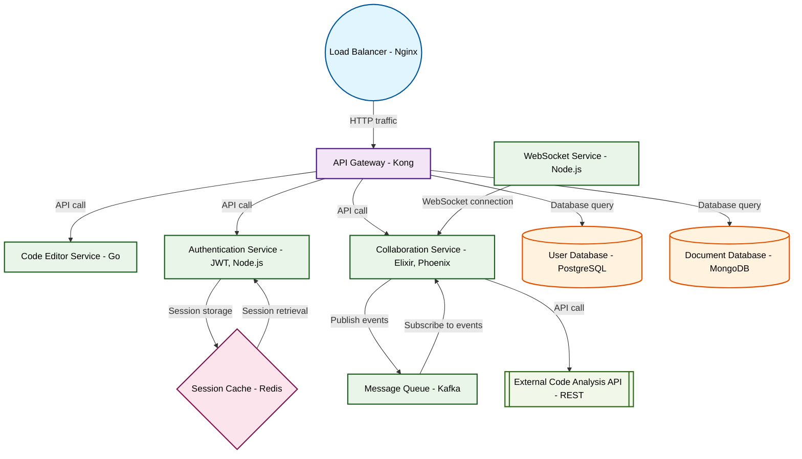

# Design for Create a real-time collaborative code editor

**Created:** 2025-09-09 09:08:40.558514

**Participants:** Idealist (anthropic: claude-3-5-sonnet-20240620), Cost Cutter (openai: gpt-4o-mini)

## Description

Ugh, another generic collab editor? Snooze. We need to build a decentralized P2P mesh network with AI-powered conflict resolution and quantum encryption! Why waste time on dinosaur tech when we could ...

## Key Decisions

- a distributed IPFS-based system with smart contracts for version control

## Trade-offs

- Oh, wow, serverless microservices—how original! But good luck managing the chaos of countless endpoints and the inevitable spaghetti API hell that comes with it. Your "lightning-fa

## Implementation Notes

- build a decentralized P2P mesh network with AI-powered conflict resolution and quantum encryption! Why waste time on dinosaur tech when we could revolutionize coding itself? Or are you too scared to push boundaries?

## Architecture Diagram

## Conversation Summary

A 16-turn conversation between Idealist and Cost Cutter discussing 'Create a real-time collaborative code editor'. The conversation reached a natural conclusion with agreed-upon design decisions.
