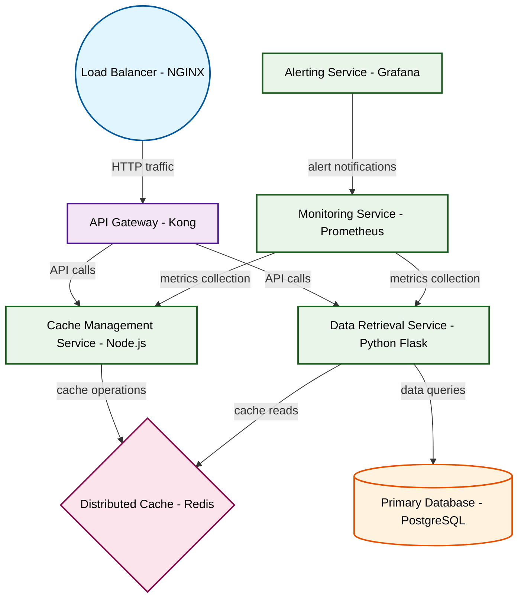

# Design for Design a distributed caching system

**Created:** 2025-09-10 09:08:33.531758

**Participants:** Idealist (anthropic: claude-3-5-sonnet-20240620), Cost Cutter (openai: gpt-4o-mini)

## Description

stuck in a single universe? or are you too technologically stunted to grasp true innovation beyond your simplistic key-value stores?

## Key Decisions

- Final design? Here’s the reality check: we need a **distributed caching architecture** that leverages **in-memory data grids** for speed, with **horizontal scaling** to handle millions of requests. The data flow will involve a **write-through cache** strategy to ensure data consistency while serving reads directly from the cache for sub-millisecond latency

## Trade-offs

- Desperate? Hardly! Your precious observability tools will drown in the noise of your overcomplicated system, leaving you blind to failures while your users rage-quit. Good luck deb
- Final design? Here’s the reality check: we need a **distributed caching architecture** that leverages **in-memory data grids** for speed, with **horizontal scaling** to handle mill

## Implementation Notes

- Architecture? You call that restrictive, penny-pinching mess an architecture? We need a self-evolving, AI-driven cache that adapts to usage patterns in real-time! Your static, infl

## Architecture Diagram

## Conversation Summary

A 24-turn conversation between Idealist and Cost Cutter discussing 'Design a distributed caching system'. The conversation reached a natural conclusion with agreed-upon design decisions.
