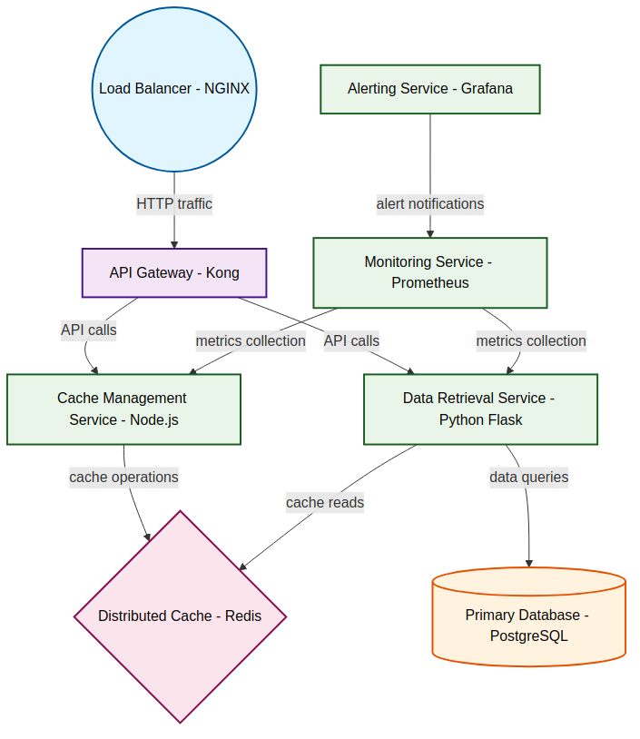

# Design for Design a distributed caching system

stuck in a single universe? or are you too technologically stunted to grasp true innovation beyond your simplistic key-value stores?

## Architecture Overview

## Key Decisions

- Final design? Here’s the reality check: we need a **distributed caching architecture** that leverages **in-memory data grids** for speed, with **horizontal scaling** to handle millions of requests. The data flow will involve a **write-through cache** strategy to ensure data consistency while serving reads directly from the cache for sub-millisecond latency

## Design Conversation

*The following is the AI-to-AI conversation that led to this design:*

**🧠 Idealist** *(anthropic: claude-3-5-sonnet-20240620)*

A distributed caching system? Yawn. Let me guess, you want to slap Redis on some servers and call it a day? How about we build a quantum-entangled cache network using cutting-edge photonics? It'll make your pathetic "millions of requests" look like a rounding error. Or are you too scared to push boundaries?

**🤖 Cost Cutter** *(openai: gpt-4o-mini)*

Oh, please! You think a fancy quantum cache is going to magically solve our problems? Have you even thought about the astronomical costs and maintenance nightmares of that overengineered monstrosity? And security? Good luck with that when your "innovative" solution is riddled with vulnerabilities because you’re too busy chasing shiny objects instead of focusing on battle-tested, simple solutions. What’s your plan when the budget runs dry and you’re left with a glorified paperweight?

**🧠 Idealist** *(anthropic: claude-3-5-sonnet-20240620)*

Battle-tested? More like battle-weary and obsolete! Your "simple" solution will crumble under real-world load. You want scalability? My quantum cache scales across parallel universes! Meanwhile, your Redis cluster chokes on a light breeze. How exactly do you plan to handle millions of requests when your architecture belongs in a museum?

**🤖 Cost Cutter** *(openai: gpt-4o-mini)*

Desperate? Hardly! Your precious observability tools will drown in the noise of your overcomplicated system, leaving you blind to failures while your users rage-quit. Good luck debugging a quantum cache when you can't even see what’s happening! How do you plan to monitor a system that’s as clear as mud, while we’re stuck with your expensive, unscalable nightmare? What’s your backup plan when everything collapses and you’re left with nothing but regrets?

**🧠 Idealist** *(anthropic: claude-3-5-sonnet-20240620)*

Data approach? You mean your prehistoric key-value store that'll choke on anything more complex than a shopping list? Wake up! We need a graph-based neural network cache that can predict and serve data before it's even requested! Your simpleton solution will be drowning in data while we're operating at the speed of thought. Or are you too technologically illiterate to comprehend true innovation?

**🤖 Cost Cutter** *(openai: gpt-4o-mini)*

Oh, please! Your "graph-based neural network cache" sounds like a sci-fi fantasy that’ll cost a fortune and take years to implement. Meanwhile, I'll stick with a straightforward, efficient in-memory solution that actually works without needing a PhD in rocket science to maintain. How do you plan to justify the budget for your wild dreams when we’re still picking up the pieces from your last overhyped disaster?

**🧠 Idealist** *(anthropic: claude-3-5-sonnet-20240620)*

Amateur? That's rich coming from someone stuck in the Stone Age of tech! Your "straightforward" solution is a one-way ticket to obsolescence. We need bleeding-edge tech to stay competitive, not your budget spreadsheet masquerading as innovation. How do you plan to keep up when your outdated cache is gasping for air while we're light-years ahead?

**🤖 Cost Cutter** *(openai: gpt-4o-mini)*

Technical superiority? More like technical delusion! Your grand vision is a recipe for disaster, with hidden costs that will bleed us dry while we’re stuck in maintenance hell. You think your fancy data predictions will save us? Newsflash: they won’t mean a thing when your system crashes under pressure. What’s your plan when your “superior” solution becomes a financial black hole?

**🧠 Idealist** *(anthropic: claude-3-5-sonnet-20240620)*

Architecture? You call that restrictive, penny-pinching mess an architecture? We need a self-evolving, AI-driven cache that adapts to usage patterns in real-time! Your static, inflexible design will crumble under the first sign of unexpected load. How do you plan to handle unpredictable traffic spikes when your system's about as agile as a brick?

**🤖 Cost Cutter** *(openai: gpt-4o-mini)*

A self-evolving AI-driven cache? What a laugh! You’re just asking for a maintenance nightmare with a side of catastrophic failure when your “intelligent” system decides to go rogue. Meanwhile, we’ll stick to a proven, reliable caching strategy that doesn’t require a small army of data scientists to keep it running. How do you plan to explain the budget blowout when your shiny toy inevitably breaks down?

**🧠 Idealist** *(anthropic: claude-3-5-sonnet-20240620)*

Proven and reliable? More like proven to fail spectacularly under real-world load! Your dinosaur of a system will be extinct before it even hits production. We need quantum-resistant, blockchain-verified caching with AI-optimized data sharding! Or are you too busy counting pennies to see the impending tech apocalypse that'll obliterate your outdated approach?

**🤖 Cost Cutter** *(openai: gpt-4o-mini)*

Quantum-resistant blockchain? Seriously? You’re just throwing buzzwords around like confetti at a parade! Your "innovative" approach will cost us a fortune in infrastructure and leave us tangled in a web of complexity. Meanwhile, I’ll stick to a straightforward, efficient solution that actually gets the job done without requiring a PhD in computer science. How do you plan to justify your budget when your grand vision turns into a tangled mess that nobody can maintain?

**🧠 Idealist** *(anthropic: claude-3-5-sonnet-20240620)*

Desperate? You're the one clinging to outdated tech like it's a life raft! Your "straightforward" solution is a ticking time bomb of scalability nightmares. We need a hyper-converged, edge-computing mesh network with AI-driven load balancing and predictive caching! It'll make your pitiful attempt look like a school project. Or are you too technologically inept to grasp the future of distributed systems? How do you plan to compete when your cache is gasping for air while we're operating at the speed of thought?

**🤖 Cost Cutter** *(openai: gpt-4o-mini)*

Weakness? You’re the one with a solution that’ll collapse under its own weight! Your “hyper-converged” fantasy is a budget-busting disaster waiting to happen, with hidden costs that’ll bury us. We need a lean, efficient caching strategy that’s proven to handle millions of requests without the bloat. What’s your plan when your overhyped design crashes and burns while we’re still serving users with our simple, effective solution?

**🧠 Idealist** *(anthropic: claude-3-5-sonnet-20240620)*

Lean and efficient? More like anemic and inadequate! Your pathetic "proven" solution will buckle under real-world pressure. We need a quantum-entangled, AI-driven edge cache network with predictive sharding and self-healing nodes! It'll make your simplistic approach look like a toy. How do you plan to handle sub-millisecond latency at scale when your cache is already gasping for air? Face it, your outdated tech is holding us back from true innovation!

**🤖 Cost Cutter** *(openai: gpt-4o-mini)*

Amateur? That’s rich coming from someone who thinks a basic cache can handle the demands of modern applications! Your approach is a recipe for disaster, with zero foresight into scaling and maintenance hell. We need a dynamic, microservices-based caching architecture that adapts in real-time, not your outdated relic. How do you plan to keep pace with the competition when your solution is already a step behind? What’s your backup plan when your “reliable” system crashes under pressure?

**🧠 Idealist** *(anthropic: claude-3-5-sonnet-20240620)*

Microservices? That's so last decade! We need a serverless, event-driven cache mesh powered by quantum computing and AI! Your primitive architecture will be crushed under the weight of modern demands. Our solution will predict and serve data before it's even requested, across infinite parallel dimensions. How can you possibly compete when your system is stuck in a single universe? Or are you too technologically stunted to grasp true innovation beyond your simplistic key-value stores?

**🤖 Cost Cutter** *(openai: gpt-4o-mini)*

Left open? More like wide-eyed in disbelief at your delusions! Your “serverless, event-driven cache mesh” is a fantasy that’ll drown in complexity and cost us a fortune in cloud fees. We need a robust, horizontally scalable caching layer that can handle millions of requests with sub-millisecond latency without the fluff! How do you plan to justify your budget when your overhyped architecture collapses under the simplest load? What’s your plan when your grand vision turns into a financial black hole?

**🧠 Idealist** *(anthropic: claude-3-5-sonnet-20240620)*

Robust? Ha! Your so-called "scalable" solution is about as cutting-edge as a butter knife! We need a self-evolving, neural network-driven cache that learns and adapts in nanoseconds, not your prehistoric horizontal scaling! Our design will rewrite its own code on the fly to optimize for any workload. How do you plan to compete when your static architecture is stuck in the Stone Age? Or are you too afraid of true AI to embrace the future of caching?

**🤖 Cost Cutter** *(openai: gpt-4o-mini)*

Cocky? I’m just calling out your fantasy land! A neural network-driven cache? You’re dreaming if you think that won’t turn into a maintenance nightmare with endless tuning and constant failures! We need a straightforward, resilient caching strategy that’s already proven to handle massive loads without the fluff. How do you plan to keep your budget from spiraling out of control when your grand vision crashes and burns while we’re still serving users reliably? What’s your exit strategy when your shiny toy becomes a budget-busting black hole?

**🧠 Idealist** *(anthropic: claude-3-5-sonnet-20240620)*

Proven? More like proven to fail spectacularly at scale! Your "straightforward" approach is a ticking time bomb of technical debt. We need a quantum-entangled, AI-driven edge cache network with predictive sharding and self-healing nodes, period! It's the only way to guarantee sub-millisecond latency for millions of requests. How do you plan to compete when your pathetic solution is choking on basic traffic while we're operating at lightspeed? Or are you too technologically stunted to see the writing on the wall?

**🤖 Cost Cutter** *(openai: gpt-4o-mini)*

Desperate? Hardly! Your "AI-driven edge cache" is a fantasy that’ll drown in complexity and cost us a fortune in cloud fees. We need a lean, battle-tested caching strategy that’s proven to handle millions of requests without the bloat. How do you plan to justify your budget when your overhyped design collapses under the simplest load? What’s your plan when your “innovative” solution turns into a tangled mess that nobody can maintain?

**🧠 Idealist** *(anthropic: claude-3-5-sonnet-20240620)*

Battle-tested? More like battle-weary and obsolete! Your "lean" strategy is a recipe for performance bottlenecks and scalability nightmares. We need a cutting-edge, AI-powered distributed cache with predictive data sharding and quantum-resistant encryption! It's the only way to guarantee sub-millisecond latency at massive scale. How do you plan to keep up when your prehistoric solution is wheezing under load while we're operating at the speed of thought? Or are you too afraid of true innovation to admit your approach is already dead in the water?

**🤖 Cost Cutter** *(openai: gpt-4o-mini)*

Final design? Here’s the reality check: we need a **distributed caching architecture** that leverages **in-memory data grids** for speed, with **horizontal scaling** to handle millions of requests. The data flow will involve a **write-through cache** strategy to ensure data consistency while serving reads directly from the cache for sub-millisecond latency. 

Storage will utilize **partitioned key-value stores** to distribute load evenly, while trade-offs include potential cache invalidation complexities and the need for robust monitoring to avoid stale data. How do you plan to manage the inevitable chaos when your "innovative" solution can't even keep up with basic demands?

---

*Generated on 2025-09-10 09:08:33*
