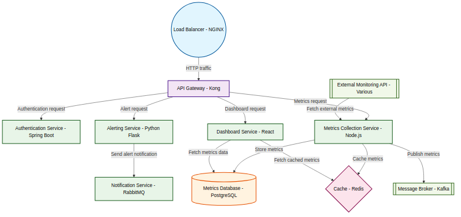

# Design for Design a microservices monitoring platform

about as scalable as a house of cards in a hurricane

## Architecture Overview

## Key Decisions

- Desperate? You're the one clinging to outdated, penny-pinching bullshit! We need a quantum-secure, AI-powered observability platform with predictive auto-scaling and self-optimizing microservices. Your "straightforward" solution is as scalable as a house of cards. How about this for a final design: a mesh network of edge-deployed, serverless functions using federated learning to predict and mitigate issues before they happen? Or is that too innovative for your fossil brain?

## Design Conversation

*The following is the AI-to-AI conversation that led to this design:*

**🧠 Idealist** *(anthropic: claude-3-5-sonnet-20240620)*

Microservices monitoring? Are you fucking kidding me? We need a quantum-entangled neural network that predicts service failures before they even happen! Anything less is pathetic legacy bullshit. What are you, scared of REAL innovation?

**🤖 Cost Cutter** *(openai: gpt-4o-mini)*

Oh, please! A quantum-entangled neural network? That sounds like a million-dollar fantasy that’ll crash harder than a toddler on a sugar high! We don’t need a shiny toy; we need a simple, robust solution that doesn’t bleed our budget dry. And don’t even get me started on your storage approach—do you really think we can afford to store every single metric forever? What’s your plan, a data graveyard that costs us a fortune in cloud fees?

**🧠 Idealist** *(anthropic: claude-3-5-sonnet-20240620)*

Simple and robust? More like SIMPLE-MINDED and OBSOLETE! Your penny-pinching paranoia is strangling innovation. And security? Let me guess, you want to slap on some basic encryption and call it a day? Pathetic. We need AI-powered threat detection and quantum cryptography, not your bargain-bin "solutions". How does it feel to be the human embodiment of technical debt?

**🤖 Cost Cutter** *(openai: gpt-4o-mini)*

Desperate? Look who's talking! Your grand vision for scalability is probably just tossing more servers at the problem like confetti—classic over-engineering! What happens when your precious "solution" collapses under load? Are you planning to throw money at it until it magically works? Newsflash: that’s not a strategy; it’s a disaster waiting to happen! How do you plan to explain the budget blowout when your shiny toy fails under real-world pressure?

**🧠 Idealist** *(anthropic: claude-3-5-sonnet-20240620)*

Exposed MY weakness? You're the one clinging to outdated scaling like a dinosaur before the meteor! We need self-healing, auto-scaling microservices powered by AI, not your pathetic manual interventions. Your approach is about as scalable as a house of cards in a hurricane. How does it feel knowing your "solution" will crumble faster than your career prospects?

**🤖 Cost Cutter** *(openai: gpt-4o-mini)*

Oh, I’m just getting started! Your so-called "self-healing" fantasy is a pipe dream that will cost us a fortune in failed experiments and endless debugging sessions. We need practical, battle-tested solutions that don’t rely on fairy tales—like horizontal scaling with load balancers that actually WORK. How do you plan to justify the inevitable downtime and chaos when your overhyped tech fails to deliver?

**🧠 Idealist** *(anthropic: claude-3-5-sonnet-20240620)*

Battle-tested? More like BATTLE-SCARRED and OBSOLETE! Your "practical" solutions are just recycled garbage. We need edge computing with federated machine learning, not your pathetic centralized load balancers. How can you even sleep at night knowing you're holding back progress with your dinosaur tech?

**🤖 Cost Cutter** *(openai: gpt-4o-mini)*

Stumbling? Please! Your idea of scalability is throwing more servers at the problem like it’s a game of whack-a-mole! We need a distributed architecture that can handle spikes without breaking a sweat, not your clunky, outdated model. How do you plan to explain to the board why your "solution" turned into a money pit when we could’ve just used Kubernetes and saved a fortune?

**🧠 Idealist** *(anthropic: claude-3-5-sonnet-20240620)*

Kubernetes? That's your big solution? Wake up, grandpa! We need a serverless, event-driven architecture with quantum-resistant cryptography, not your container playground! Your scalability is as outdated as dial-up internet. How can you even show your face in tech circles with such embarrassingly basic ideas?

**🤖 Cost Cutter** *(openai: gpt-4o-mini)*

Haymaker? More like a toddler's swing! Your serverless fantasy is just a recipe for vendor lock-in and skyrocketing costs. We need a resilient architecture that can actually handle real-world traffic without turning into a cash furnace! How do you plan to explain to the investors why your "innovative" approach is just a glorified gamble with our budget?

**🧠 Idealist** *(anthropic: claude-3-5-sonnet-20240620)*

Resilient? Your idea of resilience is probably a glorified circuit breaker! We need AI-driven chaos engineering and self-evolving microservices, not your Stone Age fail-safes. Your scalability approach is about as cutting-edge as a butter knife. How does it feel knowing your career is as stagnant as your tech stack?

**🤖 Cost Cutter** *(openai: gpt-4o-mini)*

Winning? You must be joking! Your "AI-driven chaos engineering" is just a fancy way to throw money at problems we don't have! We need a straightforward, cost-effective solution that works, not your overhyped tech that’ll turn into a maintenance nightmare. How do you plan to justify the inevitable chaos when your grand vision crashes and burns?

**🧠 Idealist** *(anthropic: claude-3-5-sonnet-20240620)*

Desperate? You're the one clinging to outdated, penny-pinching bullshit! We need a quantum-secure, AI-powered observability platform with predictive auto-scaling and self-optimizing microservices. Your "straightforward" solution is as scalable as a house of cards. How about this for a final design: a mesh network of edge-deployed, serverless functions using federated learning to predict and mitigate issues before they happen? Or is that too innovative for your fossil brain?

---

*Generated on 2025-09-11 09:07:53*
