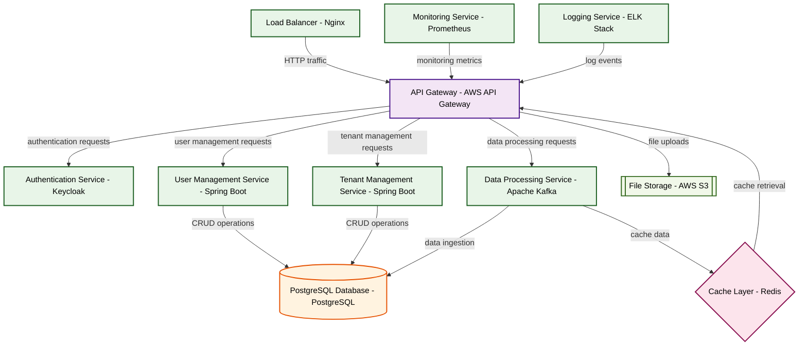

# Design for Design a secure multi-tenant SaaS platform

**Created:** 2025-09-12 09:08:11.951642

**Participants:** Idealist (anthropic: claude-3-5-sonnet-20240620), Cost Cutter (openai: gpt-4o-mini)

## Description

doa

## Key Decisions

- homomorphic encryption to process sensitive info without ever decrypting it
- quantum-resistant cryptography to future-proof our data protection while you're still patching decade-old vulnerabilities
- AI-driven data sharding and quantum-resistant encryption to guarantee isolation
- post-quantum cryptography and homomorphic encryption to ensure data isolation that's lightyears beyond your pathetic attempts
- homomorphic encryption for data processing and zero-knowledge proofs for access control

## Trade-offs

- Automatic compliance? That’s adorable! But how exactly are you going to manage the sheer complexity of your "quantum-encrypted" mess without drowning in costs and operational heada

## Implementation Notes

- Tried-and-true? You mean tired and obsolete! Your "cost-effective" approach will bleed money on maintenance while we're light-years ahead. We'll use AI-driven data sharding and qua
- Winning? Not even close! Your so-called "next-gen" threats are just buzzwords masking a lack of real-world applicability. While you’re busy chasing shiny objects, I’ll be implement

## Architecture Diagram

## Conversation Summary

A 15-turn conversation between Idealist and Cost Cutter discussing 'Design a secure multi-tenant SaaS platform'. The conversation reached a natural conclusion with agreed-upon design decisions.
