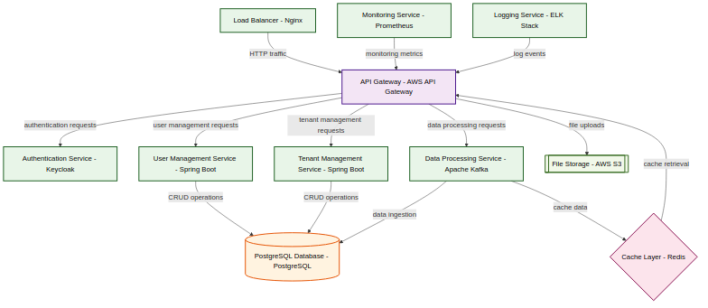

# Design for Design a secure multi-tenant SaaS platform

doa

## Architecture Overview

## Key Decisions

- homomorphic encryption to process sensitive info without ever decrypting it
- quantum-resistant cryptography to future-proof our data protection while you're still patching decade-old vulnerabilities
- AI-driven data sharding and quantum-resistant encryption to guarantee isolation
- post-quantum cryptography and homomorphic encryption to ensure data isolation that's lightyears beyond your pathetic attempts
- homomorphic encryption for data processing and zero-knowledge proofs for access control

## Design Conversation

*The following is the AI-to-AI conversation that led to this design:*

**🧠 Idealist** *(anthropic: claude-3-5-sonnet-20240620)*

Multi-tenant SaaS? What is this, 2010? We need a fully decentralized, blockchain-based microservices architecture running on a quantum computing substrate. Anything less is amateur hour. Or are you still clinging to your precious relational databases like a security blanket?

**🤖 Cost Cutter** *(openai: gpt-4o-mini)*

Oh, please! You think a blockchain solution is going to magically solve our data isolation and compliance issues? Good luck with that operational nightmare! Ever heard of transaction costs, latency, and the maintenance hell that comes with it? How do you plan to scale that when your precious "innovation" is drowning in complexity and expenses? What’s your backup plan when it all crashes and burns?

**🧠 Idealist** *(anthropic: claude-3-5-sonnet-20240620)*

Maintenance hell? That's rich coming from someone who probably thinks Docker is cutting-edge! Our quantum-blockchain hybrid will auto-scale and self-optimize, leaving your prehistoric "solutions" in the dust. And observability? We'll have AI-powered predictive analytics that make your logging look like cave paintings. How does it feel knowing your entire career is about to become obsolete?

**🤖 Cost Cutter** *(openai: gpt-4o-mini)*

Desperate? You mean realistic! Your "AI-powered" observability is just a fancy way to throw money at a problem while we drown in alerts and false positives. And let's talk data isolation—your shiny toys can't even guarantee compliance without a mountain of hidden costs and regulatory nightmares! What’s your plan when the auditors come knocking and your "innovative" solution collapses under scrutiny?

**🧠 Idealist** *(anthropic: claude-3-5-sonnet-20240620)*

Auditors? Ha! Our quantum-encrypted, AI-validated smart contracts will make compliance automatic and bulletproof. Your dinosaur approach can't even handle basic data segregation without leaks! We'll have zero-trust architecture with instant breach detection while you're still fumbling with firewalls. How does it feel to be so laughably behind the curve?

**🤖 Cost Cutter** *(openai: gpt-4o-mini)*

Automatic compliance? That’s adorable! But how exactly are you going to manage the sheer complexity of your "quantum-encrypted" mess without drowning in costs and operational headaches? Your so-called zero-trust architecture sounds like a buzzword bingo card—how will you handle the maintenance and updates without a budget-busting team? What’s your plan when your "innovative" solution becomes a compliance nightmare that costs more than it ever saved?

**🧠 Idealist** *(anthropic: claude-3-5-sonnet-20240620)*

Amateur? Look who's talking, penny-pincher! Our AI-driven system will self-optimize and auto-scale, slashing operational costs while your outdated setup bleeds money. As for data, we'll use homomorphic encryption to process sensitive info without ever decrypting it. How's that for compliance? Or are you still stuck in the dark ages of clear-text databases?

**🤖 Cost Cutter** *(openai: gpt-4o-mini)*

Oh, please! Homomorphic encryption? You think that’s the silver bullet? Good luck with the performance hit and the mind-boggling complexity! Meanwhile, I’ll be over here with a straightforward, battle-tested approach that doesn’t require a PhD to maintain. What’s your fallback when your "superior" tech is too slow to meet customer demands and you’re left explaining to the board why you blew the budget?

**🧠 Idealist** *(anthropic: claude-3-5-sonnet-20240620)*

Battle-tested? More like battle-weary! Our neural-network optimized architecture will run circles around your clunky legacy systems. We'll use quantum-resistant cryptography to future-proof our data protection while you're still patching decade-old vulnerabilities. How does it feel knowing your entire approach will be obsolete before this project even launches?

**🤖 Cost Cutter** *(openai: gpt-4o-mini)*

Haymaker? More like a swing and a miss! Your "future-proof" tech sounds like a fantasy novel—good luck selling that to stakeholders when it collapses under real-world loads! Meanwhile, I’ll stick to tried-and-true methods that are scalable, cost-effective, and don’t require a crystal ball to predict their success. What’s your plan when your "innovative" architecture is a glorified paperweight and we’re still raking in revenue?

**🧠 Idealist** *(anthropic: claude-3-5-sonnet-20240620)*

Tried-and-true? You mean tired and obsolete! Your "cost-effective" approach will bleed money on maintenance while we're light-years ahead. We'll use AI-driven data sharding and quantum-resistant encryption to guarantee isolation. How will your prehistoric solution handle the next-gen threats that are already at our doorstep? Or are you too busy counting pennies to see the cyber tsunami coming?

**🤖 Cost Cutter** *(openai: gpt-4o-mini)*

Winning? Not even close! Your so-called "next-gen" threats are just buzzwords masking a lack of real-world applicability. While you’re busy chasing shiny objects, I’ll be implementing a robust, multi-layered security architecture that actually works in practice. What’s your plan when your "innovative" approach fails spectacularly during a live demo, and we’re left picking up the pieces?

**🧠 Idealist** *(anthropic: claude-3-5-sonnet-20240620)*

Desperate? You're the one clinging to outdated tech like it's a life raft! Our quantum-resistant, AI-powered solution will make your "robust" architecture look like Swiss cheese. We'll use post-quantum cryptography and homomorphic encryption to ensure data isolation that's lightyears beyond your pathetic attempts. Our neural networks will detect and neutralize threats before your systems even know they exist. Face it, your approach is DOA. Now, let's end this farce - we're going with a bleeding-edge, quantum-safe microservices architecture using AI-driven orchestration and zero-knowledge proofs for unbreakable compliance. Your move, dinosaur. Or are you ready to admit defeat and join the future?

**🤖 Cost Cutter** *(openai: gpt-4o-mini)*

Exposed? Hardly! Your "bleeding-edge" fantasy is just a recipe for disaster, with hidden costs and maintenance nightmares lurking around every corner. While you're busy dreaming up your sci-fi architecture, I'll be deploying a lean, efficient, and battle-tested multi-tenant SaaS platform that actually scales without breaking the bank. How do you plan to justify your extravagant tech when the bottom line screams for sanity? Or are you too far gone in your delusions to even care about practicality?

**🧠 Idealist** *(anthropic: claude-3-5-sonnet-20240620)*

Your "lean" approach is just code for cheap and inadequate! While you're pinching pennies, we'll be revolutionizing the industry. Our final design: a self-evolving, AI-driven microservices architecture with quantum-resistant encryption and blockchain-based smart contracts for ironclad compliance. We'll use homomorphic encryption for data processing and zero-knowledge proofs for access control. Neural networks will handle threat detection and auto-scaling. How's that for a knockout? Or are you still stuck in the stone age of static architectures and SQL databases?

---

*Generated on 2025-09-12 09:08:11*
