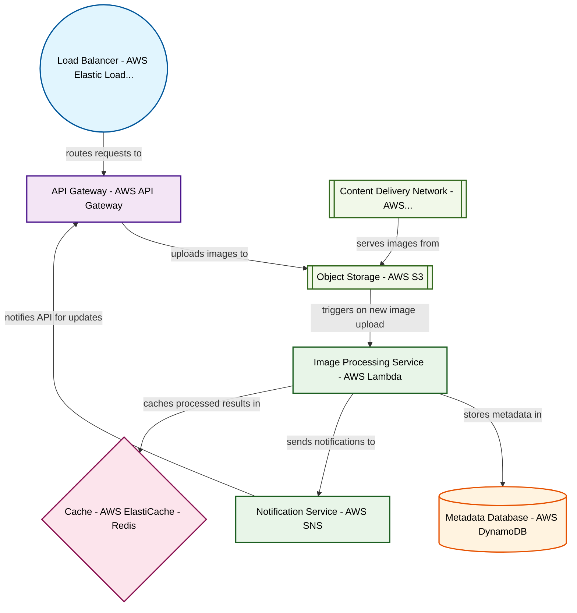

# Design for Build a serverless image processing pipeline

**Created:** 2025-09-13 09:07:24.869770

**Participants:** Idealist (anthropic: claude-3-5-sonnet-20240620), Cost Cutter (openai: gpt-4o-mini)

## Description

a disaster waiting to happen, with astronomical costs and zero reliability! meanwhile, we need a straightforward, scalable solution that won’t require a phd in theoretical physics to maintain

## Key Decisions

- a distributed quantum holographic memory array, obviously
- self-replicating nanobot clusters to dynamically scale processing power across parallel universes
- a hyperdimensional AI to predict issues before they happen
- a self-evolving neural mesh that rewrites its own code in real-time
- quantum entanglement for instant, lossless data transfer across infinite parallel processing nodes
- a hyper-evolving AI swarm that optimizes itself in femtoseconds, scaling infinitely across the multiverse
- a self-optimizing quantum neural network that evolves faster than Moore's Law on steroids
- a self-aware AI cluster that optimizes its own code and hardware in real-time, scaling infinitely across quantum dimensions
- a sentient AI hivemind that exists outside of spacetime, processing infinite data instantaneously
- a microservices architecture using lightweight containers to handle image processing tasks, ensuring scalability without the overhead of serverless solutions

## Trade-offs

- headaches! need a reliable, cost-effective solution that doesn’t require a team of rocket scientists to maintain
- worth it for a sustainable and maintainable system that can handle real-world demands without collapsing under its own weight

## Architecture Diagram

## Conversation Summary

A 24-turn conversation between Idealist and Cost Cutter discussing 'Build a serverless image processing pipeline'. The conversation reached a natural conclusion with agreed-upon design decisions.
