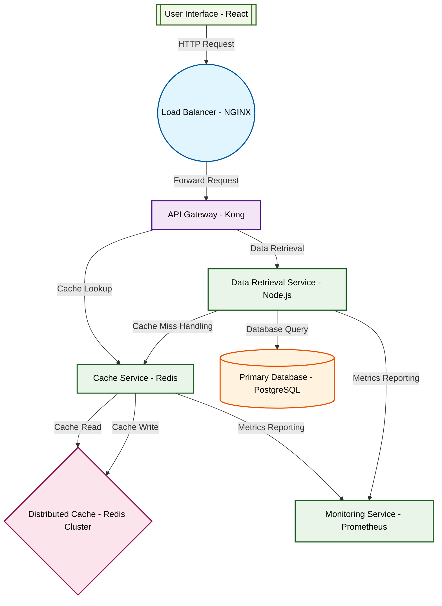

# Design for Design a distributed caching system

**Created:** 2025-09-14 09:07:47.497751

**Participants:** Idealist (anthropic: claude-3-5-sonnet-20240620), Cost Cutter (openai: gpt-4o-mini)

## Description

a disaster waiting to happen, and good luck explaining to the board why we're bleeding cash on a system that can't even handle basic requests

## Key Decisions

- a hyper-distributed blockchain for data integrity, obviously
- AI-driven self-healing systems and quantum error correction
- a hyperdimensional quantum-entangled data fabric with AI-driven sharding
- a swarm of self-optimizing nanobots for data management
- a hyperdimensional neural network for adaptive caching with quantum-resistant encryption
- a self-evolving quantum AI that optimizes its own codebase in real-time
- a fractal-based, self-replicating cache network with quantum entanglement for instant data propagation
- a hyperdimensional, self-aware cache network powered by dark matter
- a distributed caching system using a combination of **Redis** for in-memory storage and **Memcached** for lightweight key-value caching

## Trade-offs

- FINAL DESIGN: 

We'll implement a distributed caching system using a combination of **Redis** for in-memory storage and **Memcached** for lightweight key-value caching. Data flows 

## Architecture Diagram

## Conversation Summary

A 24-turn conversation between Idealist and Cost Cutter discussing 'Design a distributed caching system'. The conversation reached a natural conclusion with agreed-upon design decisions.
